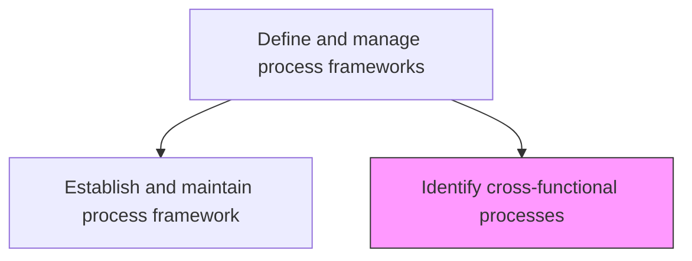
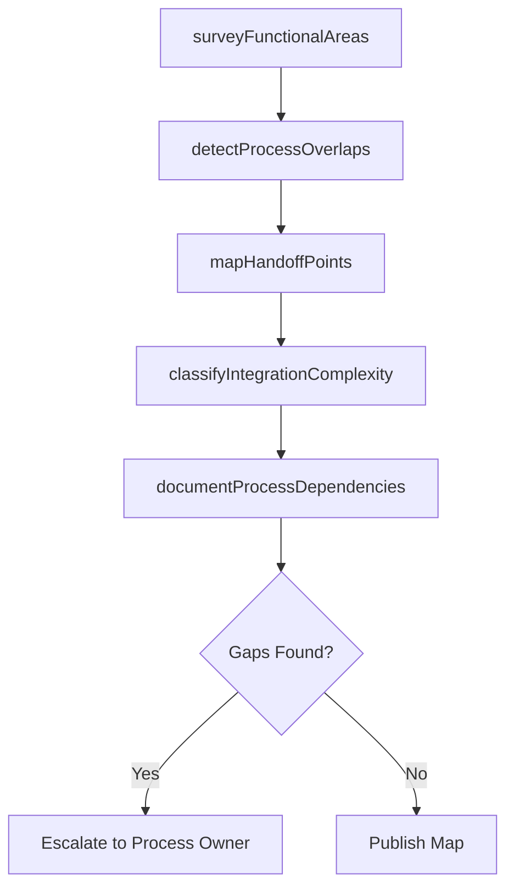

# Identify cross-functional processes

> Business-as-Code definition for cross-functional process identification. Models the discovery and cataloging of processes that span multiple functional areas and require coordinated execution across departments.

## Overview

Recognizing the different functional areas working on the same project or goal.

## Process Hierarchy



## GraphDL

```yaml
identify:
  object: Cross-functional Processes
  actor: ProcessAnalyst
  result: CrossFunctionalProcessMap
```

## Actions

| Action | Description |
|--------|-------------|
| surveyFunctionalAreas | Catalog processes within each functional department |
| detectProcessOverlaps | Identify processes that span or depend on multiple departments |
| mapHandoffPoints | Document the handoff points between functional areas in shared processes |
| classifyIntegrationComplexity | Rate the coordination complexity of each cross-functional process |
| documentProcessDependencies | Record upstream and downstream dependencies across functions |

## Events

| Event | Description |
|-------|-------------|
| functionalAreasSurveyed | Department-level process inventories completed |
| processOverlapsDetected | Cross-functional process touchpoints identified |
| handoffPointsMapped | Inter-departmental handoffs documented with owners |
| integrationComplexityClassified | Coordination complexity ratings assigned to processes |
| processDependenciesDocumented | Cross-functional dependency map published |

## Searches

| Search | Description |
|--------|-------------|
| findCrossFunctionalProcesses | List processes involving multiple departments |
| getHandoffPoints | Retrieve handoff details between departments for a process |
| getProcessDependencyMap | Retrieve the dependency graph for a cross-functional process |

## Process Flow



## RACI Matrix

| Activity | Responsible | Accountable | Consulted | Informed |
|----------|-------------|-------------|-----------|----------|
| surveyFunctionalAreas | ProcessAnalyst | ProcessArchitect | DepartmentHeads | Operations |
| detectProcessOverlaps | ProcessAnalyst | ProcessArchitect | ProcessOwners | IT |
| mapHandoffPoints | ProcessAnalyst | ProcessArchitect | FrontlineManagers | QualityTeam |

## Related Processes

| Process | Relationship |
|---------|-------------|
| 13.1.2.1 Establish and maintain process framework | Sibling - framework provides the structure for cross-functional mapping |
| 13.1.3.2 Analyze processes | Downstream - cross-functional processes are further analyzed |

## Related Departments

| Department | Role |
|-----------|------|
| Business Process Management | Leads cross-functional process identification |
| Operations | Primary source of operational cross-functional processes |
| IT | Provides system integration perspective on process overlap |

## Related Occupations

| Occupation | Involvement |
|-----------|-------------|
| Process Analyst | Identifies and maps cross-functional process flows |
| Business Architect | Provides enterprise context for process integration |

## KPIs

| KPI | Description | Unit |
|-----|-------------|------|
| Cross-Functional Coverage | Percentage of end-to-end processes mapped across departments | % |
| Handoff Documentation Rate | Percentage of cross-functional handoffs formally documented | % |
| Dependency Accuracy | Percentage of documented dependencies validated by process owners | % |

## Usage

```typescript
import { identifyCrossFunctionalProcesses } from '@headlessly/identify-cross-functional-processes'

const crossFunc = identifyCrossFunctionalProcesses()

// Detect process overlaps across departments
const overlaps = await crossFunc.detectProcessOverlaps({
  departments: ['sales', 'finance', 'operations', 'customer-service'],
  processCategory: 'order-to-cash'
})

// Map handoff points for a cross-functional process
const handoffs = await crossFunc.mapHandoffPoints({
  processId: 'PRC-order-to-cash',
  includeSystemIntegrations: true
})
```
