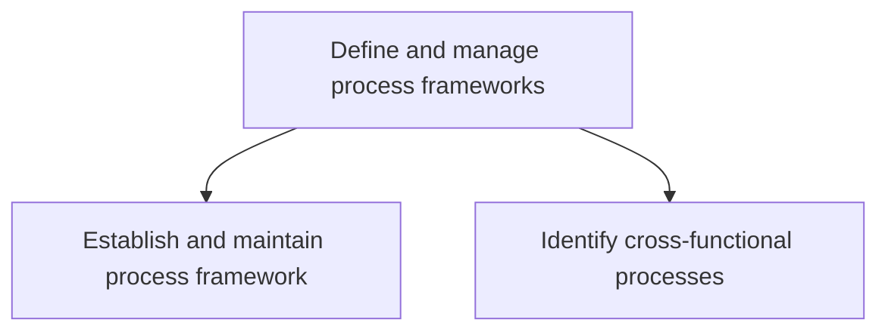
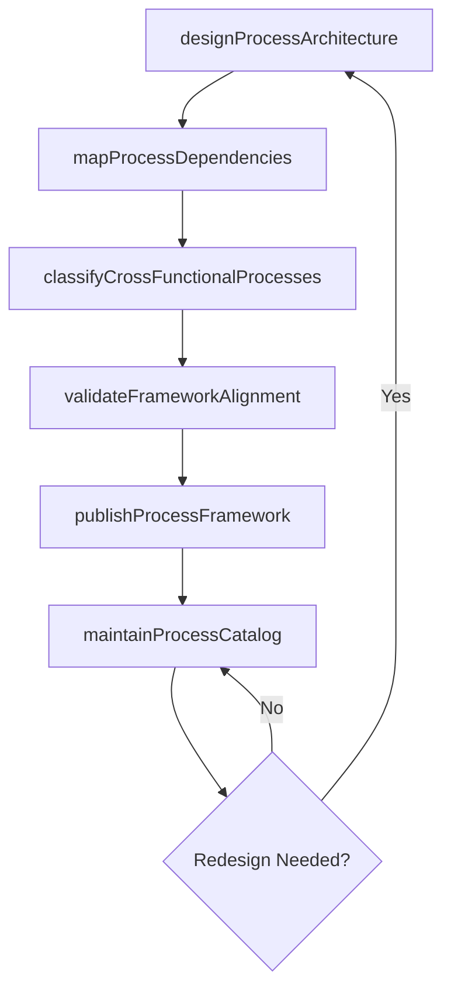

# Define and manage process frameworks

> Business-as-Code definition for business process framework design and management. Models the lifecycle of designing, establishing, and maintaining the enterprise process architecture and identifying cross-functional process dependencies.

## Overview

Determining and organizing the structural composition of business processes. Design, establish, and administer the framework. Identify any cross-functional processes that are mandatory for achieving business excellence.

## Process Hierarchy



## GraphDL

```yaml
define:
  object: And Manage Process Frameworks
  actor: BPMArchitect
  result: ProcessFramework
```

## Actions

| Action | Description |
|--------|-------------|
| designProcessArchitecture | Create the hierarchical structure of enterprise business processes |
| mapProcessDependencies | Identify and document dependencies between processes across functions |
| classifyCrossFunctionalProcesses | Categorize processes that span multiple business units or functions |
| publishProcessFramework | Release the approved process framework for enterprise adoption |
| maintainProcessCatalog | Keep the process catalog current with additions, modifications, and retirements |
| validateFrameworkAlignment | Ensure the process framework aligns with strategic objectives and governance |

## Events

| Event | Description |
|-------|-------------|
| processArchitectureDesigned | Enterprise process hierarchy defined and documented |
| processDependenciesMapped | Cross-process dependency map completed |
| crossFunctionalProcessesClassified | Multi-function processes identified and categorized |
| processFrameworkPublished | Process framework released for enterprise use |
| processCatalogMaintained | Process catalog updated with latest changes |
| frameworkAlignmentValidated | Framework alignment with strategy confirmed |

## Searches

| Search | Description |
|--------|-------------|
| findProcessesByDomain | Retrieve processes filtered by business domain or function |
| getCrossFunctionalProcesses | List processes that span multiple departments |
| getProcessDependencyMap | Query dependency relationships between processes |
| getFrameworkVersionHistory | Retrieve historical versions of the process framework |

## Process Flow



## RACI Matrix

| Activity | Responsible | Accountable | Consulted | Informed |
|----------|-------------|-------------|-----------|----------|
| designProcessArchitecture | BPMArchitect | ProcessGovernanceLead | BusinessUnitHeads | ProcessOwners |
| classifyCrossFunctionalProcesses | ProcessAnalyst | BPMArchitect | FunctionalManagers | GovernanceCouncil |
| publishProcessFramework | BPMArchitect | ProcessGovernanceLead | ChangeManagement | AllDepartments |
| maintainProcessCatalog | ProcessAnalyst | BPMArchitect | ProcessOwners | ITOperations |

## Sub-Processes

| ID | Name | Description |
|----|------|-------------|
| 13.1.2.1 | Establish and maintain process framework | Defining and managing the framework that outlines the required business processes of the organizatio |
| 13.1.2.2 | Identify cross-functional processes | Recognizing the different functional areas working on the same project or goal. |

## Related Processes

| Process | Relationship |
|---------|-------------|
| 13.1.1 Establish and maintain process management governance | Upstream - governance approach drives framework design |
| 13.6.1 Create and manage organizational performance strategy | Downstream - framework informs performance measurement |
| 1.1.1 Assess the external environment | Parallel - external context shapes process framework priorities |

## Related Departments

| Department | Role |
|-----------|------|
| Operations | Primary owner and consumer of the process framework |
| IT | Provides technical architecture alignment for process models |
| Quality | Ensures framework supports quality management standards |
| Strategy | Aligns framework with strategic objectives |

## Related Occupations

| Occupation | Involvement |
|-----------|-------------|
| BPM Architect | Designs and maintains the enterprise process framework |
| Process Analyst | Maps dependencies and classifies cross-functional processes |
| Business Analyst | Provides functional domain input for process classification |

## KPIs

| KPI | Description | Unit |
|-----|-------------|------|
| Framework Coverage | Percentage of enterprise functions represented in the framework | % |
| Cross-Functional Process Count | Number of identified cross-functional processes | Count |
| Framework Update Frequency | How often the process framework is refreshed | Per Year |
| Process Catalog Completeness | Percentage of processes with complete documentation | % |

## Usage

```typescript
import { defineAndManageProcessFrameworks } from '@headlessly/define-and-manage-process-frameworks'

const framework = defineAndManageProcessFrameworks()

// Design the process architecture
const architecture = await framework.designProcessArchitecture({
  scope: 'enterprise',
  levels: ['category', 'processGroup', 'process', 'activity'],
  standard: 'APQC-PCF'
})

// Classify cross-functional processes
const crossFunctional = await framework.classifyCrossFunctionalProcesses({
  frameworkId: architecture.id,
  minDepartments: 2
})

// Publish the process framework
await framework.publishProcessFramework({
  frameworkId: architecture.id,
  version: '3.0',
  effectiveDate: '2025-04-01'
})
```
