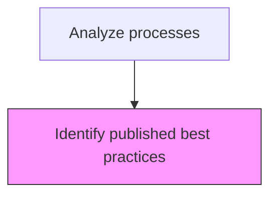
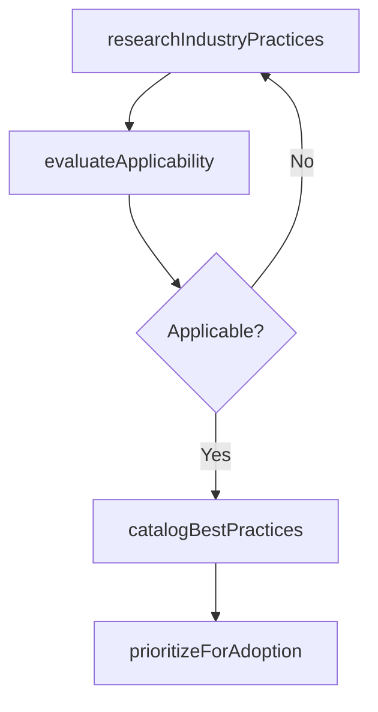

# Identify published best practices

> Business-as-Code definition for best practice identification. Models the research, evaluation, and cataloging of published industry best practices for adoption into organizational processes.

## Overview

Realizing those practices and procedures that are the most effective to the success of the business and making that information available.

## Process Hierarchy



## GraphDL

```yaml
identify:
  object: Published Best Practices
  actor: ProcessAnalyst
  result: BestPracticeCatalog
```

## Actions

| Action | Description |
|--------|-------------|
| researchIndustryPractices | Survey industry publications, frameworks, and standards for relevant best practices |
| evaluateApplicability | Assess whether identified practices are applicable to organizational context |
| catalogBestPractices | Record best practices with sources, applicability ratings, and adoption guidance |
| prioritizeForAdoption | Rank best practices by expected impact and implementation feasibility |

## Events

| Event | Description |
|-------|-------------|
| industryPracticesResearched | Industry best practice survey completed |
| applicabilityEvaluated | Best practice applicability to organization assessed |
| bestPracticesCataloged | Best practices recorded in the organizational knowledge base |
| adoptionPrioritized | Best practices ranked for implementation planning |

## Searches

| Search | Description |
|--------|-------------|
| findBestPractices | List best practices by process area, source, or applicability rating |
| getBestPracticeDetails | Retrieve detailed information for a specific best practice |
| getAdoptionPriorities | List best practices ranked by implementation priority |

## Process Flow



## RACI Matrix

| Activity | Responsible | Accountable | Consulted | Informed |
|----------|-------------|-------------|-----------|----------|
| researchIndustryPractices | ProcessAnalyst | ProcessArchitect | IndustryAdvisors | Management |
| evaluateApplicability | ProcessAnalyst | ProcessArchitect | ProcessOwners | Operations |
| catalogBestPractices | ProcessAnalyst | ProcessArchitect | KnowledgeManagement | AllStaff |

## Related Processes

| Process | Relationship |
|---------|-------------|
| 13.1.3.2 Analyze processes | Parent - best practice identification is part of process analysis |
| 13.1.5 Improve processes | Downstream - best practices inform improvement initiatives |

## Related Departments

| Department | Role |
|-----------|------|
| Business Process Management | Leads best practice research and cataloging |
| Knowledge Management | Maintains the organizational best practice repository |
| Operations | Validates practical applicability of identified practices |

## Related Occupations

| Occupation | Involvement |
|-----------|-------------|
| Process Analyst | Researches and evaluates industry best practices |
| Knowledge Manager | Curates and publishes best practice documentation |

## KPIs

| KPI | Description | Unit |
|-----|-------------|------|
| Best Practice Coverage | Number of best practices identified per process area | Count |
| Adoption Rate | Percentage of cataloged best practices implemented within 12 months | % |
| Source Currency | Average age of best practice references in the catalog | Months |

## Usage

```typescript
import { identifyPublishedBestPractices } from '@headlessly/identify-published-best-practices'

const bestPractices = identifyPublishedBestPractices()

// Research best practices for a process area
const practices = await bestPractices.researchIndustryPractices({
  processArea: 'procure-to-pay',
  sources: ['APQC', 'Gartner', 'McKinsey'],
  publishedAfter: '2024-01-01'
})

// Evaluate applicability to the organization
const assessment = await bestPractices.evaluateApplicability({
  bestPracticeId: practices[0].id,
  organizationContext: { industry: 'manufacturing', size: 'mid-market' }
})
```
