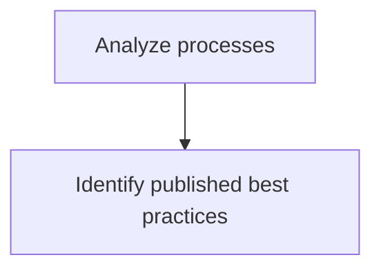
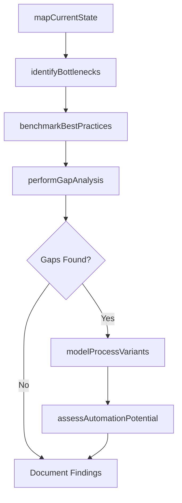

# Analyze processes

> Business-as-Code definition for process analysis. Models the examination of business processes through modeling, gap analysis, best practice identification, and improvement opportunity assessment.

## Overview

Assessing and examining the set of activities and tasks that, once completed, will accomplish an organizational goal. Create a business process model that captures how a business process works and how individuals from different groups work together to achieve a business goal.

## Process Hierarchy



## GraphDL

```yaml
analyze:
  object: Processes
  actor: ProcessAnalyst
  result: ProcessAnalysisReport
```

## Actions

| Action | Description |
|--------|-------------|
| mapCurrentState | Document the as-is process flow with inputs, outputs, and handoffs |
| identifyBottlenecks | Detect constraints and delays in process execution |
| benchmarkBestPractices | Compare current processes against published industry best practices |
| performGapAnalysis | Evaluate differences between current state and target performance |
| modelProcessVariants | Create alternative process models for scenario evaluation |
| assessAutomationPotential | Identify process steps suitable for automation or elimination |

## Events

| Event | Description |
|-------|-------------|
| currentStateMapped | As-is process flow documented and validated |
| bottlenecksIdentified | Process constraints and delays cataloged with impact estimates |
| bestPracticesBenchmarked | Industry best practices compared against current processes |
| gapAnalysisCompleted | Performance gaps quantified between current and target states |
| processVariantsModeled | Alternative process designs created and evaluated |
| automationPotentialAssessed | Automation candidates identified with feasibility ratings |

## Searches

| Search | Description |
|--------|-------------|
| getProcessModels | Retrieve process models by domain, owner, or status |
| findBottlenecks | List identified bottlenecks by severity or process area |
| getBestPractices | Retrieve published best practices by industry or process type |
| getGapAnalysisResults | Retrieve gap analysis findings by process or department |

## Process Flow



## RACI Matrix

| Activity | Responsible | Accountable | Consulted | Informed |
|----------|-------------|-------------|-----------|----------|
| mapCurrentState | ProcessAnalyst | ProcessArchitect | ProcessOwners | Operations |
| identifyBottlenecks | ProcessAnalyst | ProcessArchitect | FrontlineStaff | Management |
| benchmarkBestPractices | ProcessAnalyst | VP Operations | IndustryAdvisors | ContinuousImprovement |
| performGapAnalysis | ProcessAnalyst | ProcessArchitect | IT | Executive |

## Sub-Processes

| ID | Name | Description |
|----|------|-------------|
| 13.1.3.2.1 | Identify published best practices | Realizing those practices and procedures that are the most effective to the success of the business  |

## Related Processes

| Process | Relationship |
|---------|-------------|
| 13.1.3.1 Establish and maintain process framework | Upstream - framework provides the structure for analysis |
| 13.1.3.3 Model and document processes | Downstream - analysis findings feed process documentation |
| 13.1.5 Improve processes | Downstream - gap analysis drives improvement initiatives |

## Related Departments

| Department | Role |
|-----------|------|
| Business Process Management | Primary owner of process analysis activities |
| Operations | Provides process execution data and subject matter expertise |
| IT | Supports process modeling tools and data extraction |
| Continuous Improvement | Consumes analysis outputs for improvement planning |

## Related Occupations

| Occupation | Involvement |
|-----------|-------------|
| Process Analyst | Conducts process mapping, gap analysis, and benchmarking |
| Business Architect | Provides enterprise context for process analysis |
| Lean Six Sigma Practitioner | Applies analytical methodologies for bottleneck identification |

## KPIs

| KPI | Description | Unit |
|-----|-------------|------|
| Process Coverage | Percentage of critical processes with completed analysis | % |
| Bottleneck Detection Rate | Number of bottlenecks identified per analysis cycle | Count |
| Gap Closure Rate | Percentage of identified gaps addressed within target timeline | % |
| Analysis Cycle Time | Average time to complete a full process analysis | Days |

## Usage

```typescript
import { analyzeProcesses } from '@headlessly/analyze-processes'

const analysis = analyzeProcesses()

// Map current state of an order-to-cash process
const processMap = await analysis.mapCurrentState({
  processId: 'PRC-order-to-cash',
  scope: ['order-entry', 'fulfillment', 'invoicing', 'collections'],
  includeHandoffs: true
})

// Perform gap analysis against best practices
const gaps = await analysis.performGapAnalysis({
  processId: 'PRC-order-to-cash',
  benchmarkSource: 'APQC-top-quartile',
  dimensions: ['cycle-time', 'cost-per-transaction', 'error-rate']
})
```
