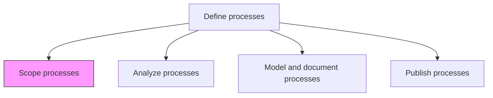
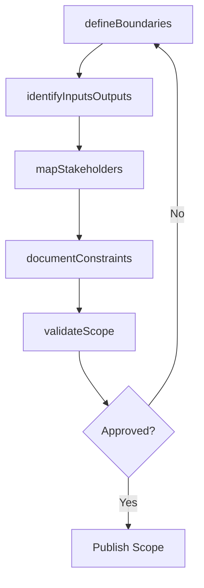

# Scope processes

> Business-as-Code definition for process scoping. Models the definition of process boundaries, inputs, outputs, and the range of activities that constitute each business process.

## Overview

Defining the extent and limits of business processes. Define the range and diversity of all the set of activities and tasks that, once completed, will accomplish an organizational goal.

## Process Hierarchy



## GraphDL

```yaml
scope:
  object: Processes
  actor: ProcessAnalyst
  result: ProcessScopeDocument
```

## Actions

| Action | Description |
|--------|-------------|
| defineBoundaries | Establish the start and end points of a business process |
| identifyInputsOutputs | Catalog the inputs consumed and outputs produced by the process |
| mapStakeholders | Identify all parties involved in or affected by the process |
| documentConstraints | Record limitations, regulations, and policies constraining the process |
| validateScope | Confirm scope completeness with process owners and stakeholders |

## Events

| Event | Description |
|-------|-------------|
| boundariesDefined | Process start and end points established and documented |
| inputsOutputsIdentified | Process inputs and outputs cataloged |
| stakeholdersMapped | Process stakeholders identified and roles clarified |
| constraintsDocumented | Process constraints and regulatory boundaries recorded |
| scopeValidated | Process scope reviewed and approved by stakeholders |

## Searches

| Search | Description |
|--------|-------------|
| getProcessScope | Retrieve scope documentation for a specific process |
| findProcessesByBoundary | List processes with boundaries intersecting a given function or system |
| getProcessInputsOutputs | Retrieve inputs and outputs for a process |

## Process Flow



## RACI Matrix

| Activity | Responsible | Accountable | Consulted | Informed |
|----------|-------------|-------------|-----------|----------|
| defineBoundaries | ProcessAnalyst | ProcessArchitect | ProcessOwner | Operations |
| identifyInputsOutputs | ProcessAnalyst | ProcessArchitect | SubjectMatterExperts | IT |
| validateScope | ProcessOwner | ProcessArchitect | Stakeholders | Management |

## Related Processes

| Process | Relationship |
|---------|-------------|
| 13.1.3.2 Analyze processes | Downstream - scoped processes are analyzed for improvement |
| 13.1.3.3 Model and document processes | Downstream - scope defines what will be modeled |

## Related Departments

| Department | Role |
|-----------|------|
| Business Process Management | Leads scoping activities |
| Operations | Provides operational context for boundary definition |
| Compliance | Advises on regulatory constraints affecting scope |

## Related Occupations

| Occupation | Involvement |
|-----------|-------------|
| Process Analyst | Defines boundaries and documents scope |
| Business Analyst | Identifies inputs, outputs, and stakeholder requirements |

## KPIs

| KPI | Description | Unit |
|-----|-------------|------|
| Scope Completion Rate | Percentage of identified processes with finalized scope documents | % |
| Stakeholder Sign-Off Rate | Percentage of scope documents approved by all stakeholders | % |
| Scope Revision Frequency | Average number of scope revisions before final approval | Count |

## Usage

```typescript
import { scopeProcesses } from '@headlessly/scope-processes'

const scoping = scopeProcesses()

// Define boundaries for a procurement process
const scope = await scoping.defineBoundaries({
  processId: 'PRC-procure-to-pay',
  startEvent: 'purchase-requisition-submitted',
  endEvent: 'payment-disbursed',
  includedDepartments: ['procurement', 'accounts-payable', 'receiving']
})

// Validate scope with stakeholders
const validation = await scoping.validateScope({
  scopeId: scope.id,
  reviewers: ['procurement-manager', 'ap-supervisor', 'cfo']
})
```
