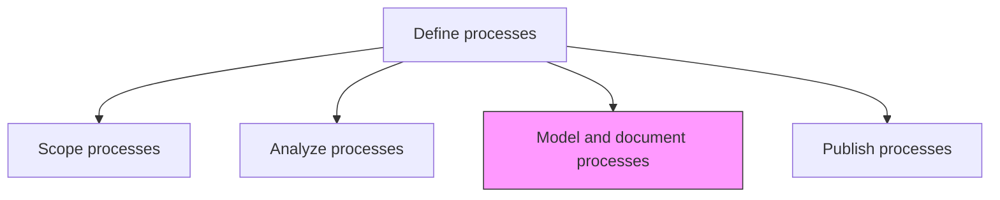
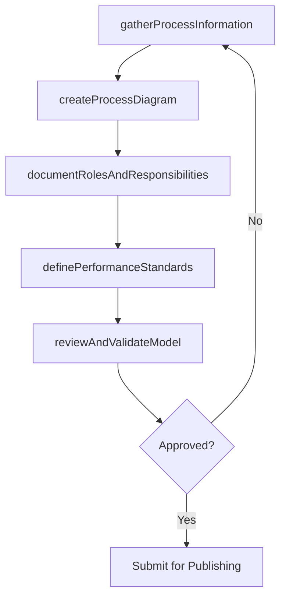

# Model and document processes

> Business-as-Code definition for process modeling and documentation. Models the creation of formal process diagrams, role descriptions, performance standards, and success criteria using structured notation.

## Overview

Defining what a business entity does, who is responsible, to what standard a business process should be completed, and how the success of a business process can be determined. Identify processes, gather information gathering, interview participants, map processes, and perform analysis.

## Process Hierarchy



## GraphDL

```yaml
model:
  object: And Document Processes
  actor: ProcessModeler
  result: ProcessModel
```

## Actions

| Action | Description |
|--------|-------------|
| gatherProcessInformation | Conduct interviews and workshops with process participants to capture current workflows |
| createProcessDiagram | Build visual process models using BPMN or equivalent notation |
| documentRolesAndResponsibilities | Record who performs each process step and their decision authority |
| definePerformanceStandards | Establish expected performance criteria and success measures for the process |
| reviewAndValidateModel | Have process owners and participants verify the accuracy of the model |

## Events

| Event | Description |
|-------|-------------|
| processInformationGathered | Interviews and workshops completed with process data captured |
| processDiagramCreated | Visual process model built and formatted |
| rolesAndResponsibilitiesDocumented | Process roles and decision authorities recorded |
| performanceStandardsDefined | Expected performance criteria established for the process |
| modelValidated | Process model reviewed and confirmed accurate by stakeholders |

## Searches

| Search | Description |
|--------|-------------|
| getProcessModels | Retrieve process models by name, owner, or domain |
| findModelsByNotation | List process models by notation type (BPMN, flowchart, value stream) |
| getModelVersionHistory | Retrieve the revision history for a specific process model |

## Process Flow



## RACI Matrix

| Activity | Responsible | Accountable | Consulted | Informed |
|----------|-------------|-------------|-----------|----------|
| gatherProcessInformation | ProcessModeler | ProcessArchitect | ProcessParticipants | Management |
| createProcessDiagram | ProcessModeler | ProcessArchitect | IT | ProcessOwners |
| reviewAndValidateModel | ProcessOwner | ProcessArchitect | QualityTeam | AllStaff |

## Related Processes

| Process | Relationship |
|---------|-------------|
| 13.1.3.1 Scope processes | Upstream - scope defines the boundaries for modeling |
| 13.1.3.2 Analyze processes | Upstream - analysis findings inform model design |
| 13.1.3.4 Publish processes | Downstream - validated models are published to stakeholders |

## Related Departments

| Department | Role |
|-----------|------|
| Business Process Management | Primary owner of process modeling and documentation |
| IT | Provides process modeling tools and system context |
| Quality | Validates that documentation meets quality standards |

## Related Occupations

| Occupation | Involvement |
|-----------|-------------|
| Process Modeler | Creates diagrams and formal process documentation |
| Business Analyst | Gathers requirements and validates process details |

## KPIs

| KPI | Description | Unit |
|-----|-------------|------|
| Model Accuracy Rate | Percentage of models validated without significant corrections | % |
| Documentation Completeness | Percentage of process models with all required sections completed | % |
| Modeling Cycle Time | Average time from information gathering to validated model | Days |

## Usage

```typescript
import { modelAndDocumentProcesses } from '@headlessly/model-and-document-processes'

const modeling = modelAndDocumentProcesses()

// Create a process diagram
const diagram = await modeling.createProcessDiagram({
  processId: 'PRC-hire-to-retire',
  notation: 'BPMN-2.0',
  swimlanes: ['HR', 'hiring-manager', 'payroll', 'IT'],
  includeExceptions: true
})

// Define performance standards
const standards = await modeling.definePerformanceStandards({
  processId: 'PRC-hire-to-retire',
  metrics: [
    { name: 'time-to-fill', target: 30, unit: 'days' },
    { name: 'offer-acceptance-rate', target: 0.85, unit: 'percentage' }
  ]
})
```
