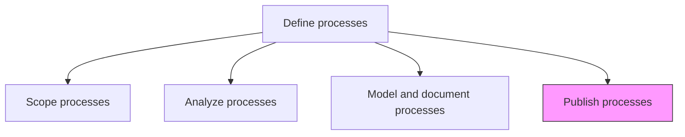
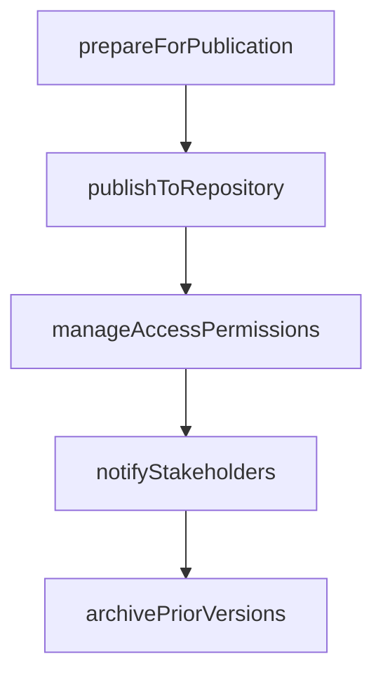

# Publish processes

> Business-as-Code definition for process publication. Models the release of validated process documentation to stakeholders through BPM platforms, portals, and communication channels.

## Overview

Disclosing the information available on business processes. Ensure the availability of the information regarding the business processes to all process team members, business stakeholders, and process owners. Use BPM software, as well as business process diagrams and documents that help depict the required information.

## Process Hierarchy



## GraphDL

```yaml
publish:
  object: Processes
  actor: ProcessDocumentationManager
  result: PublishedProcessRepository
```

## Actions

| Action | Description |
|--------|-------------|
| prepareForPublication | Format and finalize process documents for release |
| publishToRepository | Deploy process models and documentation to the BPM platform |
| notifyStakeholders | Communicate availability of new or updated process documentation |
| manageAccessPermissions | Configure who can view and edit published process content |
| archivePriorVersions | Move superseded process versions to the archive |

## Events

| Event | Description |
|-------|-------------|
| publicationPrepared | Process documentation formatted and ready for release |
| processPublished | Process models and documents deployed to the BPM platform |
| stakeholdersNotified | Publication notification sent to relevant stakeholders |
| accessPermissionsConfigured | View and edit permissions set for published content |
| priorVersionArchived | Previous process version archived with timestamp |

## Searches

| Search | Description |
|--------|-------------|
| getPublishedProcesses | List all currently published process documents |
| findRecentPublications | Retrieve processes published or updated within a date range |
| getProcessAccessLog | Retrieve access and view statistics for published processes |

## Process Flow



## RACI Matrix

| Activity | Responsible | Accountable | Consulted | Informed |
|----------|-------------|-------------|-----------|----------|
| publishToRepository | ProcessDocumentationManager | ProcessArchitect | IT | AllProcessOwners |
| notifyStakeholders | ProcessDocumentationManager | ProcessArchitect | Communications | AllStaff |
| manageAccessPermissions | ProcessDocumentationManager | ProcessArchitect | InformationSecurity | HR |

## Related Processes

| Process | Relationship |
|---------|-------------|
| 13.1.3.3 Model and document processes | Upstream - validated models are the input for publishing |
| 13.1.4.1 Provide process training | Downstream - published processes serve as training materials |

## Related Departments

| Department | Role |
|-----------|------|
| Business Process Management | Manages the process publication lifecycle |
| IT | Maintains the BPM platform and repository infrastructure |
| Communications | Supports stakeholder notification and awareness |

## Related Occupations

| Occupation | Involvement |
|-----------|-------------|
| Process Documentation Manager | Prepares and publishes process materials |
| BPM Platform Administrator | Manages the technical publishing infrastructure |

## KPIs

| KPI | Description | Unit |
|-----|-------------|------|
| Publication Timeliness | Percentage of approved processes published within SLA | % |
| Stakeholder Reach | Percentage of targeted stakeholders who accessed published content | % |
| Repository Currency | Percentage of published processes reviewed within their cycle | % |

## Usage

```typescript
import { publishProcesses } from '@headlessly/publish-processes'

const publishing = publishProcesses()

// Publish a process to the repository
const publication = await publishing.publishToRepository({
  processId: 'PRC-order-to-cash',
  version: '3.1',
  effectiveDate: '2026-02-01',
  format: ['BPMN', 'PDF', 'interactive']
})

// Notify stakeholders of the update
await publishing.notifyStakeholders({
  publicationId: publication.id,
  audiences: ['process-owners', 'operations-staff', 'training-team'],
  channel: 'email'
})
```
