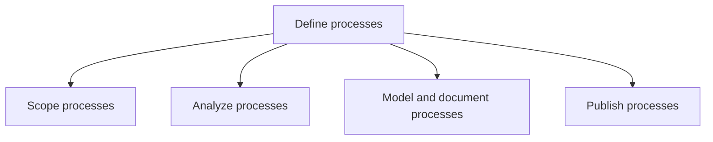
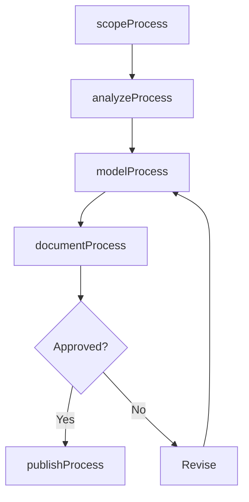

# Define processes

> Business-as-Code definition for business process definition. Models the complete workflow of scoping, analyzing, modeling, documenting, and publishing business processes for organizational use.

## Overview

Outlining and establishing the business processes of the organization. Scope, analyze, map, and publish processes for the employees who may require it.

## Process Hierarchy



## GraphDL

```yaml
define:
  object: Processes
  actor: ProcessArchitect
  result: ProcessDefinition
```

## Actions

| Action | Description |
|--------|-------------|
| scopeProcess | Define the boundaries, inputs, outputs, and stakeholders of a process |
| analyzeProcess | Examine process steps to identify best practices, bottlenecks, and redundancies |
| modelProcess | Create visual process models using standard notation such as BPMN |
| documentProcess | Write detailed process documentation including roles, rules, and exceptions |
| publishProcess | Release approved process definitions to the enterprise process repository |
| versionProcess | Create a new version of an existing process definition |

## Events

| Event | Description |
|-------|-------------|
| processScoped | Process boundaries and scope defined and approved |
| processAnalyzed | Process analysis completed with findings documented |
| processModeled | Visual process model created and validated |
| processDocumented | Process documentation completed with all required detail |
| processPublished | Process definition released to the enterprise repository |
| processVersioned | New version of a process definition created |

## Searches

| Search | Description |
|--------|-------------|
| findProcessDefinitions | List process definitions filtered by domain, status, or owner |
| getProcessModel | Retrieve the current BPMN or flow model for a specific process |
| getProcessVersionHistory | Retrieve the version history and changelog for a process definition |
| findUndocumentedProcesses | List processes that lack current documentation |

## Process Flow



## RACI Matrix

| Activity | Responsible | Accountable | Consulted | Informed |
|----------|-------------|-------------|-----------|----------|
| scopeProcess | ProcessAnalyst | ProcessArchitect | ProcessOwner | PMO |
| analyzeProcess | ProcessAnalyst | ProcessArchitect | SubjectMatterExperts | Operations |
| modelProcess | ProcessAnalyst | ProcessArchitect | IT | QualityTeam |
| documentProcess | TechnicalWriter | ProcessArchitect | ProcessOwner | AllStakeholders |
| publishProcess | ProcessArchitect | VP Operations | QualityManager | AllEmployees |

## Sub-Processes

| ID | Name | Description |
|----|------|-------------|
| 13.1.3.1 | Scope processes | Defining the extent and limits of business processes. Define the range and diversity of all the set  |
| 13.1.3.2 | Analyze processes | Assessing and examining the set of activities and tasks that, once completed, will accomplish an org |
| 13.1.3.3 | Model and document processes | Defining what a business entity does, who is responsible, to what standard a business process should |
| 13.1.3.4 | Publish processes | Disclosing the information available on business processes. Ensure the availability of the informati |

## Related Processes

| Process | Relationship |
|---------|-------------|
| 13.1.2 Define and manage process frameworks | Upstream - framework provides structure for process definitions |
| 13.1.4 Manage process performance | Downstream - defined processes are measured for performance |
| 13.1.5 Improve processes | Downstream - process definitions are refined through improvement cycles |

## Related Departments

| Department | Role |
|-----------|------|
| Business Process Management | Primary owner of process definition activities |
| Quality Assurance | Validates process definitions against quality standards |
| IT | Supports process modeling tools and repository infrastructure |
| Operations | Key stakeholder providing subject matter expertise |

## Related Occupations

| Occupation | Involvement |
|-----------|-------------|
| Process Architect | Leads process scoping, modeling, and publication |
| Business Process Analyst | Analyzes and documents process details |
| Technical Writer | Creates clear process documentation |

## KPIs

| KPI | Description | Unit |
|-----|-------------|------|
| Process Documentation Coverage | Percentage of identified processes with current documentation | % |
| Definition Cycle Time | Average time from scoping to publication of a process definition | Days |
| Process Model Accuracy | Percentage of process models validated by process owners | % |
| Publication Timeliness | Percentage of process definitions published within target timeline | % |

## Usage

```typescript
import { defineProcesses } from '@headlessly/define-processes'

const processes = defineProcesses()

// Scope a new process
const scope = await processes.scopeProcess({
  name: 'customer-onboarding',
  domain: 'customer-success',
  inputs: ['signed-contract', 'customer-profile'],
  outputs: ['active-account', 'welcome-package']
})

// Publish the documented process
const published = await processes.publishProcess({
  processId: scope.id,
  version: '1.0',
  approvedBy: 'process-governance-board'
})
```
