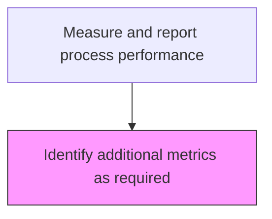
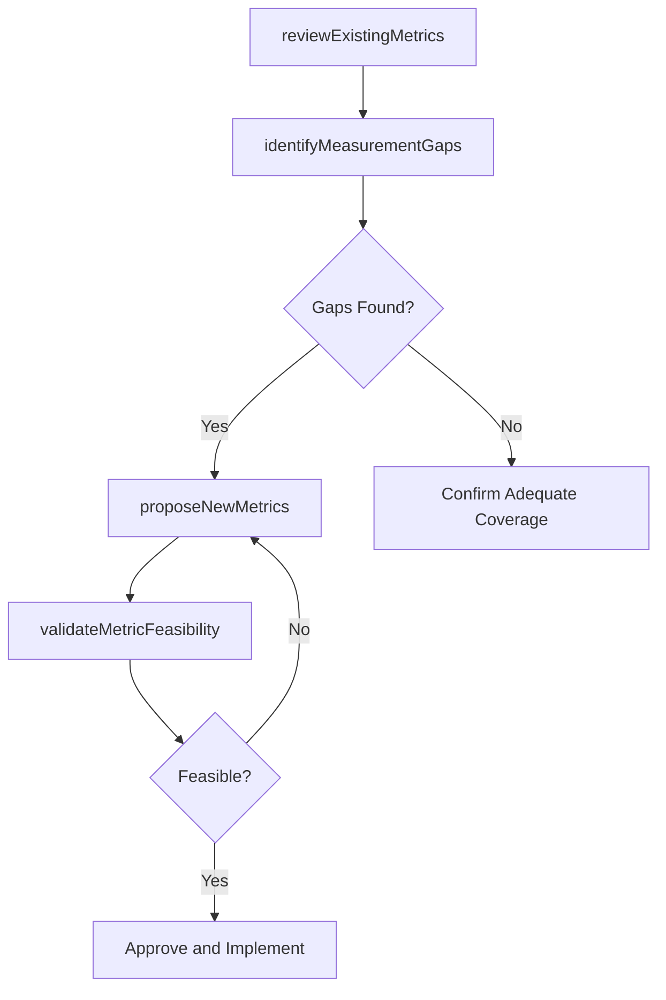

# Identify additional metrics as required

> Business-as-Code definition for supplemental metric identification. Models the evaluation of existing performance indicators and determination of additional metrics needed to achieve business objectives.

## Overview

Determining the need for additional performance indicators that would be necessary to successfully achieve the business goal.

## Process Hierarchy



## GraphDL

```yaml
identify:
  object: Additional Metrics As Required
  actor: ProcessPerformanceAnalyst
  result: MetricProposal
```

## Actions

| Action | Description |
|--------|-------------|
| reviewExistingMetrics | Assess whether current indicators adequately measure process performance |
| identifyMeasurementGaps | Detect areas where performance is not being captured by existing metrics |
| proposeNewMetrics | Define new performance indicators with calculation methods and data sources |
| validateMetricFeasibility | Confirm that proposed metrics can be reliably collected and calculated |

## Events

| Event | Description |
|-------|-------------|
| existingMetricsReviewed | Current performance indicator coverage assessed |
| measurementGapsIdentified | Uncovered performance dimensions documented |
| newMetricsProposed | Additional indicators defined with specifications |
| metricFeasibilityValidated | Proposed metrics confirmed as collectible and calculable |

## Searches

| Search | Description |
|--------|-------------|
| getMetricGaps | Retrieve identified measurement gaps by process or business goal |
| findProposedMetrics | List pending metric proposals by status or process area |
| getMetricCoverage | Retrieve metric coverage analysis for a process |

## Process Flow



## RACI Matrix

| Activity | Responsible | Accountable | Consulted | Informed |
|----------|-------------|-------------|-----------|----------|
| reviewExistingMetrics | ProcessPerformanceAnalyst | VP Operations | ProcessOwners | Finance |
| proposeNewMetrics | ProcessPerformanceAnalyst | VP Operations | DataAnalysts | IT |
| validateMetricFeasibility | DataAnalyst | ProcessPerformanceAnalyst | IT | ProcessOwners |

## Related Processes

| Process | Relationship |
|---------|-------------|
| 13.1.4.3 Measure and report process performance | Parent - this task supplements the measurement framework |
| 13.6.3.1 Establish appropriate performance indicators | Related - metric identification follows similar methodology |

## Related Departments

| Department | Role |
|-----------|------|
| Business Process Management | Identifies metric gaps and proposes new indicators |
| IT | Validates data availability for proposed metrics |
| Finance | Advises on financial metric requirements |

## Related Occupations

| Occupation | Involvement |
|-----------|-------------|
| Process Performance Analyst | Identifies gaps and designs new metrics |
| Data Analyst | Assesses data availability and feasibility |

## KPIs

| KPI | Description | Unit |
|-----|-------------|------|
| Metric Gap Closure Rate | Percentage of identified metric gaps addressed within target timeline | % |
| Metric Approval Rate | Percentage of proposed metrics approved for implementation | % |
| Coverage Improvement | Increase in process metric coverage after new metrics added | % |

## Usage

```typescript
import { identifyAdditionalMetricsAsRequired } from '@headlessly/identify-additional-metrics-as-required'

const metricReview = identifyAdditionalMetricsAsRequired()

// Review existing metrics for a process
const gaps = await metricReview.identifyMeasurementGaps({
  processId: 'PRC-customer-onboarding',
  currentMetrics: ['time-to-onboard', 'completion-rate'],
  businessGoals: ['reduce-churn', 'increase-satisfaction']
})

// Propose new metrics
const proposal = await metricReview.proposeNewMetrics({
  processId: 'PRC-customer-onboarding',
  metrics: [
    { name: 'first-value-time', calculation: 'days-to-first-feature-use', dataSource: 'product-analytics' },
    { name: 'onboarding-nps', calculation: 'survey-score', dataSource: 'feedback-system' }
  ]
})
```
