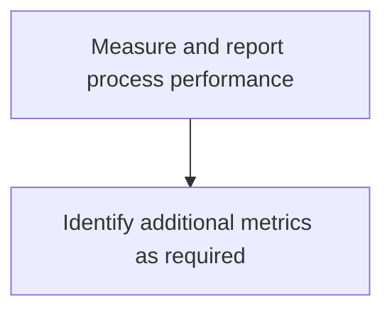
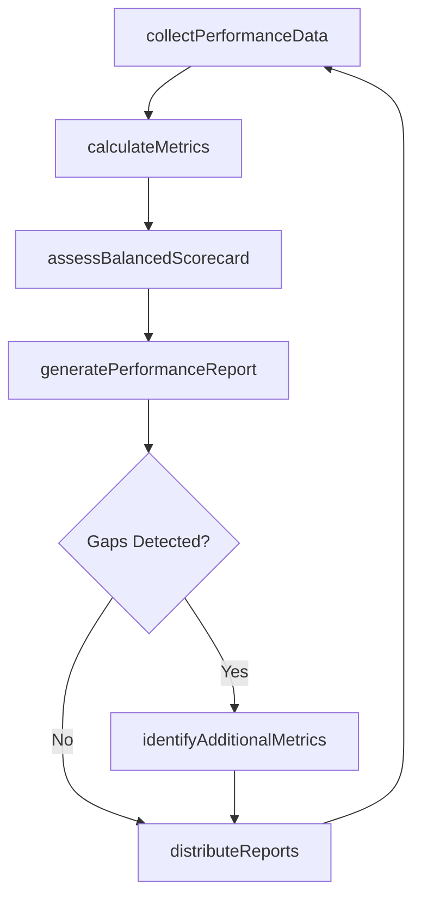

# Measure and report process performance

> Business-as-Code definition for process performance measurement and reporting. Models the collection, calculation, and presentation of balanced scorecard metrics across financial, customer, internal process, and learning perspectives.

## Overview

Defining and using performance indicators to consider the financial perspective, customer perspective, internal process perspective, and learning perspective of the organization.

## Process Hierarchy



## GraphDL

```yaml
measure:
  object: And Report Process Performance
  actor: ProcessPerformanceAnalyst
  result: ProcessPerformanceReport
```

## Actions

| Action | Description |
|--------|-------------|
| collectPerformanceData | Gather process execution data from operational systems |
| calculateMetrics | Compute performance indicators from collected raw data |
| assessBalancedScorecard | Evaluate performance across financial, customer, process, and learning perspectives |
| generatePerformanceReport | Produce formatted reports with visualizations and trend analysis |
| identifyAdditionalMetrics | Determine need for new or refined performance indicators |
| distributeReports | Deliver performance reports to stakeholders on defined cadence |

## Events

| Event | Description |
|-------|-------------|
| performanceDataCollected | Process performance data gathered and validated |
| metricsCalculated | Performance indicators computed and stored |
| balancedScorecardAssessed | Multi-perspective performance evaluation completed |
| performanceReportGenerated | Performance report produced and ready for distribution |
| additionalMetricsIdentified | New performance indicators proposed and approved |
| reportsDistributed | Performance reports delivered to all stakeholders |

## Searches

| Search | Description |
|--------|-------------|
| getProcessMetrics | Retrieve performance metrics by process, period, or perspective |
| getPerformanceTrends | Retrieve historical metric values for trend analysis |
| findMetricAnomalies | List metrics deviating from expected ranges or thresholds |
| getReportHistory | Retrieve previously generated performance reports |

## Process Flow



## RACI Matrix

| Activity | Responsible | Accountable | Consulted | Informed |
|----------|-------------|-------------|-----------|----------|
| collectPerformanceData | DataAnalyst | ProcessPerformanceAnalyst | IT | ProcessOwners |
| calculateMetrics | ProcessPerformanceAnalyst | VP Operations | Finance | Management |
| generatePerformanceReport | ProcessPerformanceAnalyst | VP Operations | ProcessOwners | Executive |
| identifyAdditionalMetrics | ProcessPerformanceAnalyst | VP Operations | ProcessOwners | ContinuousImprovement |

## Sub-Processes

| ID | Name | Description |
|----|------|-------------|
| 13.1.4.3.1 | Identify additional metrics as required | Determining the need for additional performance indicators that would be necessary to successfully a |

## Related Processes

| Process | Relationship |
|---------|-------------|
| 13.1.4.1 Establish process goals | Upstream - goals define target values for metrics |
| 13.1.4.2 Assess process capabilities | Upstream - capability baselines inform measurement design |
| 13.6.3 Evaluate process performance | Parallel - uses same data for broader performance evaluation |

## Related Departments

| Department | Role |
|-----------|------|
| Business Process Management | Primary owner of process measurement and reporting |
| IT | Provides data collection infrastructure and reporting tools |
| Finance | Supplies financial performance perspective data |
| Operations | Provides process execution data and operational context |

## Related Occupations

| Occupation | Involvement |
|-----------|-------------|
| Process Performance Analyst | Designs metrics, calculates indicators, and produces reports |
| Data Analyst | Collects and validates process performance datasets |
| Business Intelligence Developer | Builds dashboards and automated reporting pipelines |

## KPIs

| KPI | Description | Unit |
|-----|-------------|------|
| Metric Coverage | Percentage of critical processes with active performance indicators | % |
| Report Timeliness | Percentage of performance reports delivered on schedule | % |
| Data Accuracy Rate | Percentage of data points validated without corrections | % |
| Stakeholder Satisfaction | Satisfaction rating from report consumers on usefulness | Score (1-5) |

## Usage

```typescript
import { measureAndReportProcessPerformance } from '@headlessly/measure-and-report-process-performance'

const measurement = measureAndReportProcessPerformance()

// Collect and calculate metrics for a process
const metrics = await measurement.calculateMetrics({
  processId: 'PRC-procure-to-pay',
  period: '2026-Q1',
  perspectives: ['financial', 'customer', 'internal-process', 'learning']
})

// Generate a performance report
const report = await measurement.generatePerformanceReport({
  processId: 'PRC-procure-to-pay',
  period: '2026-Q1',
  format: 'balanced-scorecard',
  includeVisualizations: true
})
```
