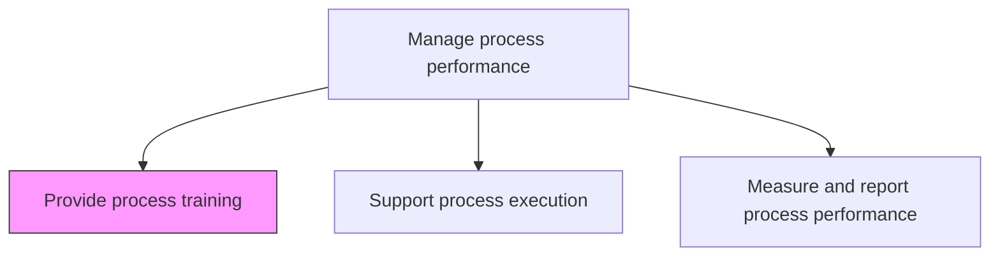
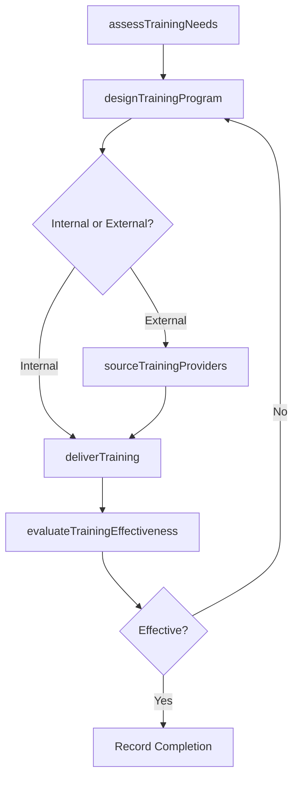

# Provide process training

> Business-as-Code definition for process training delivery. Models the design, sourcing, and delivery of training programs that equip employees and process owners to execute business processes effectively.

## Overview

Providing training for the employees and process owners that administer the business processes. Design internal training programs or source third party agencies to provide the skills and training necessary.

## Process Hierarchy



## GraphDL

```yaml
provide:
  object: Process Training
  actor: ProcessTrainer
  result: TrainingCompletionRecord
```

## Actions

| Action | Description |
|--------|-------------|
| assessTrainingNeeds | Identify skill gaps among process owners and participants |
| designTrainingProgram | Create training curriculum covering process steps, tools, and standards |
| sourceTrainingProviders | Evaluate and select third-party training agencies when needed |
| deliverTraining | Conduct training sessions through classroom, on-the-job, or online formats |
| evaluateTrainingEffectiveness | Measure participant knowledge retention and performance improvement |

## Events

| Event | Description |
|-------|-------------|
| trainingNeedsAssessed | Skill gaps identified and training requirements documented |
| trainingProgramDesigned | Training curriculum created and approved |
| trainingProvidersSourced | Third-party training providers evaluated and selected |
| trainingDelivered | Training session completed with attendance recorded |
| trainingEffectivenessEvaluated | Post-training assessment completed with results documented |

## Searches

| Search | Description |
|--------|-------------|
| getTrainingPrograms | List available process training programs by topic or format |
| findTrainingRecords | Retrieve training completion records by employee or process |
| getTrainingNeeds | List identified training gaps by department or process area |

## Process Flow



## RACI Matrix

| Activity | Responsible | Accountable | Consulted | Informed |
|----------|-------------|-------------|-----------|----------|
| assessTrainingNeeds | ProcessTrainer | ProcessPerformanceManager | ProcessOwners | HR |
| designTrainingProgram | ProcessTrainer | ProcessPerformanceManager | SubjectMatterExperts | Operations |
| deliverTraining | ProcessTrainer | ProcessPerformanceManager | IT | AllParticipants |

## Related Processes

| Process | Relationship |
|---------|-------------|
| 13.1.4.2 Support process execution | Parallel - training enables effective process execution |
| 13.1.3.4 Publish processes | Upstream - published processes define training content |

## Related Departments

| Department | Role |
|-----------|------|
| Business Process Management | Designs process-specific training content |
| Human Resources | Manages training records and compliance tracking |
| Learning and Development | Provides training delivery infrastructure |

## Related Occupations

| Occupation | Involvement |
|-----------|-------------|
| Process Trainer | Designs and delivers process training programs |
| Learning Designer | Creates training materials and assessments |

## KPIs

| KPI | Description | Unit |
|-----|-------------|------|
| Training Completion Rate | Percentage of required process training completed on schedule | % |
| Knowledge Retention Score | Average post-training assessment score | Score (0-100) |
| Time to Competency | Average time from training start to demonstrated process competency | Days |

## Usage

```typescript
import { provideProcessTraining } from '@headlessly/provide-process-training'

const training = provideProcessTraining()

// Assess training needs for a department
const needs = await training.assessTrainingNeeds({
  department: 'accounts-payable',
  processIds: ['PRC-invoice-processing', 'PRC-vendor-management'],
  assessmentMethod: 'skills-gap-analysis'
})

// Deliver a training session
const session = await training.deliverTraining({
  programId: 'TRN-invoice-processing-v2',
  format: 'virtual-classroom',
  participants: needs.targetEmployees
})
```
