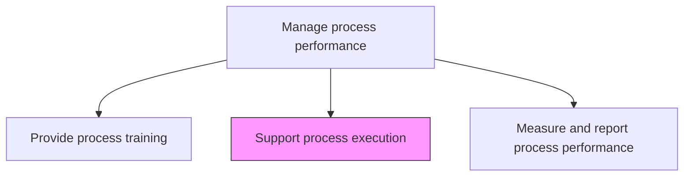
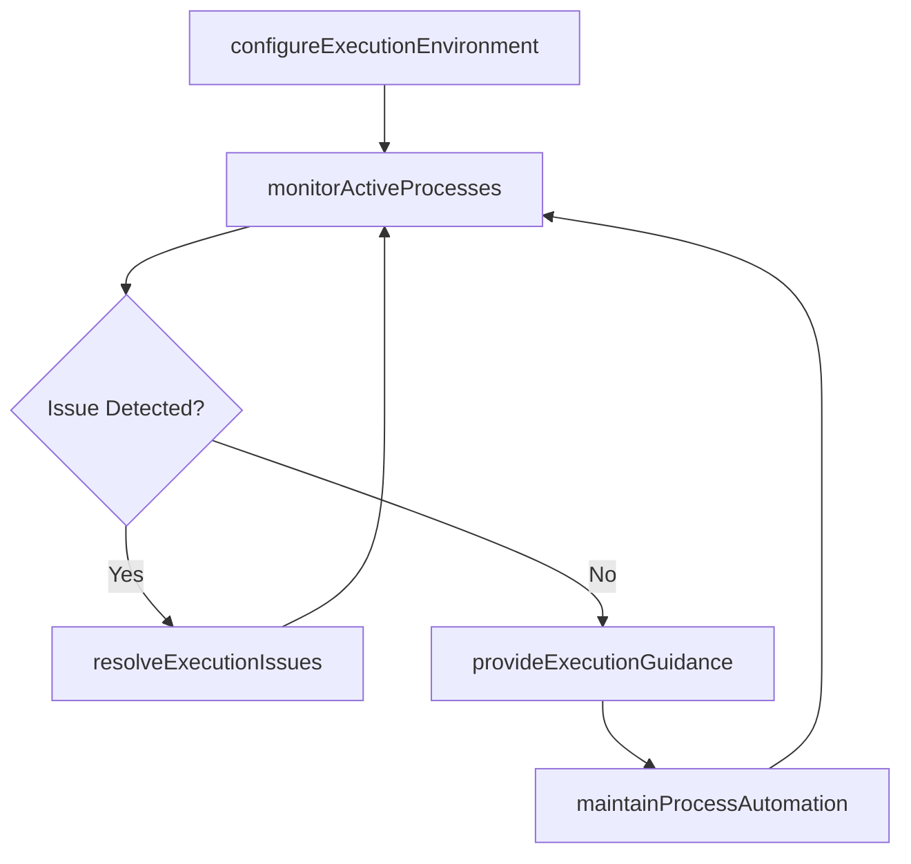

# Support process execution

> Business-as-Code definition for process execution support. Models the operational assistance, tooling, and automation that enable business processes to run according to their defined specifications.

## Overview

Assisting and executing the business processes. Use business process execution language (BEPL), which is a standard, executable language for specifying actions within the business processes with the use of web services.

## Process Hierarchy



## GraphDL

```yaml
support:
  object: Process Execution
  actor: ProcessSupportSpecialist
  result: ProcessExecutionLog
```

## Actions

| Action | Description |
|--------|-------------|
| configureExecutionEnvironment | Set up BPM tools, workflow engines, and integration services for process execution |
| monitorActiveProcesses | Track running process instances and detect execution anomalies |
| resolveExecutionIssues | Troubleshoot and resolve process execution failures or blockages |
| maintainProcessAutomation | Update and maintain automated process workflows and integrations |
| provideExecutionGuidance | Deliver real-time support to process participants during execution |

## Events

| Event | Description |
|-------|-------------|
| executionEnvironmentConfigured | BPM tools and workflow engines set up for process execution |
| activeProcessesMonitored | Running process instances tracked and status updated |
| executionIssueResolved | Process execution failure diagnosed and remediated |
| processAutomationMaintained | Automated workflows updated and validated |
| executionGuidanceProvided | Real-time support delivered to process participants |

## Searches

| Search | Description |
|--------|-------------|
| getActiveProcessInstances | List currently running process instances by type or status |
| findExecutionIssues | Retrieve process execution failures by type or severity |
| getAutomationStatus | Retrieve the health and status of automated process workflows |

## Process Flow



## RACI Matrix

| Activity | Responsible | Accountable | Consulted | Informed |
|----------|-------------|-------------|-----------|----------|
| configureExecutionEnvironment | ProcessSupportSpecialist | ProcessPerformanceManager | IT | ProcessOwners |
| monitorActiveProcesses | ProcessSupportSpecialist | ProcessPerformanceManager | Operations | Management |
| resolveExecutionIssues | ProcessSupportSpecialist | ProcessPerformanceManager | ProcessOwners | Stakeholders |

## Related Processes

| Process | Relationship |
|---------|-------------|
| 13.1.4.1 Provide process training | Parallel - trained staff execute supported processes |
| 13.1.4.3 Measure and report process performance | Downstream - execution data feeds performance measurement |

## Related Departments

| Department | Role |
|-----------|------|
| Business Process Management | Provides process execution guidance and issue resolution |
| IT | Maintains BPM platforms and workflow automation infrastructure |
| Operations | Executes processes with support from BPM team |

## Related Occupations

| Occupation | Involvement |
|-----------|-------------|
| Process Support Specialist | Monitors execution and resolves issues in real time |
| BPM Platform Administrator | Configures and maintains the execution environment |

## KPIs

| KPI | Description | Unit |
|-----|-------------|------|
| Process Uptime | Percentage of time automated processes are available and running | % |
| Issue Resolution Time | Average time from execution failure detection to resolution | Hours |
| Automation Coverage | Percentage of process steps supported by workflow automation | % |

## Usage

```typescript
import { supportProcessExecution } from '@headlessly/support-process-execution'

const support = supportProcessExecution()

// Monitor active process instances
const instances = await support.monitorActiveProcesses({
  processType: 'order-fulfillment',
  status: 'running',
  alertOnDelay: true,
  delayThresholdMinutes: 60
})

// Resolve an execution issue
const resolution = await support.resolveExecutionIssues({
  instanceId: instances.delayed[0].id,
  issueType: 'integration-timeout',
  action: 'retry-with-backoff'
})
```
