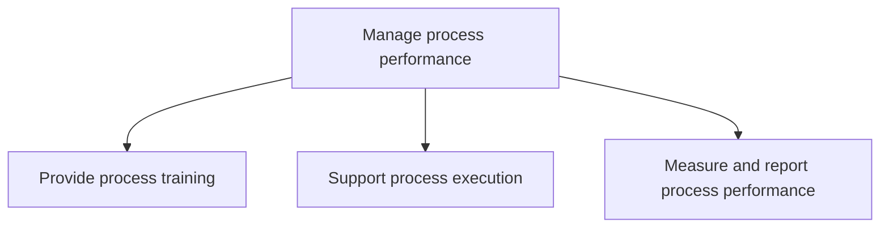
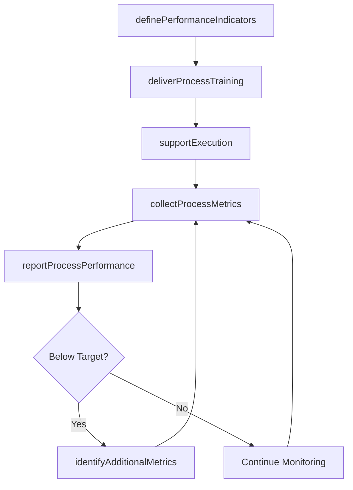

# Manage process performance

> Business-as-Code definition for process performance management. Models the lifecycle of training process owners, supporting process execution, and measuring and reporting process outcomes against key indicators.

## Overview

Evaluating and handling the performance of business processes. Provide training to process owners. Support the execution of business processes. Measure and report the performance of the business processes.

## Process Hierarchy



## GraphDL

```yaml
manage:
  object: Process Performance
  actor: ProcessPerformanceManager
  result: ProcessPerformanceReport
```

## Actions

| Action | Description |
|--------|-------------|
| deliverProcessTraining | Conduct training sessions for process owners and operators |
| supportExecution | Provide runtime guidance and tooling support for active business processes |
| definePerformanceIndicators | Establish KPIs aligned to financial, customer, and operational perspectives |
| collectProcessMetrics | Gather performance data from process execution systems |
| reportProcessPerformance | Generate dashboards and reports on process health and outcomes |
| identifyAdditionalMetrics | Determine supplementary metrics needed to close measurement gaps |

## Events

| Event | Description |
|-------|-------------|
| processTrainingDelivered | Process training session completed with attendance recorded |
| executionSupported | Process execution assistance provided to an operational team |
| performanceIndicatorsDefined | Process KPIs established and baselined |
| processMetricsCollected | Performance data gathered from process execution systems |
| processPerformanceReported | Process performance report published to stakeholders |
| additionalMetricsIdentified | Supplementary metrics defined to close measurement gaps |

## Searches

| Search | Description |
|--------|-------------|
| getProcessKPIs | Retrieve current KPI values for a specific process |
| findTrainingRecords | List training completion records by process or employee |
| getPerformanceTrends | Retrieve historical performance trends for a process |
| findUnderperformingProcesses | List processes performing below target thresholds |

## Process Flow



## RACI Matrix

| Activity | Responsible | Accountable | Consulted | Informed |
|----------|-------------|-------------|-----------|----------|
| deliverProcessTraining | ProcessTrainer | ProcessPerformanceManager | ProcessOwners | HR |
| supportExecution | ProcessAnalyst | ProcessPerformanceManager | IT | Operations |
| definePerformanceIndicators | ProcessAnalyst | ProcessPerformanceManager | Finance | Executive |
| collectProcessMetrics | DataAnalyst | ProcessPerformanceManager | IT | ProcessOwners |
| reportProcessPerformance | ProcessAnalyst | ProcessPerformanceManager | QualityTeam | SteeringCommittee |

## Sub-Processes

| ID | Name | Description |
|----|------|-------------|
| 13.1.4.1 | Provide process training | Providing training for the employees and process owners that administer the business processes. Desi |
| 13.1.4.2 | Support process execution | Assisting and executing the business processes. Use business process execution language (BEPL), whic |
| 13.1.4.3 | Measure and report process performance | Defining and using performance indicators to consider the financial perspective, customer perspectiv |

## Related Processes

| Process | Relationship |
|---------|-------------|
| 13.1.3 Define processes | Upstream - process definitions provide the baseline for performance measurement |
| 13.1.5 Improve processes | Downstream - performance insights trigger process improvements |
| 13.6 Measure and benchmark | Parallel - feeds into enterprise-wide benchmarking |

## Related Departments

| Department | Role |
|-----------|------|
| Business Process Management | Primary owner of process performance monitoring |
| Training and Development | Delivers process-related training programs |
| IT | Provides process execution engines and data collection tools |
| Quality Assurance | Validates measurement methods and data accuracy |

## Related Occupations

| Occupation | Involvement |
|-----------|-------------|
| Process Performance Manager | Oversees process measurement and reporting |
| Business Process Analyst | Designs KPIs and analyzes performance data |
| Process Trainer | Delivers training to process owners and operators |

## KPIs

| KPI | Description | Unit |
|-----|-------------|------|
| Training Completion Rate | Percentage of process owners completing required training | % |
| Process Cycle Time | Average elapsed time for end-to-end process completion | Hours |
| Process Throughput | Volume of process instances completed per time period | Count/Period |
| SLA Compliance | Percentage of process instances meeting service-level targets | % |

## Usage

```typescript
import { manageProcessPerformance } from '@headlessly/manage-process-performance'

const perf = manageProcessPerformance()

// Define performance indicators for a process
const kpis = await perf.definePerformanceIndicators({
  processId: 'PRC-invoice-processing',
  indicators: [
    { name: 'cycle-time', target: 48, unit: 'hours' },
    { name: 'error-rate', target: 0.02, unit: 'percentage' }
  ]
})

// Report on process performance
const report = await perf.reportProcessPerformance({
  processId: 'PRC-invoice-processing',
  period: '2026-Q1',
  format: 'dashboard'
})
```
