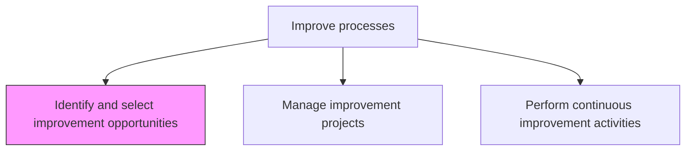
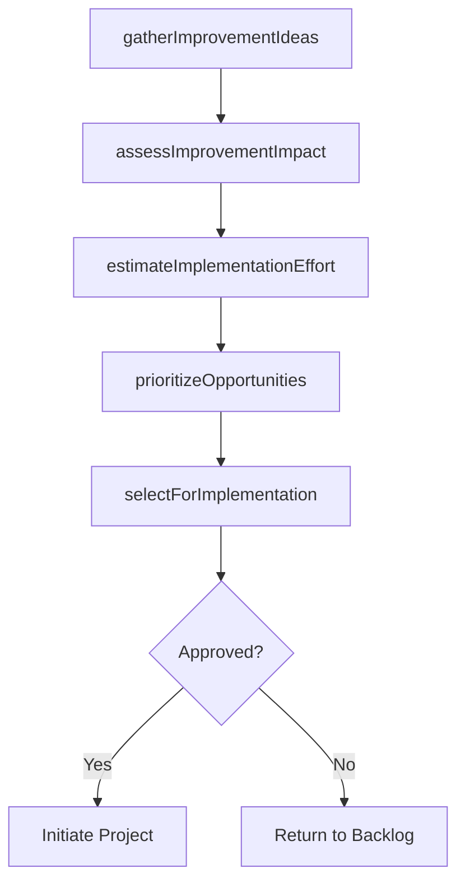

# Identify and select improvement opportunities

> Business-as-Code definition for improvement opportunity identification. Models the discovery, evaluation, and prioritization of process improvement opportunities aligned with organizational goals.

## Overview

Helping a process owner to identify, analyze, and improve existing business processes within an organization to meet new goals and objectives.

## Process Hierarchy



## GraphDL

```yaml
identify:
  object: And Select Improvement Opportunities
  actor: ContinuousImprovementLead
  result: ImprovementOpportunityPortfolio
```

## Actions

| Action | Description |
|--------|-------------|
| gatherImprovementIdeas | Collect improvement suggestions from process owners, staff, and performance data |
| assessImprovementImpact | Evaluate the potential benefit of each improvement opportunity |
| estimateImplementationEffort | Determine the resources, cost, and time required for each opportunity |
| prioritizeOpportunities | Rank improvement opportunities by impact, effort, and strategic alignment |
| selectForImplementation | Approve top-priority opportunities for project initiation |

## Events

| Event | Description |
|-------|-------------|
| improvementIdeasGathered | Improvement suggestions collected and cataloged |
| improvementImpactAssessed | Potential benefit of opportunities evaluated |
| implementationEffortEstimated | Resource and cost estimates prepared for opportunities |
| opportunitiesPrioritized | Improvement opportunities ranked by priority |
| opportunitiesSelectedForImplementation | Top opportunities approved for project initiation |

## Searches

| Search | Description |
|--------|-------------|
| getImprovementOpportunities | List improvement opportunities by process, status, or priority |
| findHighImpactOpportunities | Retrieve opportunities ranked by potential benefit |
| getOpportunityPipeline | Retrieve the full pipeline of opportunities from idea to selection |

## Process Flow



## RACI Matrix

| Activity | Responsible | Accountable | Consulted | Informed |
|----------|-------------|-------------|-----------|----------|
| gatherImprovementIdeas | ContinuousImprovementLead | VP Operations | ProcessOwners | AllStaff |
| assessImprovementImpact | ContinuousImprovementLead | VP Operations | Finance | ProcessOwners |
| selectForImplementation | VP Operations | COO | SteeringCommittee | ProjectManagers |

## Related Processes

| Process | Relationship |
|---------|-------------|
| 13.1.5.2 Manage improvement projects | Downstream - selected opportunities become improvement projects |
| 13.1.4.3 Measure and report process performance | Upstream - performance data reveals improvement needs |

## Related Departments

| Department | Role |
|-----------|------|
| Continuous Improvement | Leads opportunity identification and prioritization |
| Operations | Provides process performance context and improvement ideas |
| Finance | Validates cost-benefit analysis for proposed improvements |

## Related Occupations

| Occupation | Involvement |
|-----------|-------------|
| Continuous Improvement Lead | Facilitates opportunity identification and selection |
| Process Owner | Contributes domain knowledge and improvement ideas |

## KPIs

| KPI | Description | Unit |
|-----|-------------|------|
| Opportunity Pipeline Size | Number of improvement opportunities in the active pipeline | Count |
| Selection Rate | Percentage of identified opportunities approved for implementation | % |
| Idea-to-Selection Cycle Time | Average time from idea submission to selection decision | Days |

## Usage

```typescript
import { identifyAndSelectImprovementOpportunities } from '@headlessly/identify-and-select-improvement-opportunities'

const opportunities = identifyAndSelectImprovementOpportunities()

// Gather improvement ideas for a process
const ideas = await opportunities.gatherImprovementIdeas({
  processId: 'PRC-accounts-payable',
  sources: ['performance-data', 'employee-suggestions', 'audit-findings'],
  period: '2026-Q1'
})

// Prioritize and select opportunities
const selected = await opportunities.selectForImplementation({
  candidates: ideas.map(i => i.id),
  criteria: ['roi', 'strategic-alignment', 'implementation-effort'],
  maxSelections: 3
})
```
