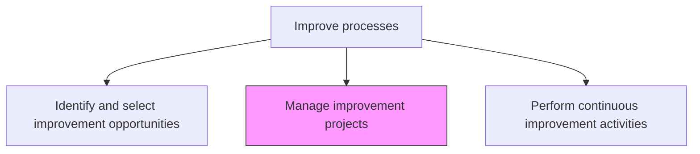
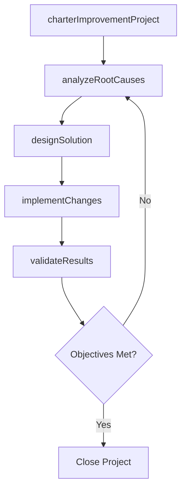

# Manage improvement projects

> Business-as-Code definition for improvement project management. Models the planning, execution, and tracking of structured process improvement initiatives using systematic methodologies.

## Overview

Developing and implementing a systematic approach to help the organization optimize its underlying processes in order to achieve more efficient results. Systematically gather information to clarify issues or problems. Intervene for improvements. Restructure training programs as appropriate to increase effectiveness.

## Process Hierarchy



## GraphDL

```yaml
manage:
  object: Improvement Projects
  actor: ImprovementProjectManager
  result: ImprovementProjectOutcome
```

## Actions

| Action | Description |
|--------|-------------|
| charterImprovementProject | Define project scope, objectives, team, and timeline for the improvement initiative |
| analyzeRootCauses | Investigate and determine the underlying causes of process inefficiencies |
| designSolution | Develop the improved process design addressing identified root causes |
| implementChanges | Execute the process changes according to the improvement plan |
| validateResults | Measure post-implementation results against project objectives |

## Events

| Event | Description |
|-------|-------------|
| improvementProjectChartered | Project scope, team, and objectives defined and approved |
| rootCausesAnalyzed | Underlying causes of process inefficiencies determined |
| solutionDesigned | Improved process design completed and reviewed |
| changesImplemented | Process changes deployed into the operational environment |
| resultsValidated | Post-implementation performance measured against objectives |

## Searches

| Search | Description |
|--------|-------------|
| getImprovementProjects | List improvement projects by status, process area, or methodology |
| findProjectMilestones | Retrieve milestone progress for a specific improvement project |
| getProjectResults | Retrieve outcome measurements for completed improvement projects |

## Process Flow



## RACI Matrix

| Activity | Responsible | Accountable | Consulted | Informed |
|----------|-------------|-------------|-----------|----------|
| charterImprovementProject | ImprovementProjectManager | ContinuousImprovementLead | ProcessOwner | SteeringCommittee |
| analyzeRootCauses | ImprovementProjectManager | ContinuousImprovementLead | SubjectMatterExperts | Operations |
| implementChanges | ProcessOwner | ContinuousImprovementLead | IT | AllStaff |

## Related Processes

| Process | Relationship |
|---------|-------------|
| 13.1.5.1 Identify and select improvement opportunities | Upstream - selected opportunities become improvement projects |
| 13.1.5.3 Perform continuous improvement activities | Parallel - project-based and continuous improvement complement each other |

## Related Departments

| Department | Role |
|-----------|------|
| Continuous Improvement | Provides methodology expertise and project oversight |
| Operations | Implements process changes and validates results |
| IT | Supports technology changes required by improvement designs |

## Related Occupations

| Occupation | Involvement |
|-----------|-------------|
| Improvement Project Manager | Leads project execution from charter to validation |
| Lean Six Sigma Practitioner | Applies structured improvement methodologies |

## KPIs

| KPI | Description | Unit |
|-----|-------------|------|
| Project Completion Rate | Percentage of improvement projects completed within timeline | % |
| Benefit Realization | Percentage of projected benefits realized within 12 months | % |
| Root Cause Resolution Rate | Percentage of identified root causes addressed by the solution | % |

## Usage

```typescript
import { manageImprovementProjects } from '@headlessly/manage-improvement-projects'

const projects = manageImprovementProjects()

// Charter an improvement project
const charter = await projects.charterImprovementProject({
  opportunityId: 'OPP-2026-0045',
  methodology: 'DMAIC',
  processId: 'PRC-invoice-processing',
  targetImprovement: { metric: 'cycle-time', reduction: 0.30 },
  timeline: { start: '2026-02-01', end: '2026-05-31' }
})

// Validate results after implementation
const validation = await projects.validateResults({
  projectId: charter.id,
  baselineMetrics: { cycleTime: 12, errorRate: 0.08 },
  postImplementationMetrics: { cycleTime: 8, errorRate: 0.03 }
})
```
