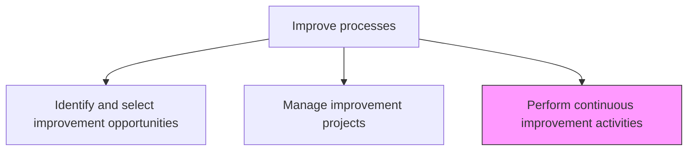
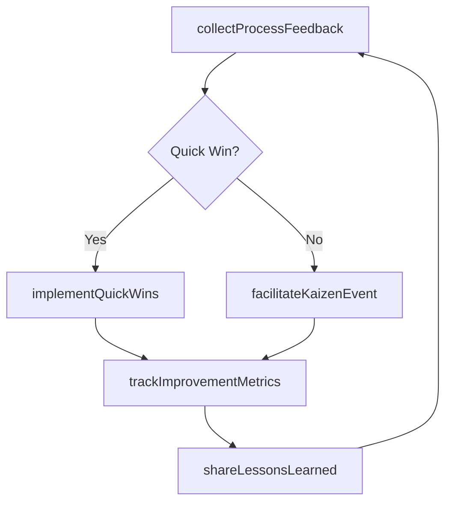

# Perform continuous improvement activities

> Business-as-Code definition for continuous improvement execution. Models the ongoing, incremental improvement activities that sustain process optimization through Kaizen events, feedback loops, and iterative refinements.

## Overview

Persistently implementing activities for improving business processes.

## Process Hierarchy



## GraphDL

```yaml
perform:
  object: Continuous Improvement Activities
  actor: ContinuousImprovementFacilitator
  result: ImprovementActivityLog
```

## Actions

| Action | Description |
|--------|-------------|
| facilitateKaizenEvent | Conduct focused rapid improvement workshops targeting specific process issues |
| collectProcessFeedback | Gather ongoing feedback from process participants on inefficiencies |
| implementQuickWins | Deploy small-scale improvements that require minimal approval |
| trackImprovementMetrics | Monitor the cumulative impact of continuous improvement activities |
| shareLessonsLearned | Document and distribute improvement insights across the organization |

## Events

| Event | Description |
|-------|-------------|
| kaizenEventCompleted | Rapid improvement workshop concluded with action items |
| processFeedbackCollected | Process participant feedback gathered and categorized |
| quickWinImplemented | Small-scale process improvement deployed |
| improvementMetricsTracked | Cumulative improvement impact measured and recorded |
| lessonsLearnedShared | Improvement insights documented and distributed |

## Searches

| Search | Description |
|--------|-------------|
| getImprovementActivities | List continuous improvement activities by type, date, or process |
| findQuickWins | Retrieve implemented quick wins by process area or impact |
| getLessonsLearned | Retrieve documented improvement lessons by topic or process |

## Process Flow



## RACI Matrix

| Activity | Responsible | Accountable | Consulted | Informed |
|----------|-------------|-------------|-----------|----------|
| facilitateKaizenEvent | ContinuousImprovementFacilitator | ContinuousImprovementLead | ProcessOwners | Operations |
| collectProcessFeedback | ProcessOwner | ContinuousImprovementLead | FrontlineStaff | Management |
| trackImprovementMetrics | ContinuousImprovementFacilitator | ContinuousImprovementLead | DataAnalysts | Executive |

## Related Processes

| Process | Relationship |
|---------|-------------|
| 13.1.5.2 Manage improvement projects | Parallel - continuous improvement supplements project-based improvements |
| 13.1.4.3 Measure and report process performance | Upstream - performance data reveals incremental improvement needs |

## Related Departments

| Department | Role |
|-----------|------|
| Continuous Improvement | Facilitates Kaizen events and tracks ongoing improvements |
| Operations | Implements quick wins and participates in improvement activities |
| Knowledge Management | Maintains the lessons learned repository |

## Related Occupations

| Occupation | Involvement |
|-----------|-------------|
| Continuous Improvement Facilitator | Leads Kaizen events and quick win implementation |
| Process Owner | Identifies daily improvement opportunities |

## KPIs

| KPI | Description | Unit |
|-----|-------------|------|
| Improvement Activity Frequency | Number of continuous improvement activities completed per quarter | Count |
| Quick Win Implementation Rate | Percentage of identified quick wins implemented within 30 days | % |
| Cumulative Efficiency Gain | Aggregate efficiency improvement from continuous improvement activities | % |

## Usage

```typescript
import { performContinuousImprovementActivities } from '@headlessly/perform-continuous-improvement-activities'

const ci = performContinuousImprovementActivities()

// Facilitate a Kaizen event
const kaizen = await ci.facilitateKaizenEvent({
  processId: 'PRC-warehouse-picking',
  focusArea: 'pick-path-optimization',
  duration: '3-days',
  participants: ['warehouse-team-b', 'logistics-supervisor']
})

// Implement a quick win
const quickWin = await ci.implementQuickWins({
  processId: 'PRC-warehouse-picking',
  description: 'Reorganize bin locations by frequency of access',
  estimatedImpact: { metric: 'pick-time', improvement: 0.15 }
})
```
