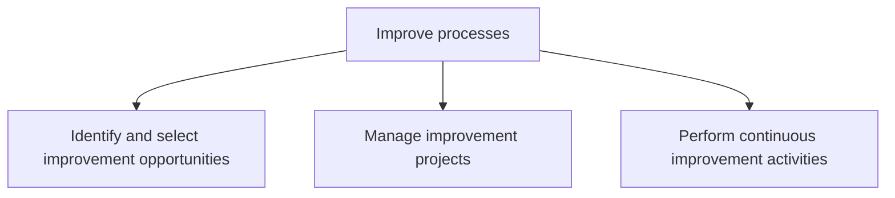
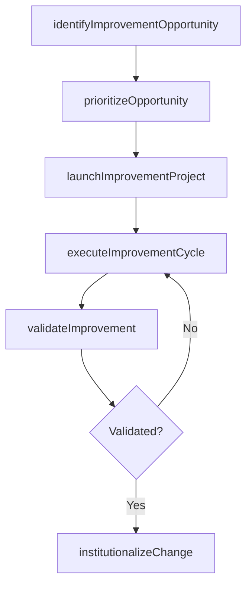

# Improve processes

> Business-as-Code definition for continuous process improvement. Models the identification of improvement opportunities, management of improvement projects, and execution of ongoing Lean/Six Sigma and Kaizen activities.

## Overview

Identifying and choosing improvement opportunities. Create and manage improvement projects. Perform the improvement activities continuously and routinely.

## Process Hierarchy



## GraphDL

```yaml
improve:
  object: Processes
  actor: ContinuousImprovementLead
  result: ProcessImprovementOutcome
```

## Actions

| Action | Description |
|--------|-------------|
| identifyImprovementOpportunity | Discover and evaluate potential process improvements from performance data |
| prioritizeOpportunity | Rank improvement opportunities by business impact and feasibility |
| launchImprovementProject | Initiate a formal improvement project with charter and team |
| executeImprovementCycle | Run DMAIC, Kaizen, or other structured improvement cycles |
| validateImprovement | Verify that changes produce the expected performance gains |
| institutionalizeChange | Embed successful improvements into standard operating procedures |

## Events

| Event | Description |
|-------|-------------|
| improvementOpportunityIdentified | Potential process improvement discovered and documented |
| opportunityPrioritized | Improvement opportunity ranked and selected for action |
| improvementProjectLaunched | Improvement project formally initiated with charter and resources |
| improvementCycleExecuted | Structured improvement cycle completed |
| improvementValidated | Performance gains confirmed through statistical validation |
| changeInstitutionalized | Improvement embedded into standard procedures and controls |

## Searches

| Search | Description |
|--------|-------------|
| findImprovementOpportunities | List identified opportunities filtered by status, impact, or domain |
| getImprovementProjectStatus | Retrieve current status and metrics for an improvement project |
| getImprovementHistory | Retrieve historical improvements for a process |
| findActiveKaizenEvents | List active Kaizen or rapid improvement events |

## Process Flow



## RACI Matrix

| Activity | Responsible | Accountable | Consulted | Informed |
|----------|-------------|-------------|-----------|----------|
| identifyImprovementOpportunity | ProcessAnalyst | ContinuousImprovementLead | ProcessOwners | Operations |
| launchImprovementProject | ContinuousImprovementLead | VP Operations | PMO | Executive |
| executeImprovementCycle | ImprovementTeam | ContinuousImprovementLead | QualityEngineer | ProcessOwner |
| validateImprovement | QualityEngineer | ContinuousImprovementLead | DataAnalyst | SteeringCommittee |

## Sub-Processes

| ID | Name | Description |
|----|------|-------------|
| 13.1.5.1 | Identify and select improvement opportunities | Helping a process owner to identify, analyze, and improve existing business processes within an orga |
| 13.1.5.2 | Manage improvement projects | Developing and implementing a systematic approach to help the organization optimize its underlying p |
| 13.1.5.3 | Perform continuous improvement activities | Persistently implementing activities for improving business processes. |

## Related Processes

| Process | Relationship |
|---------|-------------|
| 13.1.4 Manage process performance | Upstream - performance data reveals improvement opportunities |
| 13.1.3 Define processes | Parallel - improved processes require updated definitions |
| 13.4 Manage change | Downstream - process improvements are implemented through change management |

## Related Departments

| Department | Role |
|-----------|------|
| Continuous Improvement | Primary owner of improvement methodology and projects |
| Operations | Participates in improvement events and adopts changes |
| Quality Assurance | Validates improvement outcomes against quality standards |
| IT | Enables process automation and tooling improvements |

## Related Occupations

| Occupation | Involvement |
|-----------|-------------|
| Continuous Improvement Lead | Manages the improvement portfolio and methodology |
| Lean Six Sigma Black Belt | Leads structured improvement projects |
| Process Analyst | Identifies opportunities from performance data |

## KPIs

| KPI | Description | Unit |
|-----|-------------|------|
| Improvement ROI | Return on investment from completed improvement projects | % |
| Opportunity Pipeline Size | Number of identified improvement opportunities in backlog | Count |
| Project Completion Rate | Percentage of improvement projects completed within target timeline | % |
| Sustained Improvement Rate | Percentage of improvements still delivering gains after 12 months | % |

## Usage

```typescript
import { improveProcesses } from '@headlessly/improve-processes'

const ci = improveProcesses()

// Identify improvement opportunities from performance data
const opportunities = await ci.identifyImprovementOpportunity({
  processId: 'PRC-order-fulfillment',
  criteria: ['cycle-time', 'error-rate'],
  threshold: 'below-target'
})

// Launch an improvement project
const project = await ci.launchImprovementProject({
  opportunityId: opportunities[0].id,
  methodology: 'DMAIC',
  targetImprovement: 0.25,
  teamMembers: ['analyst-01', 'operator-05', 'engineer-03']
})
```
