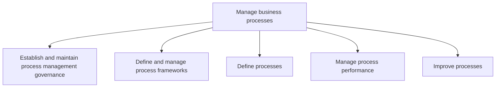
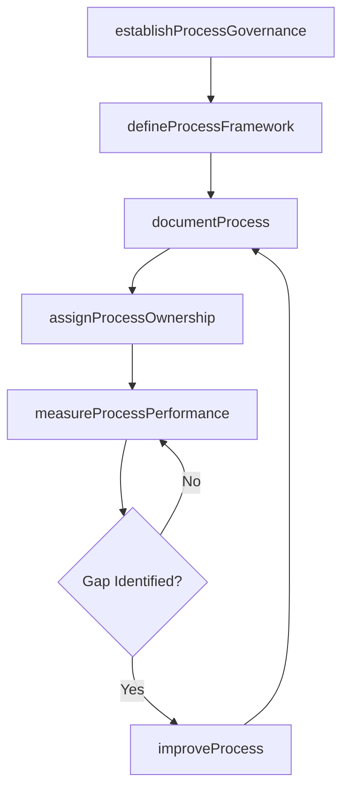

# Manage business processes

> Business-as-Code definition for establishing process governance, defining and documenting business process frameworks, managing process performance, and driving continuous process improvement across the enterprise.

## Overview

Establishing and administering governance for management of the processes. Outline and manage the frameworks for management of the processes. Define the business processes. Administer the performance of the processes. Enhance the business processes.

## Process Hierarchy



## GraphDL

```yaml
manage:
  object: Business Processes
  actor: ProcessExcellenceLead
  result: ProcessMaturityAssessment
```

## Actions

| Action | Description |
|--------|-------------|
| establishProcessGovernance | Define governance approach, roles, and decision-making authority for process management |
| defineProcessFramework | Design and maintain the enterprise process architecture and taxonomy |
| documentProcess | Scope, model, and publish individual business process definitions |
| measureProcessPerformance | Track process KPIs and identify performance gaps |
| improveProcess | Identify improvement opportunities and execute optimization projects |
| assignProcessOwnership | Designate and support accountable owners for each business process |

## Events

| Event | Description |
|-------|-------------|
| processGovernanceEstablished | Process governance framework approved and communicated |
| processFrameworkDefined | Enterprise process architecture documented and published |
| processDocumented | Business process model created or updated |
| processPerformanceMeasured | Process KPI review completed with gaps identified |
| processImproved | Process optimization project completed with results validated |
| processOwnershipAssigned | Process owner designated and accountability established |

## Searches

| Search | Description |
|--------|-------------|
| findProcesses | List documented processes by domain, owner, or maturity level |
| getProcessModel | Retrieve detailed process model including steps, roles, and systems |
| getProcessMetrics | Query process performance KPIs by process or time period |
| findImprovementProjects | List active process improvement initiatives by status or domain |

## Process Flow



## RACI Matrix

| Activity | Responsible | Accountable | Consulted | Informed |
|----------|-------------|-------------|-----------|----------|
| establishProcessGovernance | ProcessExcellenceLead | COO | BusinessUnitLeads | IT |
| defineProcessFramework | BusinessArchitect | ProcessExcellenceLead | ProcessOwners | Executive |
| documentProcess | ProcessAnalyst | ProcessOwner | SubjectMatterExperts | IT |
| measureProcessPerformance | ProcessAnalyst | ProcessExcellenceLead | Finance | Operations |
| improveProcess | ProcessEngineer | ProcessOwner | ChangeManager | AllStaff |

## Sub-Processes

| ID | Name | Description |
|----|------|-------------|
| 13.1.1 | Establish and maintain process management governance | Defining and managing the organization's approach to governing business process management. Establis |
| 13.1.2 | Define and manage process frameworks | Determining and organizing the structural composition of business processes. Design, establish, and  |
| 13.1.3 | Define processes | Outlining and establishing the business processes of the organization. Scope, analyze, map, and publ |
| 13.1.4 | Manage process performance | Evaluating and handling the performance of business processes. Provide training to process owners. S |
| 13.1.5 | Improve processes | Identifying and choosing improvement opportunities. Create and manage improvement projects. Perform  |

## Related Processes

| Process | Relationship |
|---------|-------------|
| 13.4 Manage change | Downstream - process improvements require change management |
| 13.6 Measure and benchmark | Parallel - benchmarking data informs process improvement priorities |
| 7.0 Manage Information Technology | Parallel - IT systems enable process automation and monitoring |

## Related Departments

| Department | Role |
|-----------|------|
| Process Excellence | Owns process governance, architecture, and improvement methodology |
| Business Architecture | Defines enterprise process frameworks and taxonomies |
| Quality Assurance | Ensures processes meet quality and compliance standards |
| Information Technology | Provides process automation and performance monitoring tools |

## Related Occupations

| Occupation | Involvement |
|-----------|-------------|
| Business Process Analyst | Documents, models, and analyzes business processes |
| Process Engineer | Designs process improvements and optimization solutions |
| Business Architect | Defines enterprise process architecture and frameworks |

## KPIs

| KPI | Description | Unit |
|-----|-------------|------|
| Process Documentation Coverage | Percentage of critical processes with current documentation | % |
| Process Maturity Score | Average maturity level across documented processes | Level (1-5) |
| Improvement Project ROI | Return on investment from completed process improvement projects | % |
| Process Cycle Time Reduction | Average cycle time improvement from optimization initiatives | % |

## Usage

```typescript
import { manageBusinessProcesses } from '@headlessly/manage-business-processes'

const bpm = manageBusinessProcesses()

// Document a business process
const process = await bpm.documentProcess({
  name: 'order-to-cash',
  domain: 'finance',
  notation: 'BPMN-2.0',
  includeMetrics: true
})

// Measure process performance
const metrics = await bpm.measureProcessPerformance({
  processId: 'order-to-cash',
  period: '2025-Q1',
  kpis: ['cycle-time', 'error-rate', 'throughput']
})

// Initiate process improvement
const improvement = await bpm.improveProcess({
  processId: 'order-to-cash',
  methodology: 'lean-six-sigma',
  targetImprovement: { metric: 'cycle-time', reduction: 25 }
})
```
