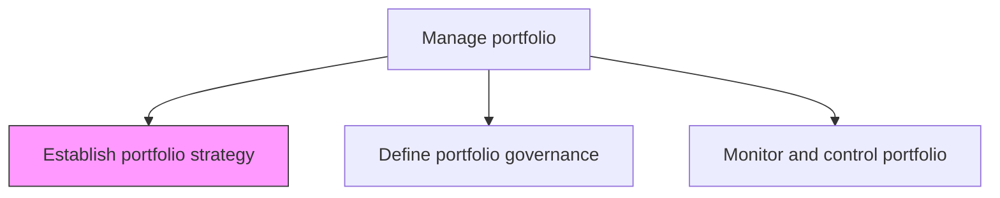
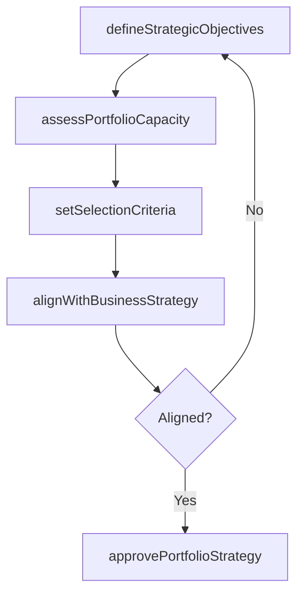

# Establish portfolio strategy

> Business-as-Code definition for portfolio strategy establishment. Models the creation of a systematic investment and prioritization plan covering products, businesses, brands, and holdings.

## Overview

Instituting the strategy for managing business portfolio. Create a systematic plan that defines the strategy for managing investments, holdings, products, businesses, and brands.

## Process Hierarchy



## GraphDL

```yaml
establish:
  object: Portfolio Strategy
  actor: PortfolioManager
  result: PortfolioStrategyDocument
```

## Actions

| Action | Description |
|--------|-------------|
| defineStrategicObjectives | Articulate the investment themes and strategic priorities for the portfolio |
| assessPortfolioCapacity | Evaluate organizational capacity for new investments and initiatives |
| setSelectionCriteria | Establish criteria for evaluating and prioritizing portfolio components |
| alignWithBusinessStrategy | Ensure portfolio strategy supports the overall enterprise strategy |
| approvePortfolioStrategy | Submit strategy for executive review and approval |

## Events

| Event | Description |
|-------|-------------|
| strategicObjectivesDefined | Portfolio investment themes and priorities articulated |
| portfolioCapacityAssessed | Organizational investment capacity evaluated |
| selectionCriteriaSet | Component evaluation and prioritization criteria established |
| strategyAligned | Portfolio strategy confirmed as aligned with business strategy |
| portfolioStrategyApproved | Portfolio strategy reviewed and approved by governance board |

## Searches

| Search | Description |
|--------|-------------|
| getPortfolioStrategy | Retrieve the current portfolio strategy document |
| getSelectionCriteria | List active portfolio selection and prioritization criteria |
| getStrategicObjectives | Retrieve portfolio strategic objectives by theme |

## Process Flow



## RACI Matrix

| Activity | Responsible | Accountable | Consulted | Informed |
|----------|-------------|-------------|-----------|----------|
| defineStrategicObjectives | PortfolioManager | PMODirector | StrategyTeam | Executive |
| setSelectionCriteria | PortfolioManager | PMODirector | Finance | ProgramManagers |
| approvePortfolioStrategy | PMODirector | CIO | SteeringCommittee | AllProjectManagers |

## Related Processes

| Process | Relationship |
|---------|-------------|
| 13.2.1.2 Define portfolio governance | Downstream - strategy guides governance structure design |
| 13.2.1.3 Monitor and control portfolio | Downstream - strategy defines monitoring criteria |

## Related Departments

| Department | Role |
|-----------|------|
| PMO | Primary owner of portfolio strategy development |
| Strategy | Provides enterprise strategic direction for alignment |
| Finance | Advises on investment capacity and financial criteria |

## Related Occupations

| Occupation | Involvement |
|-----------|-------------|
| Portfolio Manager | Develops and maintains the portfolio strategy |
| Strategy Analyst | Provides market and competitive context |

## KPIs

| KPI | Description | Unit |
|-----|-------------|------|
| Strategic Alignment Score | Percentage of portfolio components aligned with strategic objectives | % |
| Strategy Review Frequency | How often the portfolio strategy is formally reviewed | Per Year |
| Investment Utilization | Percentage of budgeted portfolio capacity actively deployed | % |

## Usage

```typescript
import { establishPortfolioStrategy } from '@headlessly/establish-portfolio-strategy'

const strategy = establishPortfolioStrategy()

// Define strategic objectives for the portfolio
const objectives = await strategy.defineStrategicObjectives({
  themes: ['digital-transformation', 'operational-excellence', 'market-expansion'],
  planningHorizon: '3-years',
  budgetEnvelope: 15000000
})

// Set selection criteria for portfolio components
const criteria = await strategy.setSelectionCriteria({
  dimensions: ['strategic-fit', 'roi', 'risk-level', 'resource-availability'],
  weights: { 'strategic-fit': 0.35, roi: 0.30, 'risk-level': 0.20, 'resource-availability': 0.15 }
})
```
