# Define portfolio governance

> Business-as-Code definition for portfolio governance definition. Models the creation of decision rights, escalation paths, health metrics, and oversight structures for portfolio management.

## Overview

Outlining the administration of business portfolio of the organization. Create and manage the rules and regulations regarding the business processes in order to identify, select, prioritize, and monitor portfolio components. Include a set of metrics to indicate the health and progress of the portfolio in the most vital area.

## Process Hierarchy


## GraphDL

```yaml
define:
  object: Portfolio Governance
  actor: PortfolioManager
  result: PortfolioGovernanceFramework
```

## Actions

| Action | Description |
|--------|-------------|
| defineDecisionRights | Establish who can approve, prioritize, and terminate portfolio components |
| createEscalationPaths | Design the escalation process for portfolio risks and issues |
| establishHealthMetrics | Define the metrics and thresholds for portfolio health monitoring |
| designReviewCadence | Set the frequency and format for portfolio governance reviews |
| documentGovernancePolicies | Record all governance rules, roles, and procedures |

## Events

| Event | Description |
|-------|-------------|
| decisionRightsDefined | Portfolio approval and authorization structure established |
| escalationPathsCreated | Risk and issue escalation procedures documented |
| healthMetricsEstablished | Portfolio health indicators and thresholds set |
| reviewCadenceDesigned | Governance review schedule and format approved |
| governancePoliciesDocumented | Governance framework recorded and published |

## Searches

| Search | Description |
|--------|-------------|
| getGovernanceFramework | Retrieve the current portfolio governance policies and procedures |
| getDecisionRights | List authorized decision-makers by portfolio governance area |
| getHealthMetricThresholds | Retrieve defined health metric thresholds for the portfolio |

## Process Flow

```mermaid
graph TD
    A[defineDecisionRights] --> B[createEscalationPaths]
    B --> C[establishHealthMetrics]
    C --> D[designReviewCadence]
    D --> E[documentGovernancePolicies]
    E --> F{Approved?}
    F -->|Yes| G[Publish Framework]
    F -->|No| A
```



## RACI Matrix

| Activity | Responsible | Accountable | Consulted | Informed |
|----------|-------------|-------------|-----------|----------|
| defineDecisionRights | PortfolioManager | PMODirector | Legal | Executive |
| establishHealthMetrics | PortfolioManager | PMODirector | Finance | ProgramManagers |
| documentGovernancePolicies | PortfolioManager | PMODirector | Compliance | AllStakeholders |

## Related Processes

| Process | Relationship |
|---------|-------------|
| 13.2.1.1 Establish portfolio strategy | Upstream - strategy guides governance design |
| 13.2.1.3 Monitor and control portfolio | Downstream - governance defines monitoring rules |

## Related Departments

| Department | Role |
|-----------|------|
| PMO | Primary owner of portfolio governance design |
| Finance | Defines financial governance thresholds and controls |
| Compliance | Ensures governance framework meets regulatory requirements |

## Related Occupations

| Occupation | Involvement |
|-----------|-------------|
| Portfolio Manager | Designs governance structures and policies |
| PMO Director | Approves and enforces governance framework |

## KPIs

| KPI | Description | Unit |
|-----|-------------|------|
| Governance Compliance Rate | Percentage of portfolio decisions made through defined governance processes | % |
| Review Adherence | Percentage of scheduled governance reviews conducted on time | % |
| Escalation Resolution Time | Average time to resolve escalated portfolio issues | Days |

## Usage

```typescript
import { definePortfolioGovernance } from '@headlessly/define-portfolio-governance'

const governance = definePortfolioGovernance()

// Define decision rights for the portfolio
const rights = await governance.defineDecisionRights({
  portfolioId: 'PORT-enterprise',
  approvalLevels: [
    { threshold: 100000, approver: 'portfolio-manager' },
    { threshold: 500000, approver: 'pmo-director' },
    { threshold: 1000000, approver: 'steering-committee' }
  ]
})

// Establish health metrics
const metrics = await governance.establishHealthMetrics({
  portfolioId: 'PORT-enterprise',
  indicators: [
    { name: 'budget-variance', threshold: 0.10, alertLevel: 'warning' },
    { name: 'schedule-variance', threshold: 0.15, alertLevel: 'critical' }
  ]
})
```
