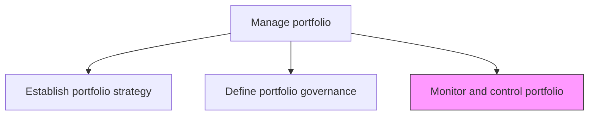
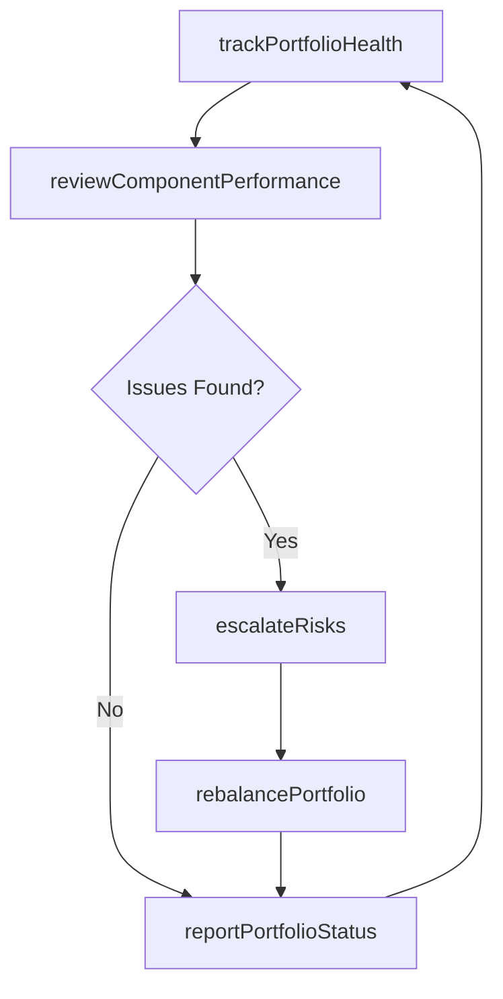

# Monitor and control portfolio

> Business-as-Code definition for portfolio monitoring and control. Models the ongoing oversight of portfolio health, performance tracking, rebalancing decisions, and corrective actions across investments and initiatives.

## Overview

Overseeing and administering the business portfolio of the organization. Monitor all activities related to investments, holdings, products, businesses, and brands by effectively monitoring and supervising these activities.

## Process Hierarchy



## GraphDL

```yaml
monitor:
  object: And Control Portfolio
  actor: PortfolioManager
  result: PortfolioHealthReport
```

## Actions

| Action | Description |
|--------|-------------|
| trackPortfolioHealth | Monitor key health indicators across all portfolio components |
| reviewComponentPerformance | Assess individual program and project performance against targets |
| rebalancePortfolio | Adjust resource allocation and priorities based on performance data |
| escalateRisks | Elevate critical portfolio risks through defined governance channels |
| reportPortfolioStatus | Produce consolidated portfolio status reports for leadership |

## Events

| Event | Description |
|-------|-------------|
| portfolioHealthTracked | Portfolio health indicators reviewed and status updated |
| componentPerformanceReviewed | Individual component performance assessed against targets |
| portfolioRebalanced | Resource allocation and priorities adjusted |
| risksEscalated | Critical portfolio risks elevated to governance board |
| portfolioStatusReported | Consolidated status report delivered to leadership |

## Searches

| Search | Description |
|--------|-------------|
| getPortfolioHealth | Retrieve current health status across all portfolio components |
| findAtRiskComponents | List portfolio components with health indicators below thresholds |
| getPortfolioStatusHistory | Retrieve historical portfolio status reports by period |

## Process Flow



## RACI Matrix

| Activity | Responsible | Accountable | Consulted | Informed |
|----------|-------------|-------------|-----------|----------|
| trackPortfolioHealth | PortfolioManager | PMODirector | ProgramManagers | Finance |
| rebalancePortfolio | PMODirector | CIO | SteeringCommittee | ProjectManagers |
| reportPortfolioStatus | PortfolioManager | PMODirector | Finance | Executive |

## Related Processes

| Process | Relationship |
|---------|-------------|
| 13.2.1.2 Define portfolio governance | Upstream - governance defines monitoring rules and thresholds |
| 13.2.2.4 Review and report program performance | Upstream - program performance feeds portfolio monitoring |

## Related Departments

| Department | Role |
|-----------|------|
| PMO | Primary owner of portfolio monitoring and control |
| Finance | Provides financial performance data and budget tracking |
| Operations | Supplies operational performance data for portfolio components |

## Related Occupations

| Occupation | Involvement |
|-----------|-------------|
| Portfolio Manager | Monitors health and coordinates rebalancing decisions |
| PMO Analyst | Collects and consolidates portfolio performance data |

## KPIs

| KPI | Description | Unit |
|-----|-------------|------|
| Portfolio Health Score | Composite score reflecting overall portfolio health | Score (0-100) |
| On-Track Component Rate | Percentage of portfolio components performing within targets | % |
| Rebalancing Frequency | Number of portfolio rebalancing actions per quarter | Count |

## Usage

```typescript
import { monitorAndControlPortfolio } from '@headlessly/monitor-and-control-portfolio'

const portfolio = monitorAndControlPortfolio()

// Track portfolio health
const health = await portfolio.trackPortfolioHealth({
  portfolioId: 'PORT-enterprise',
  indicators: ['budget-variance', 'schedule-variance', 'resource-utilization', 'risk-exposure']
})

// Rebalance portfolio based on performance
const rebalance = await portfolio.rebalancePortfolio({
  portfolioId: 'PORT-enterprise',
  action: 'reallocate-budget',
  fromComponent: 'PRG-legacy-migration',
  toComponent: 'PRG-cloud-platform',
  amount: 250000
})
```
