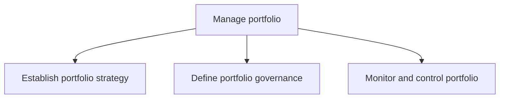
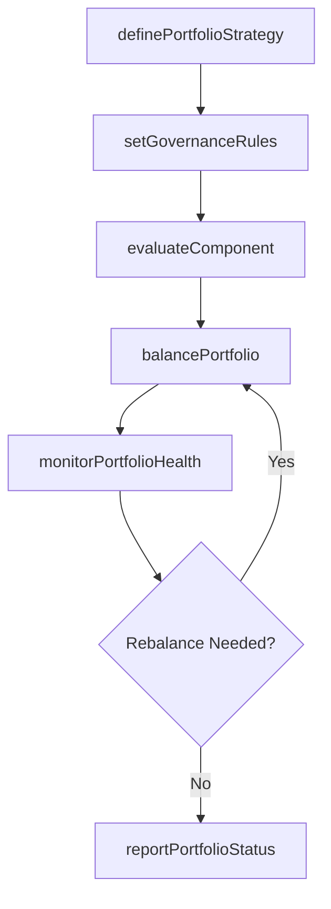

# Manage portfolio

> Business-as-Code definition for portfolio management. Models the strategic governance of an organization's investment portfolio including strategy definition, governance framework, and ongoing monitoring and control.

## Overview

Managing the business portfolio of the organization, including investments, holdings, products, businesses, and brands. Establish a portfolio strategy. Define portfolio governance. Monitor and control the portfolio.

## Process Hierarchy



## GraphDL

```yaml
manage:
  object: Portfolio
  actor: PortfolioManager
  result: PortfolioBalanceReport
```

## Actions

| Action | Description |
|--------|-------------|
| definePortfolioStrategy | Establish strategic investment themes, risk appetite, and allocation targets |
| setGovernanceRules | Define decision rights, approval thresholds, and escalation paths |
| evaluateComponent | Assess an investment proposal against portfolio criteria and capacity |
| balancePortfolio | Rebalance portfolio mix to maintain alignment with strategic targets |
| monitorPortfolioHealth | Track portfolio-level performance, risk exposure, and resource utilization |
| reportPortfolioStatus | Generate portfolio dashboards for the investment committee |

## Events

| Event | Description |
|-------|-------------|
| portfolioStrategyDefined | Strategic investment themes and allocation targets approved |
| governanceRulesSet | Portfolio governance framework and decision rights established |
| componentEvaluated | Investment proposal assessed and disposition determined |
| portfolioBalanced | Portfolio rebalanced to align with strategic allocation targets |
| portfolioHealthMonitored | Portfolio-level health check completed with risk assessment |
| portfolioStatusReported | Portfolio performance report delivered to investment committee |

## Searches

| Search | Description |
|--------|-------------|
| findPortfolioComponents | List portfolio investments filtered by theme, status, or business unit |
| getPortfolioAllocation | Retrieve current allocation by category, theme, or risk profile |
| getComponentPerformance | Retrieve performance metrics for a specific portfolio component |
| findGovernanceDecisions | List governance decisions and approval history |

## Process Flow



## RACI Matrix

| Activity | Responsible | Accountable | Consulted | Informed |
|----------|-------------|-------------|-----------|----------|
| definePortfolioStrategy | PortfolioManager | CIO | CFO | Board |
| setGovernanceRules | PortfolioManager | CIO | Legal | PMO |
| evaluateComponent | PortfolioAnalyst | PortfolioManager | BusinessUnitLeads | Finance |
| monitorPortfolioHealth | PortfolioAnalyst | PortfolioManager | RiskManagement | ExecutiveTeam |

## Sub-Processes

| ID | Name | Description |
|----|------|-------------|
| 13.2.1.1 | Establish portfolio strategy | Instituting the strategy for managing business portfolio. Create a systematic plan that defines the  |
| 13.2.1.2 | Define portfolio governance | Outlining the administration of business portfolio of the organization. Create and manage the rules  |
| 13.2.1.3 | Monitor and control portfolio | Overseeing and administering the business portfolio of the organization. Monitor all activities rela |

## Related Processes

| Process | Relationship |
|---------|-------------|
| 13.2.2 Manage programs | Downstream - portfolio decisions determine which programs to fund |
| 13.2.3 Manage projects | Downstream - projects are executed as portfolio components |
| 1.2 Develop and manage business strategy | Upstream - strategic priorities drive portfolio composition |

## Related Departments

| Department | Role |
|-----------|------|
| Project Management Office (PMO) | Administers portfolio governance and reporting |
| Finance | Provides financial analysis and investment return data |
| Strategy | Sets strategic themes that guide portfolio selection |
| Risk Management | Evaluates portfolio-level risk exposure |

## Related Occupations

| Occupation | Involvement |
|-----------|-------------|
| Portfolio Manager | Leads portfolio strategy, governance, and balancing decisions |
| Financial Analyst | Evaluates investment proposals and tracks financial performance |
| Risk Analyst | Assesses portfolio-level risk and concentration |

## KPIs

| KPI | Description | Unit |
|-----|-------------|------|
| Portfolio Value Realization | Percentage of planned portfolio benefits realized | % |
| Strategic Alignment Index | Degree to which portfolio composition matches strategic themes | Score (1-5) |
| Portfolio Risk Score | Aggregate risk exposure across all active components | Score (1-10) |
| Investment Decision Cycle Time | Average time from proposal submission to approval decision | Days |

## Usage

```typescript
import { managePortfolio } from '@headlessly/manage-portfolio'

const portfolio = managePortfolio()

// Evaluate a new investment component
const evaluation = await portfolio.evaluateComponent({
  proposalId: 'INV-2026-019',
  strategicTheme: 'digital-transformation',
  estimatedCost: 2500000,
  expectedROI: 0.35
})

// Monitor portfolio health
const health = await portfolio.monitorPortfolioHealth({
  asOfDate: '2026-02-01',
  dimensions: ['risk', 'budget', 'schedule', 'strategic-fit']
})
```
