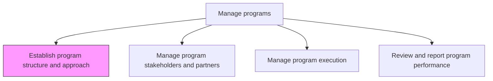
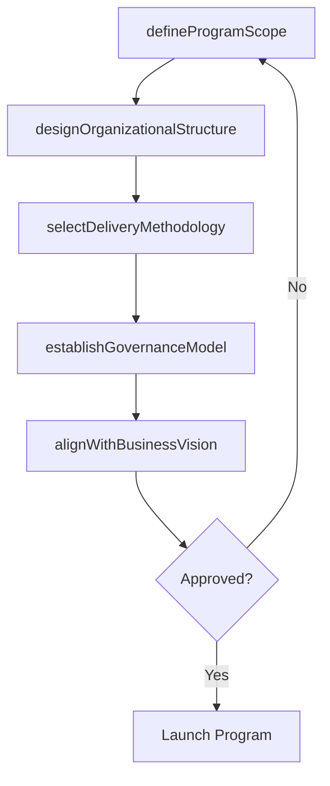

# Establish program structure and approach

> Business-as-Code definition for program structure and approach establishment. Models the design of program governance, organizational structure, delivery methodology, and alignment mechanisms for multi-project initiatives.

## Overview

Constructing and instituting the framework and approach to manage business programs. Monitor key factors such as governance, alignment with the overall business vision, assurance, and management.

## Process Hierarchy



## GraphDL

```yaml
establish:
  object: Program Structure And Approach
  actor: ProgramManager
  result: ProgramCharter
```

## Actions

| Action | Description |
|--------|-------------|
| defineProgramScope | Establish the boundaries, objectives, and expected outcomes of the program |
| designOrganizationalStructure | Define the program team structure, roles, and reporting lines |
| selectDeliveryMethodology | Choose the management approach (waterfall, agile, hybrid) for the program |
| establishGovernanceModel | Create decision-making structures and oversight mechanisms |
| alignWithBusinessVision | Validate that the program structure supports strategic business objectives |

## Events

| Event | Description |
|-------|-------------|
| programScopeDefined | Program boundaries and objectives established |
| organizationalStructureDesigned | Program team roles and reporting lines defined |
| deliveryMethodologySelected | Management approach chosen and documented |
| governanceModelEstablished | Decision-making structures and oversight set up |
| businessVisionAligned | Program confirmed as aligned with strategic objectives |

## Searches

| Search | Description |
|--------|-------------|
| getProgramCharters | Retrieve program charters by status, sponsor, or domain |
| getProgramStructure | Retrieve organizational structure for a specific program |
| getDeliveryMethodology | Retrieve the management methodology for a program |

## Process Flow



## RACI Matrix

| Activity | Responsible | Accountable | Consulted | Informed |
|----------|-------------|-------------|-----------|----------|
| defineProgramScope | ProgramManager | ProgramSponsor | SteeringCommittee | ProjectManagers |
| selectDeliveryMethodology | ProgramManager | PMODirector | AgileCoach | TeamLeads |
| establishGovernanceModel | ProgramManager | ProgramSponsor | Legal | Stakeholders |

## Related Processes

| Process | Relationship |
|---------|-------------|
| 13.2.2.2 Manage program stakeholders and partners | Downstream - structure informs stakeholder engagement approach |
| 13.2.2.3 Manage program execution | Downstream - structure and methodology guide execution |

## Related Departments

| Department | Role |
|-----------|------|
| PMO | Provides program management standards and methodology guidance |
| Strategy | Validates program alignment with business vision |
| HR | Supports organizational design and staffing |

## Related Occupations

| Occupation | Involvement |
|-----------|-------------|
| Program Manager | Designs program structure and selects approach |
| Agile Coach | Advises on delivery methodology selection |

## KPIs

| KPI | Description | Unit |
|-----|-------------|------|
| Structure Approval Time | Time from program initiation to charter approval | Days |
| Role Fill Rate | Percentage of defined program roles filled within target timeline | % |
| Governance Compliance | Percentage of program decisions made through defined governance channels | % |

## Usage

```typescript
import { establishProgramStructureAndApproach } from '@headlessly/establish-program-structure-and-approach'

const program = establishProgramStructureAndApproach()

// Define program scope
const scope = await program.defineProgramScope({
  name: 'Digital Customer Experience',
  objectives: ['unify-channels', 'personalize-journeys', 'reduce-friction'],
  expectedOutcome: 'omnichannel-customer-platform',
  duration: '18-months'
})

// Select delivery methodology
const methodology = await program.selectDeliveryMethodology({
  programId: scope.id,
  approach: 'scaled-agile',
  releaseFrequency: 'quarterly',
  sprintDuration: '2-weeks'
})
```
