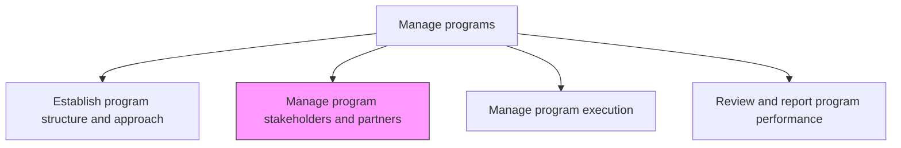
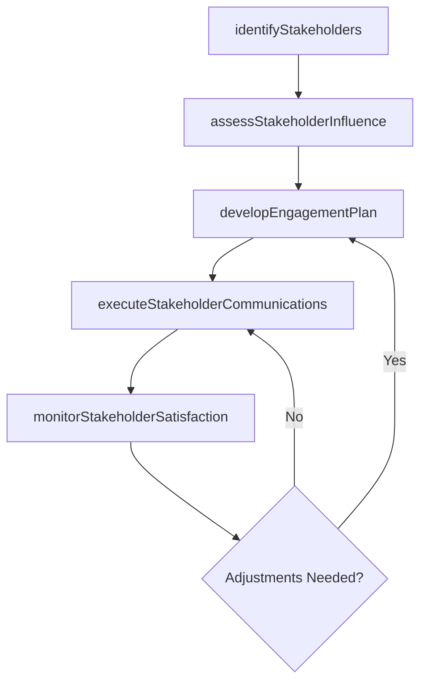

# Manage program stakeholders and partners

> Business-as-Code definition for program stakeholder and partner management. Models the identification, engagement, communication, and relationship management of internal and external program stakeholders.

## Overview

Managing relationships with stakeholders and partners of the business programs.

## Process Hierarchy



## GraphDL

```yaml
manage:
  object: Program Stakeholders And Partners
  actor: ProgramManager
  result: StakeholderEngagementReport
```

## Actions

| Action | Description |
|--------|-------------|
| identifyStakeholders | Catalog all internal and external stakeholders and their interests |
| assessStakeholderInfluence | Evaluate each stakeholder's power, interest, and impact on the program |
| developEngagementPlan | Create tailored engagement strategies for each stakeholder group |
| executeStakeholderCommunications | Deliver targeted communications to stakeholders per the engagement plan |
| monitorStakeholderSatisfaction | Track stakeholder sentiment and adjust engagement as needed |

## Events

| Event | Description |
|-------|-------------|
| stakeholdersIdentified | Program stakeholders cataloged with interests documented |
| stakeholderInfluenceAssessed | Power-interest analysis completed for all stakeholders |
| engagementPlanDeveloped | Stakeholder engagement strategies created and approved |
| stakeholderCommunicationsExecuted | Program communications delivered to stakeholders |
| stakeholderSatisfactionMonitored | Stakeholder sentiment tracked and reported |

## Searches

| Search | Description |
|--------|-------------|
| getStakeholderRegistry | Retrieve the program stakeholder registry with influence ratings |
| getEngagementPlan | Retrieve the engagement plan for a stakeholder group |
| getStakeholderSatisfaction | Retrieve satisfaction scores by stakeholder or program |

## Process Flow



## RACI Matrix

| Activity | Responsible | Accountable | Consulted | Informed |
|----------|-------------|-------------|-----------|----------|
| identifyStakeholders | ProgramManager | ProgramSponsor | ProjectManagers | PMO |
| developEngagementPlan | ProgramManager | ProgramSponsor | Communications | Stakeholders |
| monitorStakeholderSatisfaction | ProgramManager | ProgramSponsor | HR | Executive |

## Related Processes

| Process | Relationship |
|---------|-------------|
| 13.2.2.1 Establish program structure and approach | Upstream - structure defines stakeholder landscape |
| 13.2.2.3 Manage program execution | Parallel - stakeholder engagement supports execution |

## Related Departments

| Department | Role |
|-----------|------|
| PMO | Provides stakeholder management templates and tools |
| Communications | Supports messaging and communication delivery |
| Procurement | Manages external partner relationships and contracts |

## Related Occupations

| Occupation | Involvement |
|-----------|-------------|
| Program Manager | Leads stakeholder identification and engagement |
| Communications Specialist | Develops and delivers stakeholder communications |

## KPIs

| KPI | Description | Unit |
|-----|-------------|------|
| Stakeholder Satisfaction Score | Average satisfaction rating from program stakeholder surveys | Score (1-5) |
| Communication Delivery Rate | Percentage of planned stakeholder communications delivered on time | % |
| Partner Engagement Level | Percentage of external partners actively participating in program activities | % |

## Usage

```typescript
import { manageProgramStakeholdersAndPartners } from '@headlessly/manage-program-stakeholders-and-partners'

const stakeholders = manageProgramStakeholdersAndPartners()

// Identify and assess stakeholders
const registry = await stakeholders.identifyStakeholders({
  programId: 'PRG-digital-transformation',
  includeExternal: true,
  categories: ['executive-sponsor', 'business-unit-leads', 'vendors', 'end-users']
})

// Develop engagement plan
const plan = await stakeholders.developEngagementPlan({
  programId: 'PRG-digital-transformation',
  stakeholderGroups: registry.groups,
  communicationCadence: { executives: 'weekly', teams: 'bi-weekly', vendors: 'monthly' }
})
```
