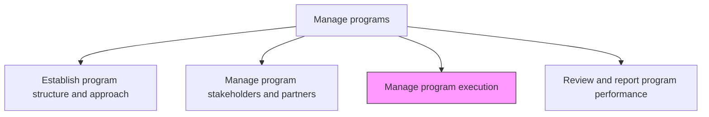
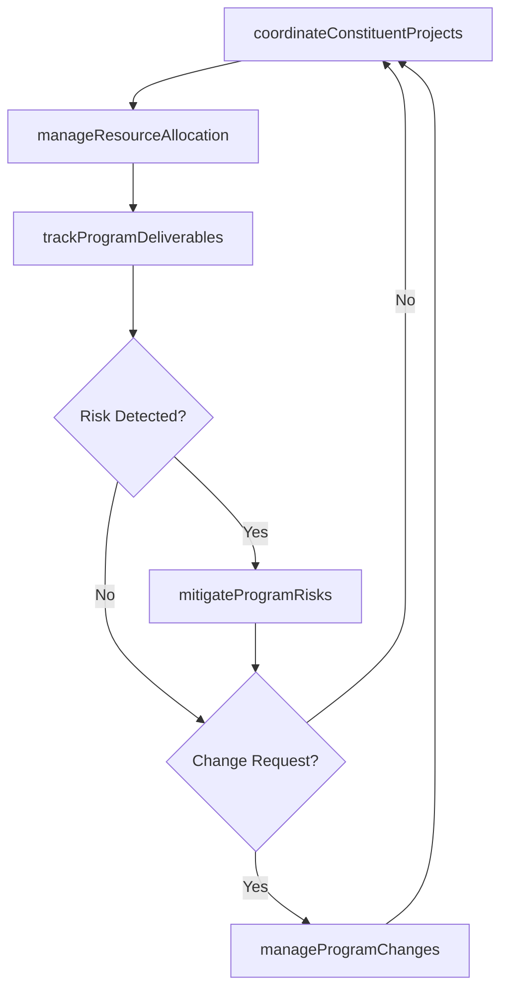

# Manage program execution

> Business-as-Code definition for program execution management. Models the coordination of constituent projects, resource management, risk mitigation, and delivery tracking across the program lifecycle.

## Overview

Administering and implementing business programs. Implement and execute programs with the intention of improving an organization's performance. Execute all the individual projects of the program to ensure the desired success.

## Process Hierarchy



## GraphDL

```yaml
manage:
  object: Program Execution
  actor: ProgramManager
  result: ProgramExecutionReport
```

## Actions

| Action | Description |
|--------|-------------|
| coordinateConstituentProjects | Synchronize schedules, dependencies, and deliverables across program projects |
| manageResourceAllocation | Allocate and balance resources across program components |
| mitigateProgramRisks | Identify, assess, and respond to risks at the program level |
| trackProgramDeliverables | Monitor progress of key deliverables across all constituent projects |
| manageProgramChanges | Evaluate and process change requests that impact program scope or timeline |

## Events

| Event | Description |
|-------|-------------|
| constituentProjectsCoordinated | Cross-project schedules and dependencies synchronized |
| resourceAllocationManaged | Program resources allocated and balanced across components |
| programRisksMitigated | Program-level risks assessed and response actions implemented |
| programDeliverablesTracked | Key deliverable progress updated across all projects |
| programChangesManaged | Change requests evaluated and dispositioned |

## Searches

| Search | Description |
|--------|-------------|
| getProgramStatus | Retrieve execution status across all constituent projects |
| findProgramRisks | List active program risks by severity or probability |
| getProgramDeliverables | Retrieve deliverable tracking data by project or milestone |

## Process Flow



## RACI Matrix

| Activity | Responsible | Accountable | Consulted | Informed |
|----------|-------------|-------------|-----------|----------|
| coordinateConstituentProjects | ProgramManager | ProgramSponsor | ProjectManagers | PMO |
| manageResourceAllocation | ProgramManager | ProgramSponsor | HR | Finance |
| mitigateProgramRisks | ProgramManager | ProgramSponsor | RiskManagement | SteeringCommittee |

## Related Processes

| Process | Relationship |
|---------|-------------|
| 13.2.2.1 Establish program structure and approach | Upstream - structure and methodology guide execution |
| 13.2.2.4 Review and report program performance | Downstream - execution data feeds performance reporting |
| 13.2.3.4 Execute projects | Downstream - program execution coordinates individual project execution |

## Related Departments

| Department | Role |
|-----------|------|
| PMO | Provides execution methodology and tools |
| Operations | Supplies resources and operational support |
| Risk Management | Supports program-level risk assessment and mitigation |

## Related Occupations

| Occupation | Involvement |
|-----------|-------------|
| Program Manager | Coordinates execution across constituent projects |
| Resource Manager | Manages resource allocation and capacity |

## KPIs

| KPI | Description | Unit |
|-----|-------------|------|
| Schedule Performance Index | Ratio of earned value to planned value across the program | Ratio |
| Cost Performance Index | Ratio of earned value to actual cost across the program | Ratio |
| Risk Mitigation Rate | Percentage of identified risks with implemented response plans | % |

## Usage

```typescript
import { manageProgramExecution } from '@headlessly/manage-program-execution'

const execution = manageProgramExecution()

// Coordinate constituent projects
const coordination = await execution.coordinateConstituentProjects({
  programId: 'PRG-digital-transformation',
  projects: ['PRJ-crm-migration', 'PRJ-data-platform', 'PRJ-channel-integration'],
  syncDependencies: true
})

// Mitigate a program risk
const mitigation = await execution.mitigateProgramRisks({
  programId: 'PRG-digital-transformation',
  riskId: 'RISK-vendor-delay',
  response: 'activate-contingency-vendor',
  impactedProjects: ['PRJ-channel-integration']
})
```
