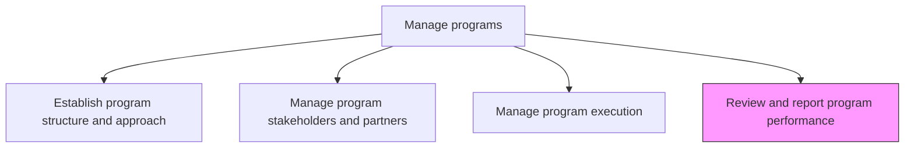
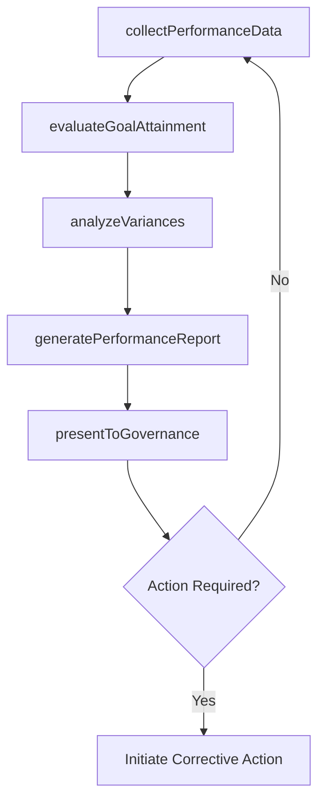

# Review and report program performance

> Business-as-Code definition for program performance review and reporting. Models the evaluation of program outcomes against targets, creation of performance reports, and communication of results to stakeholders.

## Overview

Evaluating and documenting the performance of business programs. Evaluate the performance of the programs. Create reports on the basis of the analysis. Use performance indicators and metrics such as desired/achieved goals, completion dates, issues and defects, and cost effectiveness.

## Process Hierarchy



## GraphDL

```yaml
review:
  object: And Report Program Performance
  actor: ProgramManager
  result: ProgramPerformanceReport
```

## Actions

| Action | Description |
|--------|-------------|
| collectPerformanceData | Gather metrics from constituent projects including schedule, cost, and quality data |
| evaluateGoalAttainment | Assess progress toward program objectives and expected outcomes |
| analyzeVariances | Investigate deviations from planned performance baselines |
| generatePerformanceReport | Produce formatted program performance reports with visualizations |
| presentToGovernance | Deliver performance findings to steering committee and sponsors |

## Events

| Event | Description |
|-------|-------------|
| performanceDataCollected | Program metrics gathered from all constituent projects |
| goalAttainmentEvaluated | Progress toward program objectives assessed |
| variancesAnalyzed | Performance deviations investigated with root causes identified |
| performanceReportGenerated | Program performance report produced and formatted |
| governancePresentationCompleted | Performance results delivered to governance body |

## Searches

| Search | Description |
|--------|-------------|
| getProgramPerformance | Retrieve performance metrics for a program by period |
| findPerformanceVariances | List programs with significant deviations from baselines |
| getPerformanceReportHistory | Retrieve historical performance reports for a program |

## Process Flow



## RACI Matrix

| Activity | Responsible | Accountable | Consulted | Informed |
|----------|-------------|-------------|-----------|----------|
| collectPerformanceData | PMOAnalyst | ProgramManager | ProjectManagers | Finance |
| evaluateGoalAttainment | ProgramManager | ProgramSponsor | SteeringCommittee | Executive |
| presentToGovernance | ProgramManager | ProgramSponsor | PMODirector | AllStakeholders |

## Related Processes

| Process | Relationship |
|---------|-------------|
| 13.2.2.3 Manage program execution | Upstream - execution provides performance data for review |
| 13.2.1.3 Monitor and control portfolio | Upstream - portfolio monitoring consumes program performance data |

## Related Departments

| Department | Role |
|-----------|------|
| PMO | Produces performance reports and analysis |
| Finance | Provides financial performance data and cost analysis |
| Strategy | Validates program alignment with strategic goals |

## Related Occupations

| Occupation | Involvement |
|-----------|-------------|
| Program Manager | Reviews performance and presents to governance |
| PMO Analyst | Collects data and prepares performance reports |

## KPIs

| KPI | Description | Unit |
|-----|-------------|------|
| Report Timeliness | Percentage of performance reports delivered on schedule | % |
| Goal Achievement Rate | Percentage of program objectives on track or completed | % |
| Variance Resolution Time | Average time to resolve identified performance variances | Days |

## Usage

```typescript
import { reviewAndReportProgramPerformance } from '@headlessly/review-and-report-program-performance'

const review = reviewAndReportProgramPerformance()

// Evaluate goal attainment for a program
const attainment = await review.evaluateGoalAttainment({
  programId: 'PRG-digital-transformation',
  period: '2026-Q1',
  objectives: ['launch-unified-platform', 'migrate-80-percent-users', 'reduce-support-tickets']
})

// Generate performance report
const report = await review.generatePerformanceReport({
  programId: 'PRG-digital-transformation',
  period: '2026-Q1',
  sections: ['executive-summary', 'schedule', 'budget', 'quality', 'risks']
})
```
