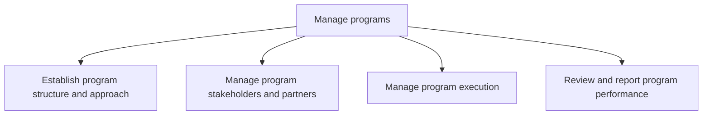
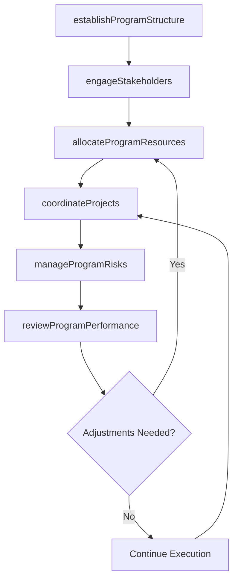

# Manage programs

> Business-as-Code definition for program management. Models the full program lifecycle from governance structure establishment and stakeholder engagement through coordinated execution, resource prioritization, and performance reporting across constituent projects.

## Overview

Establishing, implementing, and managing business programs. Successfully handle related projects that together constitute a program. Establish the program structure and approach. Coordinate with stakeholders and partners. Execute the program. Assess and report the performance of the program. Coordinate and prioritize resources across projects. Manage links between the projects and the overall costs and risks of the program.

## Process Hierarchy



## GraphDL

```yaml
manage:
  object: Programs
  actor: ProgramManager
  result: ProgramPerformanceReport
```

## Actions

| Action | Description |
|--------|-------------|
| establishProgramStructure | Define the program governance model, roles, and decision framework |
| engageStakeholders | Identify and manage stakeholder relationships and expectations |
| coordinateProjects | Synchronize interdependent projects within the program |
| allocateProgramResources | Prioritize and assign shared resources across constituent projects |
| manageProgramRisks | Identify, assess, and mitigate program-level risks and dependencies |
| reviewProgramPerformance | Evaluate program progress against milestones, budget, and benefits |

## Events

| Event | Description |
|-------|-------------|
| programStructureEstablished | Program governance framework and approach approved |
| stakeholdersEngaged | Stakeholder communication plan activated and relationships established |
| projectsCoordinated | Cross-project dependencies synchronized and resolved |
| programResourcesAllocated | Shared resources prioritized and assigned across projects |
| programRisksManaged | Program-level risk register updated with mitigation actions |
| programPerformanceReviewed | Program performance report completed and distributed |

## Searches

| Search | Description |
|--------|-------------|
| findPrograms | List active programs filtered by status, sponsor, or business unit |
| getProgramDashboard | Retrieve aggregated health metrics for a specific program |
| findProgramDependencies | List cross-project dependencies within a program |
| getStakeholderRegistry | Retrieve the stakeholder register for a program |

## Process Flow



## RACI Matrix

| Activity | Responsible | Accountable | Consulted | Informed |
|----------|-------------|-------------|-----------|----------|
| establishProgramStructure | ProgramManager | PMODirector | ExecutiveSponsor | ProjectManagers |
| engageStakeholders | ProgramManager | ExecutiveSponsor | Communications | Board |
| coordinateProjects | ProgramManager | PMODirector | ProjectManagers | ResourceManagers |
| reviewProgramPerformance | ProgramManager | PMODirector | Finance | SteeringCommittee |

## Sub-Processes

| ID | Name | Description |
|----|------|-------------|
| 13.2.2.1 | Establish program structure and approach | Constructing and instituting the framework and approach to manage business programs. Monitor key fac |
| 13.2.2.2 | Manage program stakeholders and partners | Managing relationships with stakeholders and partners of the business programs. |
| 13.2.2.3 | Manage program execution | Administering and implementing business programs. Implement and execute programs with the intention  |
| 13.2.2.4 | Review and report program performance | Evaluating and documenting the performance of business programs. Evaluate the performance of the pro |

## Related Processes

| Process | Relationship |
|---------|-------------|
| 13.2.1 Manage portfolio | Upstream - portfolio decisions determine which programs to fund |
| 13.2.3 Manage projects | Downstream - programs decompose into coordinated projects |
| 13.4 Manage change | Parallel - programs often drive organizational change |

## Related Departments

| Department | Role |
|-----------|------|
| Project Management Office (PMO) | Provides governance, standards, and reporting for programs |
| Finance | Tracks program-level budget and benefits realization |
| IT | Delivers technology components of programs |
| Human Resources | Supports resource planning and organizational readiness |

## Related Occupations

| Occupation | Involvement |
|-----------|-------------|
| Program Manager | Leads program governance, coordination, and performance reporting |
| Project Manager | Manages individual projects within the program |
| Business Analyst | Defines cross-project requirements and dependencies |

## KPIs

| KPI | Description | Unit |
|-----|-------------|------|
| Benefits Realization Rate | Percentage of planned program benefits delivered | % |
| Cross-Project Dependency Resolution | Percentage of inter-project dependencies resolved on schedule | % |
| Program Budget Variance | Difference between planned and actual program spend | % |
| Stakeholder Satisfaction | Stakeholder satisfaction with program delivery and communication | Score (1-5) |

## Usage

```typescript
import { managePrograms } from '@headlessly/manage-programs'

const programs = managePrograms()

// Establish a new program
const program = await programs.establishProgramStructure({
  name: 'Digital Customer Experience',
  sponsor: 'chief-digital-officer',
  projects: ['web-redesign', 'mobile-app', 'crm-integration'],
  governanceModel: 'agile-program'
})

// Review program performance
const review = await programs.reviewProgramPerformance({
  programId: program.id,
  period: '2026-Q1',
  metrics: ['schedule', 'budget', 'benefits', 'risk']
})
```
