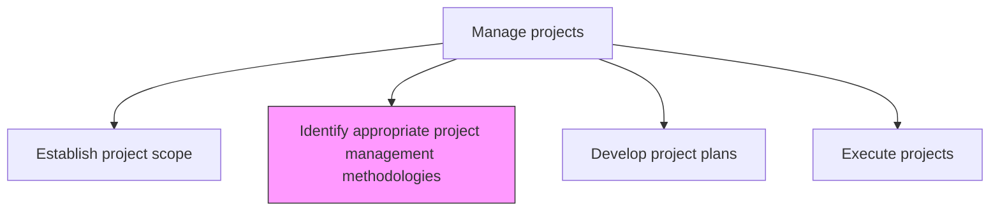
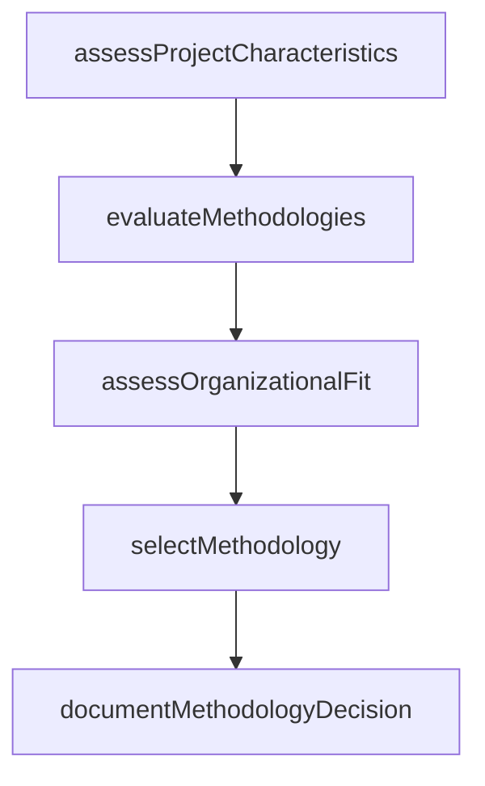

# Identify appropriate project management methodologies

> Business-as-Code definition for project management methodology selection. Models the evaluation and selection of management approaches such as waterfall, agile, hybrid, and adaptive frameworks based on project characteristics.

## Overview

Identifying and implementing the techniques and procedures for managing business projects. Identify the most appropriate models, which are to be employed by the project managers for the purpose of designing, planning, implementing, and achieving project objectives. Examine and assess various project management methodologies such as adaptive project framework, agile development, crystal methods, and feature-driven development.

## Process Hierarchy



## GraphDL

```yaml
identify:
  object: Appropriate Project Management Methodologies
  actor: PMODirector
  result: MethodologySelectionDecision
```

## Actions

| Action | Description |
|--------|-------------|
| assessProjectCharacteristics | Evaluate project size, complexity, uncertainty, and team distribution |
| evaluateMethodologies | Compare candidate methodologies against project requirements |
| assessOrganizationalFit | Determine alignment between methodology and organizational culture |
| selectMethodology | Choose the most appropriate methodology based on evaluation results |
| documentMethodologyDecision | Record the rationale and implementation guidance for the selected approach |

## Events

| Event | Description |
|-------|-------------|
| projectCharacteristicsAssessed | Project attributes evaluated for methodology selection |
| methodologiesEvaluated | Candidate approaches compared against requirements |
| organizationalFitAssessed | Methodology alignment with organizational culture confirmed |
| methodologySelected | Project management methodology chosen and approved |
| methodologyDecisionDocumented | Selection rationale and implementation guidance recorded |

## Searches

| Search | Description |
|--------|-------------|
| getMethodologyCatalog | List available project management methodologies with descriptions |
| getMethodologyAssessments | Retrieve methodology evaluation results by project |
| findProjectsByMethodology | List projects using a specific management methodology |

## Process Flow



## RACI Matrix

| Activity | Responsible | Accountable | Consulted | Informed |
|----------|-------------|-------------|-----------|----------|
| assessProjectCharacteristics | ProjectManager | PMODirector | ProjectSponsor | ProjectTeam |
| evaluateMethodologies | PMODirector | CIO | AgileCoach | ProjectManagers |
| selectMethodology | PMODirector | ProjectSponsor | ChangeManagement | AllStakeholders |

## Related Processes

| Process | Relationship |
|---------|-------------|
| 13.2.3.1 Establish project scope | Upstream - project scope informs methodology selection |
| 13.2.3.3 Develop project plans | Downstream - selected methodology drives plan structure |

## Related Departments

| Department | Role |
|-----------|------|
| PMO | Maintains methodology catalog and provides selection guidance |
| IT | Advises on technology-related methodology considerations |
| Change Management | Assesses organizational readiness for methodology adoption |

## Related Occupations

| Occupation | Involvement |
|-----------|-------------|
| PMO Director | Leads methodology evaluation and selection |
| Agile Coach | Advises on agile and hybrid methodology options |

## KPIs

| KPI | Description | Unit |
|-----|-------------|------|
| Methodology Adherence Rate | Percentage of projects following their selected methodology | % |
| Selection Decision Time | Average time from project initiation to methodology decision | Days |
| Project Success by Methodology | Success rate of projects grouped by management methodology | % |

## Usage

```typescript
import { identifyAppropriateProjectManagementMethodologies } from '@headlessly/identify-appropriate-project-management-methodologies'

const methodologies = identifyAppropriateProjectManagementMethodologies()

// Assess project characteristics for methodology selection
const characteristics = await methodologies.assessProjectCharacteristics({
  projectId: 'PRJ-mobile-app',
  attributes: {
    size: 'medium',
    complexity: 'high',
    uncertainty: 'high',
    teamDistribution: 'co-located',
    regulatoryRequirements: 'low'
  }
})

// Select methodology based on assessment
const selection = await methodologies.selectMethodology({
  projectId: 'PRJ-mobile-app',
  candidateMethodologies: ['scrum', 'kanban', 'waterfall', 'hybrid'],
  projectCharacteristics: characteristics
})
```
