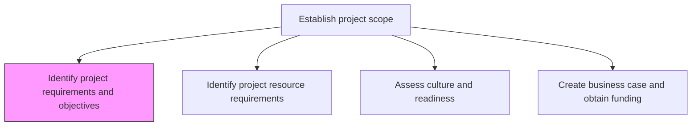
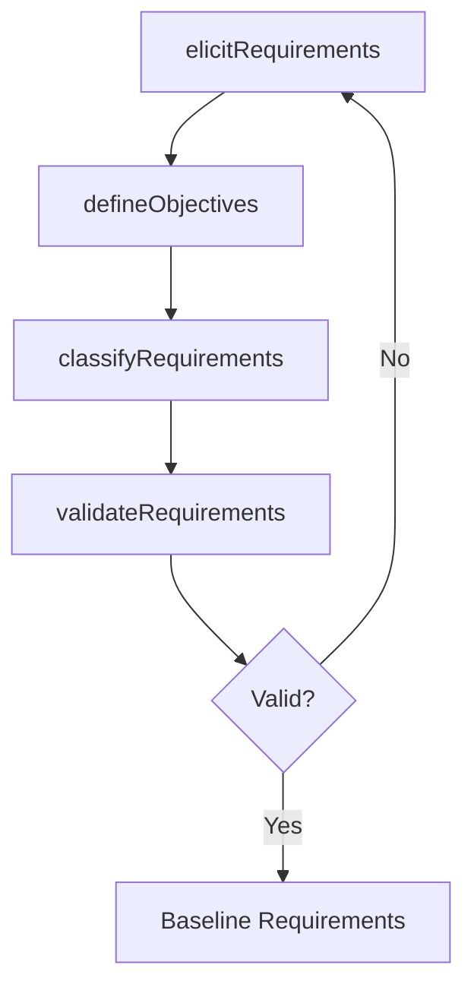

# Identify project requirements and objectives

> Business-as-Code definition for project requirements and objectives identification. Models the elicitation, documentation, and validation of project deliverable specifications and success criteria.

## Overview

Recognizing and defining what the project is ultimately supposed to do. Specify the capabilities, features, or attributes of the project's deliverables, as well as any kind of formal documentation.

## Process Hierarchy



## GraphDL

```yaml
identify:
  object: Project Requirements And Objectives
  actor: BusinessAnalyst
  result: RequirementsSpecification
```

## Actions

| Action | Description |
|--------|-------------|
| elicitRequirements | Gather requirements from stakeholders through interviews, workshops, and document analysis |
| defineObjectives | Articulate measurable project objectives aligned with business goals |
| classifyRequirements | Categorize requirements as functional, non-functional, or constraints |
| validateRequirements | Confirm requirements are complete, consistent, and achievable with stakeholders |

## Events

| Event | Description |
|-------|-------------|
| requirementsElicited | Stakeholder requirements gathered and recorded |
| objectivesDefined | Measurable project objectives articulated |
| requirementsClassified | Requirements categorized by type and priority |
| requirementsValidated | Requirements confirmed as complete and achievable |

## Searches

| Search | Description |
|--------|-------------|
| getProjectRequirements | Retrieve requirements by project, priority, or category |
| getProjectObjectives | List project objectives with success criteria |
| findRequirementGaps | Identify incomplete or conflicting requirements |

## Process Flow



## RACI Matrix

| Activity | Responsible | Accountable | Consulted | Informed |
|----------|-------------|-------------|-----------|----------|
| elicitRequirements | BusinessAnalyst | ProjectManager | Stakeholders | ProgramManager |
| defineObjectives | ProjectManager | ProjectSponsor | BusinessAnalyst | PMO |
| validateRequirements | BusinessAnalyst | ProjectManager | QualityTeam | Stakeholders |

## Related Processes

| Process | Relationship |
|---------|-------------|
| 13.2.3.1.2 Identify project resource requirements | Downstream - requirements inform resource needs |
| 13.2.3.1.4 Create business case and obtain funding | Downstream - requirements feed business case justification |

## Related Departments

| Department | Role |
|-----------|------|
| PMO | Provides requirements management templates and standards |
| Business Units | Source of business requirements and objectives |
| IT | Contributes technical requirements and feasibility assessment |

## Related Occupations

| Occupation | Involvement |
|-----------|-------------|
| Business Analyst | Elicits, documents, and validates requirements |
| Project Manager | Defines objectives and ensures alignment with scope |

## KPIs

| KPI | Description | Unit |
|-----|-------------|------|
| Requirements Completeness | Percentage of required specification sections completed | % |
| Stakeholder Sign-Off Rate | Percentage of requirements validated by all stakeholders | % |
| Requirements Stability | Percentage of baselined requirements unchanged after approval | % |

## Usage

```typescript
import { identifyProjectRequirementsAndObjectives } from '@headlessly/identify-project-requirements-and-objectives'

const requirements = identifyProjectRequirementsAndObjectives()

// Elicit requirements from stakeholders
const reqs = await requirements.elicitRequirements({
  projectId: 'PRJ-crm-migration',
  stakeholders: ['sales-director', 'marketing-vp', 'it-architect'],
  methods: ['interviews', 'workshops', 'document-review']
})

// Define measurable objectives
const objectives = await requirements.defineObjectives({
  projectId: 'PRJ-crm-migration',
  objectives: [
    { name: 'data-migration-accuracy', target: 0.999, unit: 'percentage' },
    { name: 'user-adoption', target: 0.90, unit: 'percentage', timeframe: '90-days' }
  ]
})
```
