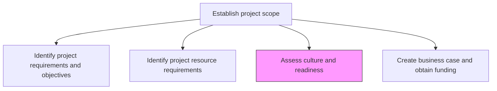
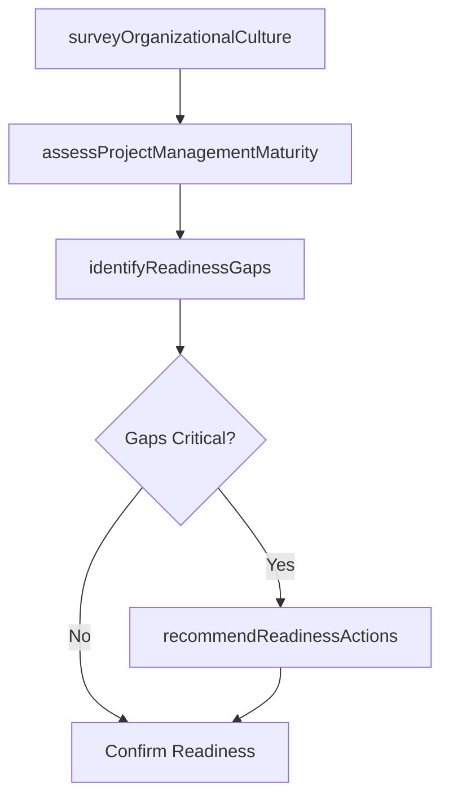

# Assess culture and readiness for project management approach

> Business-as-Code definition for organizational culture and readiness assessment. Models the evaluation of organizational maturity, cultural alignment, and change readiness for adopting a project management approach.

## Overview

Evaluating the culture and readiness of the organizational environment is order to implement the project management approach.

## Process Hierarchy



## GraphDL

```yaml
assess:
  object: Culture And Readiness For Project Management Approach
  actor: ChangeReadinessAssessor
  result: ReadinessAssessmentReport
```

## Actions

| Action | Description |
|--------|-------------|
| surveyOrganizationalCulture | Evaluate the organizational culture regarding collaboration, accountability, and change tolerance |
| assessProjectManagementMaturity | Determine the current maturity level of project management practices |
| identifyReadinessGaps | Detect areas where the organization is not prepared for the proposed approach |
| recommendReadinessActions | Propose actions to close readiness gaps before project launch |

## Events

| Event | Description |
|-------|-------------|
| organizationalCultureSurveyed | Cultural assessment completed with findings documented |
| projectManagementMaturityAssessed | PM maturity level determined using a recognized model |
| readinessGapsIdentified | Organizational readiness gaps cataloged with severity ratings |
| readinessActionsRecommended | Gap closure actions proposed and prioritized |

## Searches

| Search | Description |
|--------|-------------|
| getReadinessAssessments | Retrieve readiness assessments by project or department |
| getMaturityRatings | Retrieve PM maturity ratings by organizational unit |
| findReadinessGaps | List identified readiness gaps by severity or area |

## Process Flow



## RACI Matrix

| Activity | Responsible | Accountable | Consulted | Informed |
|----------|-------------|-------------|-----------|----------|
| surveyOrganizationalCulture | ChangeReadinessAssessor | ProjectManager | HR | DepartmentHeads |
| assessProjectManagementMaturity | PMOAnalyst | PMODirector | ProjectManagers | Executive |
| recommendReadinessActions | ChangeReadinessAssessor | ProjectManager | ChangeManagement | Stakeholders |

## Related Processes

| Process | Relationship |
|---------|-------------|
| 13.2.3.2 Identify appropriate project management methodologies | Downstream - readiness informs methodology selection |
| 13.4.1.3 Assess readiness for change | Related - shares assessment methodologies and tools |

## Related Departments

| Department | Role |
|-----------|------|
| PMO | Provides maturity assessment frameworks |
| HR | Contributes organizational culture data |
| Change Management | Supports readiness gap analysis and action planning |

## Related Occupations

| Occupation | Involvement |
|-----------|-------------|
| Change Readiness Assessor | Conducts cultural and readiness evaluations |
| PMO Analyst | Assesses PM maturity against established models |

## KPIs

| KPI | Description | Unit |
|-----|-------------|------|
| Readiness Score | Composite organizational readiness rating | Score (1-5) |
| Gap Closure Rate | Percentage of identified readiness gaps addressed before project launch | % |
| Maturity Level | Project management maturity level on a recognized scale | Level (1-5) |

## Usage

```typescript
import { assessCultureAndReadinessForProjectManagementApproach } from '@headlessly/assess-culture-and-readiness-for-project-management-approach'

const readiness = assessCultureAndReadinessForProjectManagementApproach()

// Survey organizational culture
const culture = await readiness.surveyOrganizationalCulture({
  projectId: 'PRJ-erp-implementation',
  departments: ['finance', 'operations', 'hr', 'it'],
  dimensions: ['change-tolerance', 'collaboration', 'accountability']
})

// Assess PM maturity
const maturity = await readiness.assessProjectManagementMaturity({
  organizationUnit: 'BU-north-america',
  model: 'OPM3',
  domains: ['project', 'program', 'portfolio']
})
```
