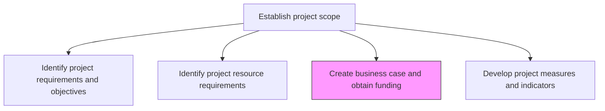
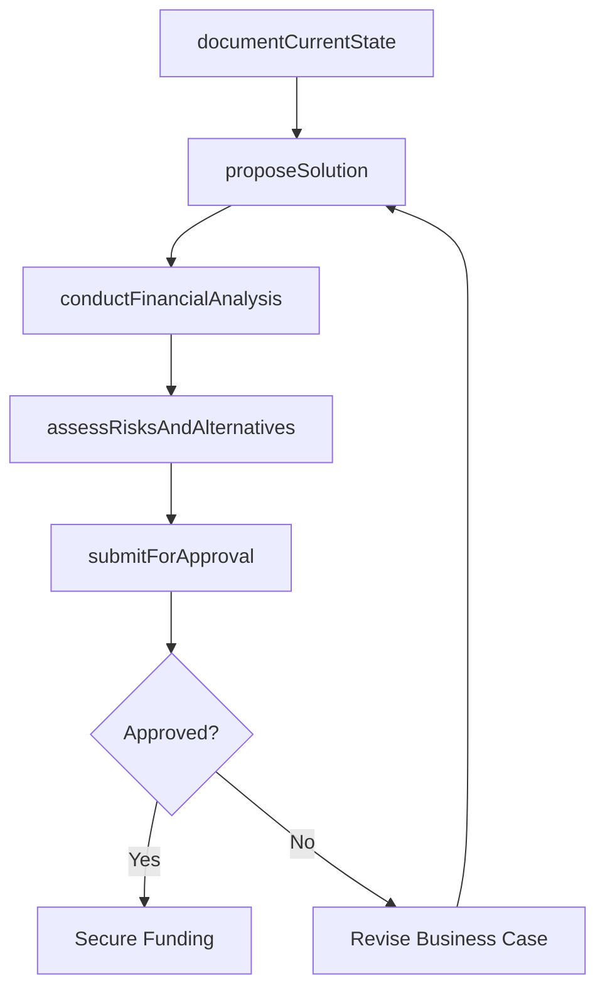

# Create business case and obtain funding

> Business-as-Code definition for business case creation and funding acquisition. Models the development of financial justification documents and the process of securing investment approval from decision-makers.

## Overview

Creating a document that includes the current situation, proposed solution, financial analysis, conclusion, etc. Convince a decision maker and investors to approve the project. Obtain funding.

## Process Hierarchy



## GraphDL

```yaml
create:
  object: Business Case And Obtain Funding
  actor: ProjectManager
  result: ApprovedBusinessCase
```

## Actions

| Action | Description |
|--------|-------------|
| documentCurrentState | Describe the current situation, pain points, and opportunity cost of inaction |
| proposeSolution | Outline the proposed project solution with scope and approach |
| conductFinancialAnalysis | Prepare ROI, NPV, payback period, and total cost of ownership calculations |
| assessRisksAndAlternatives | Evaluate project risks and compare against alternative approaches |
| submitForApproval | Present the business case to decision-makers for funding authorization |

## Events

| Event | Description |
|-------|-------------|
| currentStateDocumented | Current situation and pain points described |
| solutionProposed | Project solution outlined with scope and approach |
| financialAnalysisConducted | Financial justification calculations completed |
| risksAndAlternativesAssessed | Project risks and alternatives evaluated |
| fundingApproved | Business case approved and project funding authorized |

## Searches

| Search | Description |
|--------|-------------|
| getBusinessCases | Retrieve business cases by project, status, or approval stage |
| findPendingApprovals | List business cases awaiting funding decisions |
| getFinancialProjections | Retrieve financial analysis data for a business case |

## Process Flow



## RACI Matrix

| Activity | Responsible | Accountable | Consulted | Informed |
|----------|-------------|-------------|-----------|----------|
| conductFinancialAnalysis | BusinessAnalyst | ProjectManager | Finance | PMO |
| assessRisksAndAlternatives | ProjectManager | ProjectSponsor | RiskManagement | SteeringCommittee |
| submitForApproval | ProjectManager | ProjectSponsor | CIO | AllStakeholders |

## Related Processes

| Process | Relationship |
|---------|-------------|
| 13.2.3.1.1 Identify project requirements and objectives | Upstream - requirements justify the business case |
| 13.2.3.1.2 Identify project resource requirements | Upstream - resource estimates feed financial analysis |

## Related Departments

| Department | Role |
|-----------|------|
| Finance | Validates financial analysis and budget allocation |
| PMO | Provides business case templates and review standards |
| Strategy | Confirms strategic alignment of the proposed project |

## Related Occupations

| Occupation | Involvement |
|-----------|-------------|
| Project Manager | Leads business case development |
| Financial Analyst | Prepares financial projections and ROI calculations |

## KPIs

| KPI | Description | Unit |
|-----|-------------|------|
| Business Case Approval Rate | Percentage of submitted business cases approved on first submission | % |
| Funding Cycle Time | Average time from business case submission to funding decision | Days |
| Financial Projection Accuracy | Percentage of approved projects where actuals are within 20% of projections | % |

## Usage

```typescript
import { createBusinessCaseAndObtainFunding } from '@headlessly/create-business-case-and-obtain-funding'

const businessCase = createBusinessCaseAndObtainFunding()

// Conduct financial analysis
const financials = await businessCase.conductFinancialAnalysis({
  projectId: 'PRJ-automation-platform',
  investmentCost: 750000,
  annualBenefit: 400000,
  timeHorizon: 5,
  discountRate: 0.08
})

// Submit for approval
const submission = await businessCase.submitForApproval({
  projectId: 'PRJ-automation-platform',
  approvalBody: 'investment-committee',
  financialSummary: financials,
  requestedBudget: 750000
})
```
