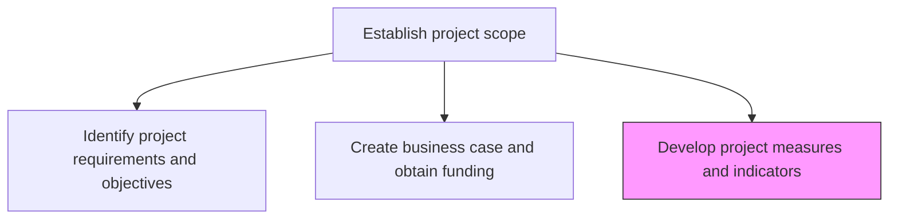
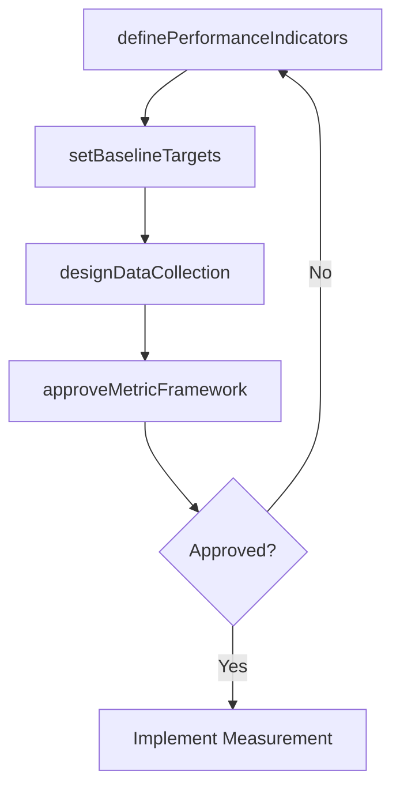

# Develop project measures and indicators

> Business-as-Code definition for project measurement development. Models the design of cost, schedule, resource, risk, and quality indicators used to track and assess project performance.

## Overview

Developing procedures and indictors to assess performance of business projects. Design and develop metrics and indicators--such as cost, schedule, resources, risk, and quality--that exhibit the performance of the business projects.

## Process Hierarchy



## GraphDL

```yaml
develop:
  object: Project Measures And Indicators
  actor: ProjectManager
  result: ProjectMeasurementPlan
```

## Actions

| Action | Description |
|--------|-------------|
| definePerformanceIndicators | Establish metrics for cost, schedule, resource, risk, and quality dimensions |
| setBaselineTargets | Define target values and thresholds for each performance indicator |
| designDataCollection | Determine data sources, collection frequency, and responsible parties for each metric |
| approveMetricFramework | Submit the measurement plan for stakeholder review and approval |

## Events

| Event | Description |
|-------|-------------|
| performanceIndicatorsDefined | Project performance metrics established across all dimensions |
| baselineTargetsSet | Target values and thresholds defined for all indicators |
| dataCollectionDesigned | Metric data sources and collection procedures documented |
| metricFrameworkApproved | Measurement plan reviewed and approved by stakeholders |

## Searches

| Search | Description |
|--------|-------------|
| getProjectMetrics | Retrieve defined metrics for a project by dimension |
| getBaselineTargets | Retrieve target values for project performance indicators |
| getMetricFramework | Retrieve the complete measurement plan for a project |

## Process Flow



## RACI Matrix

| Activity | Responsible | Accountable | Consulted | Informed |
|----------|-------------|-------------|-----------|----------|
| definePerformanceIndicators | ProjectManager | ProjectSponsor | PMO | ProjectTeam |
| setBaselineTargets | ProjectManager | ProjectSponsor | Finance | SteeringCommittee |
| designDataCollection | PMOAnalyst | ProjectManager | IT | ProjectTeam |

## Related Processes

| Process | Relationship |
|---------|-------------|
| 13.2.3.1.1 Identify project requirements and objectives | Upstream - objectives inform what should be measured |
| 13.2.3.4 Execute projects | Downstream - metrics are tracked during project execution |

## Related Departments

| Department | Role |
|-----------|------|
| PMO | Provides measurement standards and templates |
| Finance | Validates cost metrics and financial indicators |
| Quality | Advises on quality measurement approaches |

## Related Occupations

| Occupation | Involvement |
|-----------|-------------|
| Project Manager | Defines indicators and sets targets |
| PMO Analyst | Designs data collection and reporting procedures |

## KPIs

| KPI | Description | Unit |
|-----|-------------|------|
| Metric Definition Coverage | Percentage of project dimensions with defined indicators | % |
| Data Collection Reliability | Percentage of metrics with automated data collection | % |
| Framework Approval Time | Time from initial draft to approved measurement plan | Days |

## Usage

```typescript
import { developProjectMeasuresAndIndicators } from '@headlessly/develop-project-measures-and-indicators'

const measures = developProjectMeasuresAndIndicators()

// Define performance indicators
const indicators = await measures.definePerformanceIndicators({
  projectId: 'PRJ-supply-chain-optimization',
  dimensions: [
    { name: 'schedule-performance-index', type: 'earned-value', target: 1.0 },
    { name: 'cost-performance-index', type: 'earned-value', target: 1.0 },
    { name: 'defect-density', type: 'quality', target: 0.02 }
  ]
})

// Set baseline targets
const baselines = await measures.setBaselineTargets({
  projectId: 'PRJ-supply-chain-optimization',
  indicators: indicators.map(i => i.id),
  thresholds: { green: 0.95, amber: 0.85, red: 0.75 }
})
```
