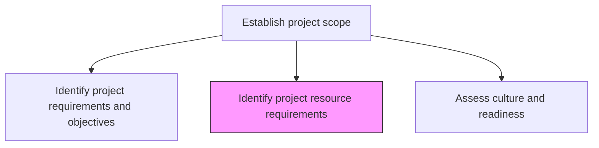
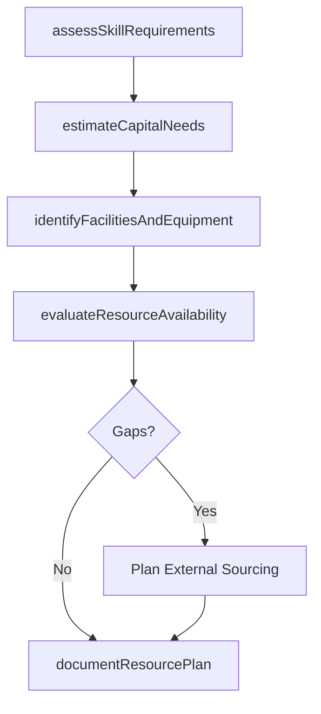

# Identify project resource requirements

> Business-as-Code definition for project resource requirements identification. Models the assessment of people, capital, facilities, equipment, and information needed to accomplish project objectives.

## Overview

Identifying the prerequisites of business projects. Identify the people with appropriate and applicable skills and competencies. Locate resources such as capital, facilities, equipment, material, and information required to accomplish the objectives of a specific project.

## Process Hierarchy



## GraphDL

```yaml
identify:
  object: Project Resource Requirements
  actor: ProjectManager
  result: ResourceRequirementsPlan
```

## Actions

| Action | Description |
|--------|-------------|
| assessSkillRequirements | Determine the competencies and roles needed for project execution |
| estimateCapitalNeeds | Calculate the financial resources required for the project |
| identifyFacilitiesAndEquipment | Catalog the physical facilities, tools, and equipment needed |
| evaluateResourceAvailability | Assess whether required resources are available within the organization |
| documentResourcePlan | Record all resource requirements with timing and sourcing strategies |

## Events

| Event | Description |
|-------|-------------|
| skillRequirementsAssessed | Required competencies and staffing levels determined |
| capitalNeedsEstimated | Financial resource requirements calculated |
| facilitiesAndEquipmentIdentified | Physical resource needs cataloged |
| resourceAvailabilityEvaluated | Internal resource availability confirmed or gaps identified |
| resourcePlanDocumented | Resource requirements plan completed and approved |

## Searches

| Search | Description |
|--------|-------------|
| getResourceRequirements | Retrieve resource requirements by project or resource type |
| findResourceGaps | List resources needed but not available internally |
| getResourceAvailability | Check availability of specific skills or assets |

## Process Flow



## RACI Matrix

| Activity | Responsible | Accountable | Consulted | Informed |
|----------|-------------|-------------|-----------|----------|
| assessSkillRequirements | ProjectManager | ProjectSponsor | HR | ResourceManagers |
| estimateCapitalNeeds | ProjectManager | ProjectSponsor | Finance | PMO |
| evaluateResourceAvailability | ResourceManager | ProjectManager | HR | DepartmentHeads |

## Related Processes

| Process | Relationship |
|---------|-------------|
| 13.2.3.1.1 Identify project requirements and objectives | Upstream - requirements define resource needs |
| 13.2.3.1.4 Create business case and obtain funding | Downstream - resource estimates feed the business case |

## Related Departments

| Department | Role |
|-----------|------|
| PMO | Provides resource planning templates and tools |
| HR | Identifies available talent and staffing options |
| Finance | Validates capital requirements and budget availability |

## Related Occupations

| Occupation | Involvement |
|-----------|-------------|
| Project Manager | Leads resource identification and planning |
| Resource Manager | Assesses availability and allocates resources |

## KPIs

| KPI | Description | Unit |
|-----|-------------|------|
| Resource Plan Accuracy | Percentage of initial resource estimates within 10% of actual needs | % |
| Skill Gap Fill Rate | Percentage of identified skill gaps filled before project start | % |
| Resource Readiness | Percentage of required resources confirmed and available at project start | % |

## Usage

```typescript
import { identifyProjectResourceRequirements } from '@headlessly/identify-project-resource-requirements'

const resources = identifyProjectResourceRequirements()

// Assess skill requirements for a project
const skills = await resources.assessSkillRequirements({
  projectId: 'PRJ-data-warehouse',
  roles: ['data-engineer', 'etl-developer', 'dba', 'business-analyst'],
  estimatedEffort: { 'data-engineer': 3, 'etl-developer': 2, dba: 1, 'business-analyst': 1 }
})

// Evaluate resource availability
const availability = await resources.evaluateResourceAvailability({
  projectId: 'PRJ-data-warehouse',
  requiredRoles: skills.roles,
  startDate: '2026-03-01'
})
```
