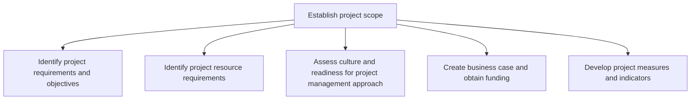
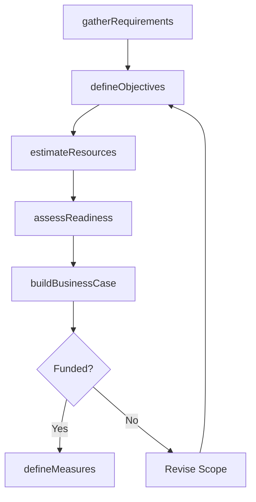

# Establish project scope

> Business-as-Code definition for project scope establishment. Models the process of defining project objectives, identifying resource needs, assessing organizational readiness, building the business case, and developing performance indicators.

## Overview

Establishing the horizons of business projects. Identify the objectives of the program, along with the resource requirements. Assess the readiness for the project management approach. Identify methodologies for project management. Obtain funding. Develop performance measures and indicators.

## Process Hierarchy



## GraphDL

```yaml
establish:
  object: Project Scope
  actor: ProjectManager
  result: ProjectScopeStatement
```

## Actions

| Action | Description |
|--------|-------------|
| gatherRequirements | Elicit and document project requirements from stakeholders |
| defineObjectives | Establish measurable project objectives and success criteria |
| estimateResources | Identify and quantify personnel, budget, and infrastructure needs |
| assessReadiness | Evaluate organizational culture and readiness for the project approach |
| buildBusinessCase | Create a business case with financial analysis and benefit projection |
| defineMeasures | Develop KPIs and indicators for tracking project performance |

## Events

| Event | Description |
|-------|-------------|
| requirementsGathered | Project requirements documented and validated by stakeholders |
| objectivesDefined | Measurable project objectives and success criteria approved |
| resourcesEstimated | Resource requirements quantified and resource plan drafted |
| readinessAssessed | Organizational readiness evaluation completed |
| businessCaseBuilt | Business case approved and funding secured |
| measuresDefined | Project performance indicators established and baselined |

## Searches

| Search | Description |
|--------|-------------|
| getProjectRequirements | Retrieve documented requirements for a specific project |
| getResourceEstimate | Retrieve the resource plan and estimates for a project |
| getBusinessCase | Retrieve the approved business case and funding details |
| findSimilarProjects | List historical projects with similar scope for estimation reference |

## Process Flow



## RACI Matrix

| Activity | Responsible | Accountable | Consulted | Informed |
|----------|-------------|-------------|-----------|----------|
| gatherRequirements | BusinessAnalyst | ProjectManager | Stakeholders | PMO |
| estimateResources | ProjectManager | ProgramManager | ResourceManagers | Finance |
| buildBusinessCase | ProjectManager | ExecutiveSponsor | Finance | SteeringCommittee |
| defineMeasures | ProjectManager | ProgramManager | QualityTeam | PMO |

## Sub-Processes

| ID | Name | Description |
|----|------|-------------|
| 13.2.3.1.1 | Identify project requirements and objectives | Recognizing and defining what the project is ultimately supposed to do. Specify the capabilities, fe |
| 13.2.3.1.2 | Identify project resource requirements | Identifying the prerequisites of business projects. Identify the people with appropriate and applica |
| 13.2.3.1.3 | Assess culture and readiness for project management approach | Evaluating the culture and readiness of the organizational environment is order to implement the pro |
| 13.2.3.1.4 | Create business case and obtain funding | Creating a document that includes the current situation, proposed solution, financial analysis, conc |
| 13.2.3.1.5 | Develop project measures and indicators | Developing procedures and indictors to assess performance of business projects. Design and develop m |

## Related Processes

| Process | Relationship |
|---------|-------------|
| 13.2.3.2 Identify appropriate project management methodologies | Downstream - scope informs methodology selection |
| 13.2.3.3 Develop project plans | Downstream - scope defines the boundaries for planning |
| 13.2.1 Manage portfolio | Upstream - portfolio authorization gates project initiation |

## Related Departments

| Department | Role |
|-----------|------|
| Project Management Office (PMO) | Provides templates and governance for scope definition |
| Finance | Reviews and approves the business case and budget |
| Business Units | Provide requirements and validate scope alignment |
| Human Resources | Supports resource availability and capability assessment |

## Related Occupations

| Occupation | Involvement |
|-----------|-------------|
| Project Manager | Leads scope definition and business case development |
| Business Analyst | Elicits and documents project requirements |
| Financial Analyst | Prepares financial analysis for the business case |

## KPIs

| KPI | Description | Unit |
|-----|-------------|------|
| Requirements Completeness | Percentage of stakeholder needs captured in scope documentation | % |
| Business Case Approval Rate | Percentage of business cases approved on first submission | % |
| Scope Definition Cycle Time | Time from project initiation request to approved scope statement | Days |

## Usage

```typescript
import { establishProjectScope } from '@headlessly/establish-project-scope'

const scope = establishProjectScope()

// Gather requirements from stakeholders
const requirements = await scope.gatherRequirements({
  projectId: 'PRJ-2026-042',
  stakeholders: ['product-owner', 'engineering-lead', 'finance-controller'],
  method: 'structured-interviews'
})

// Build the business case
const businessCase = await scope.buildBusinessCase({
  projectId: 'PRJ-2026-042',
  investmentAmount: 750000,
  benefitHorizon: 36,
  discountRate: 0.08
})
```
