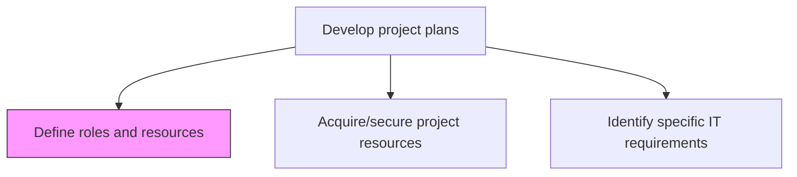
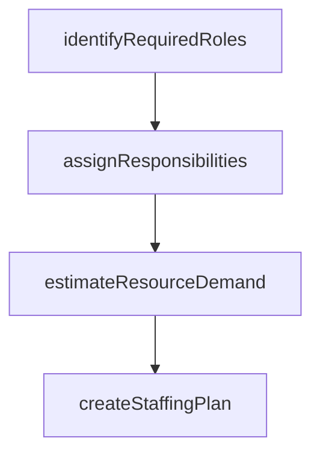

# Define roles and resources

> Business-as-Code definition for project role and resource definition. Models the assignment of team roles, responsibilities, and resource allocations for project execution.

## Overview

Outlining the resources and their roles in the business projects.

## Process Hierarchy



## GraphDL

```yaml
define:
  object: Roles And Resources
  actor: ProjectManager
  result: ResourceAssignmentMatrix
```

## Actions

| Action | Description |
|--------|-------------|
| identifyRequiredRoles | Determine all roles needed for successful project delivery |
| assignResponsibilities | Map responsibilities to each role using a RACI or similar framework |
| estimateResourceDemand | Calculate the effort and duration needed for each role |
| createStaffingPlan | Develop a plan for when each resource is needed and for how long |

## Events

| Event | Description |
|-------|-------------|
| requiredRolesIdentified | All project roles defined with descriptions |
| responsibilitiesAssigned | Role responsibilities mapped and documented |
| resourceDemandEstimated | Effort and duration calculated for each role |
| staffingPlanCreated | Resource timing and allocation plan finalized |

## Searches

| Search | Description |
|--------|-------------|
| getProjectRoles | Retrieve defined roles for a project |
| getResourceAssignments | List resource assignments by project or role |
| getStaffingPlan | Retrieve the staffing timeline for a project |

## Process Flow



## RACI Matrix

| Activity | Responsible | Accountable | Consulted | Informed |
|----------|-------------|-------------|-----------|----------|
| identifyRequiredRoles | ProjectManager | ProjectSponsor | HR | PMO |
| assignResponsibilities | ProjectManager | ProjectSponsor | TeamLeads | ProjectTeam |
| createStaffingPlan | ProjectManager | ProjectSponsor | ResourceManagers | Finance |

## Related Processes

| Process | Relationship |
|---------|-------------|
| 13.2.3.3.2 Acquire/secure project resources | Downstream - role definitions drive resource acquisition |
| 13.2.3.1.2 Identify project resource requirements | Upstream - resource requirements inform role definition |

## Related Departments

| Department | Role |
|-----------|------|
| PMO | Provides role definition templates and standards |
| HR | Assists with role descriptions and staffing strategies |

## Related Occupations

| Occupation | Involvement |
|-----------|-------------|
| Project Manager | Defines roles and creates staffing plan |
| Resource Manager | Supports resource demand estimation |

## KPIs

| KPI | Description | Unit |
|-----|-------------|------|
| Role Definition Completeness | Percentage of project roles with documented responsibilities | % |
| Staffing Plan Accuracy | Percentage of roles filled on time per the staffing plan | % |

## Usage

```typescript
import { defineRolesAndResources } from '@headlessly/define-roles-and-resources'

const roles = defineRolesAndResources()

const staffingPlan = await roles.createStaffingPlan({
  projectId: 'PRJ-data-platform',
  roles: [
    { name: 'tech-lead', effort: 1.0, startWeek: 1, endWeek: 24 },
    { name: 'data-engineer', effort: 2.0, startWeek: 3, endWeek: 20 },
    { name: 'qa-engineer', effort: 1.0, startWeek: 8, endWeek: 22 }
  ]
})
```
