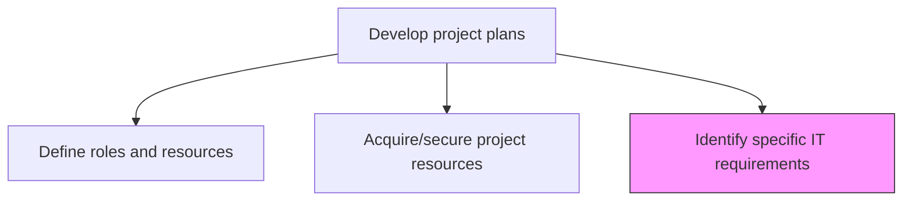
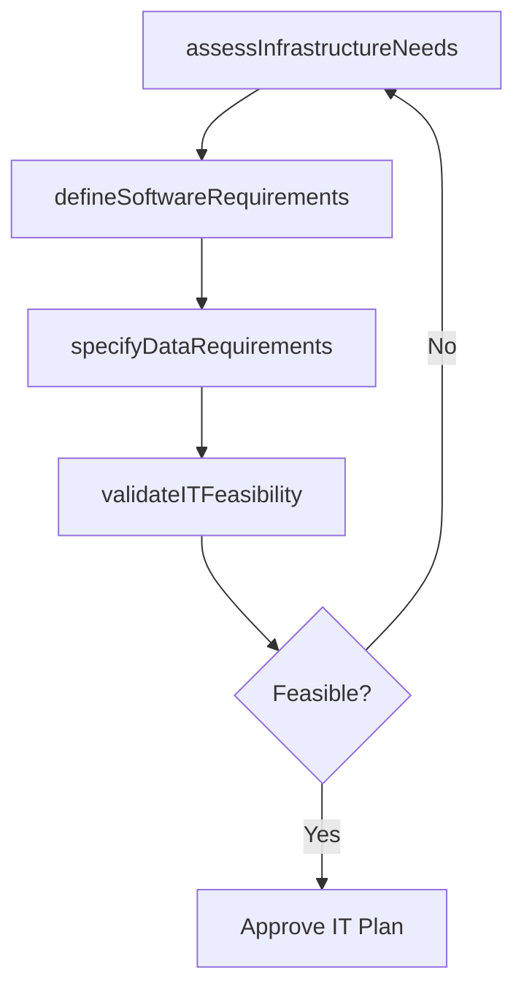

# Identify specific IT requirements

> Business-as-Code definition for IT requirements identification. Models the determination of hardware, software, network, and data requirements for project delivery.

## Overview

Determining the IT requirements for specific business projects. Identify the requirements of computers and telecommunications equipment to store, retrieve, transmit, and manipulate data related to the project. Consider factors such as functional requirements, design requirements, project phases, and project schedule.

## Process Hierarchy



## GraphDL

```yaml
identify:
  object: Specific IT Requirements
  actor: ITArchitect
  result: ITRequirementsDocument
```

## Actions

| Action | Description |
|--------|-------------|
| assessInfrastructureNeeds | Determine hardware, network, and hosting requirements for the project |
| defineSoftwareRequirements | Identify software tools, platforms, and licenses needed |
| specifyDataRequirements | Document data storage, integration, and security requirements |
| validateITFeasibility | Confirm IT requirements are technically achievable within project constraints |

## Events

| Event | Description |
|-------|-------------|
| infrastructureNeedsAssessed | Hardware and network requirements determined |
| softwareRequirementsDefined | Software tools and platform needs identified |
| dataRequirementsSpecified | Data handling requirements documented |
| itFeasibilityValidated | IT requirements confirmed as achievable |

## Searches

| Search | Description |
|--------|-------------|
| getITRequirements | Retrieve IT requirements by project or category |
| findInfrastructureGaps | List infrastructure gaps between current state and project needs |

## Process Flow



## RACI Matrix

| Activity | Responsible | Accountable | Consulted | Informed |
|----------|-------------|-------------|-----------|----------|
| assessInfrastructureNeeds | ITArchitect | ProjectManager | ITOperations | PMO |
| defineSoftwareRequirements | ITArchitect | ProjectManager | Vendors | Finance |

## Related Processes

| Process | Relationship |
|---------|-------------|
| 13.2.3.3.1 Define roles and resources | Parallel - IT requirements inform technical staffing |
| 13.2.3.3.2 Acquire/secure project resources | Downstream - IT resources acquired based on requirements |

## Related Departments

| Department | Role |
|-----------|------|
| IT | Primary owner of technical requirements specification |
| Information Security | Advises on security and compliance requirements |

## Related Occupations

| Occupation | Involvement |
|-----------|-------------|
| IT Architect | Specifies infrastructure and software requirements |
| Security Analyst | Defines data security requirements |

## KPIs

| KPI | Description | Unit |
|-----|-------------|------|
| Requirements Coverage | Percentage of project functions with defined IT requirements | % |
| IT Readiness at Launch | Percentage of IT requirements fulfilled by project start | % |

## Usage

```typescript
import { identifySpecificItRequirements } from '@headlessly/identify-specific-it-requirements'

const itReqs = identifySpecificItRequirements()

const requirements = await itReqs.assessInfrastructureNeeds({
  projectId: 'PRJ-ecommerce-platform',
  needs: ['cloud-hosting', 'cdn', 'database', 'ci-cd-pipeline'],
  scalingRequirements: { peakUsers: 50000, dataVolumeGB: 500 }
})
```
