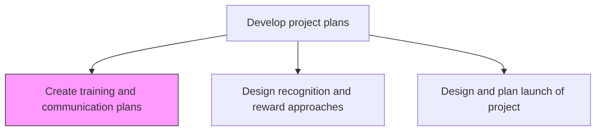
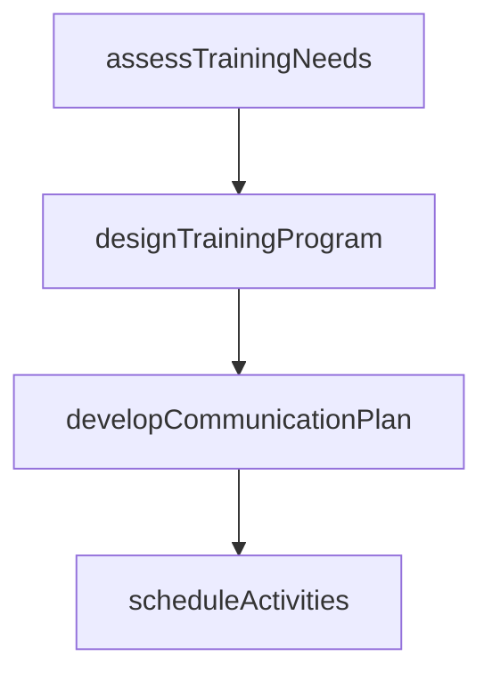

# Create training and communication plans

> Business-as-Code definition for project training and communication plan creation. Models the design of skill development programs and stakeholder communication strategies for the project lifecycle.

## Overview

Designing a plan for equipping the project team with the necessary skills and abilities to fulfill their roles and responsibilities in the project effectively and efficiently. Offer formal training, mentoring, or coaching. Initiate informal conversations. Communicate messages during the project.

## Process Hierarchy



## GraphDL

```yaml
create:
  object: Training And Communication Plans
  actor: ProjectManager
  result: TrainingAndCommunicationPlan
```

## Actions

| Action | Description |
|--------|-------------|
| assessTrainingNeeds | Identify skill gaps in the project team relative to project demands |
| designTrainingProgram | Create a training curriculum covering tools, processes, and domain knowledge |
| developCommunicationPlan | Define stakeholder communication channels, frequency, and messaging |
| scheduleActivities | Set dates and deadlines for training sessions and communication milestones |

## Events

| Event | Description |
|-------|-------------|
| trainingNeedsAssessed | Project team skill gaps identified |
| trainingProgramDesigned | Training curriculum created and approved |
| communicationPlanDeveloped | Stakeholder communication strategy documented |
| activitiesScheduled | Training and communication timelines established |

## Searches

| Search | Description |
|--------|-------------|
| getTrainingPlan | Retrieve the training plan for a project |
| getCommunicationPlan | Retrieve the communication plan for a project |

## Process Flow



## RACI Matrix

| Activity | Responsible | Accountable | Consulted | Informed |
|----------|-------------|-------------|-----------|----------|
| designTrainingProgram | ProjectManager | ProjectSponsor | LearningDevelopment | ProjectTeam |
| developCommunicationPlan | ProjectManager | ProjectSponsor | Communications | Stakeholders |

## Related Processes

| Process | Relationship |
|---------|-------------|
| 13.2.3.3.1 Define roles and resources | Upstream - role definitions inform training needs |
| 13.2.3.3.6 Design and plan launch of project | Downstream - communication plan supports project launch |

## Related Departments

| Department | Role |
|-----------|------|
| Learning and Development | Supports training design and delivery |
| Communications | Advises on stakeholder messaging strategy |

## Related Occupations

| Occupation | Involvement |
|-----------|-------------|
| Project Manager | Designs training and communication plans |
| Learning Designer | Creates training materials and curriculum |

## KPIs

| KPI | Description | Unit |
|-----|-------------|------|
| Training Completion Rate | Percentage of team members completing required training before project start | % |
| Communication Plan Adherence | Percentage of planned communications delivered on schedule | % |

## Usage

```typescript
import { createTrainingAndCommunicationPlans } from '@headlessly/create-training-and-communication-plans'

const plans = createTrainingAndCommunicationPlans()

const commPlan = await plans.developCommunicationPlan({
  projectId: 'PRJ-erp-rollout',
  audiences: ['executive', 'end-users', 'it-support'],
  channels: { executive: 'bi-weekly-email', 'end-users': 'weekly-newsletter', 'it-support': 'daily-standup' }
})
```
