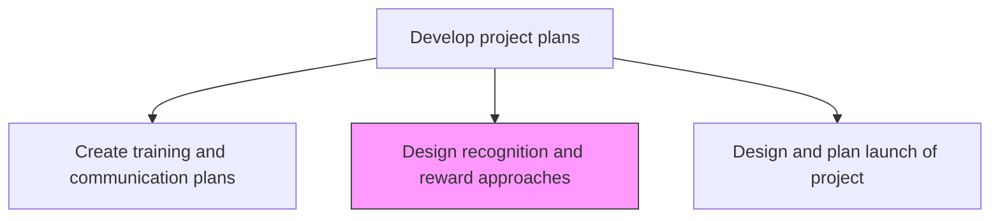
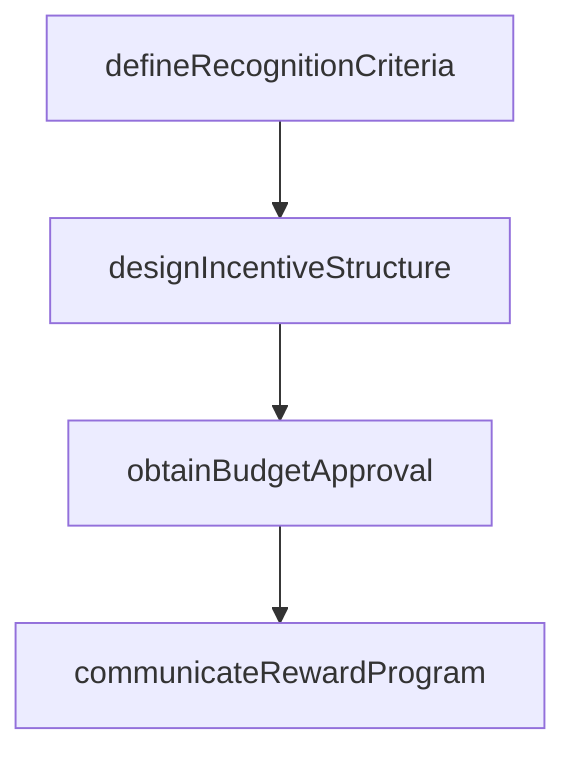

# Design recognition and reward approaches

> Business-as-Code definition for project recognition and reward design. Models the creation of incentive structures, performance-based bonuses, and recognition programs to motivate project team members.

## Overview

Creating a plan for recognizing and rewarding extraordinary performances within the business projects. Use incentives, bonuses, and certificates for recognition and rewarding purposes.

## Process Hierarchy



## GraphDL

```yaml
design:
  object: Recognition And Reward Approaches
  actor: ProjectManager
  result: RecognitionAndRewardPlan
```

## Actions

| Action | Description |
|--------|-------------|
| defineRecognitionCriteria | Establish the performance criteria that qualify for recognition and rewards |
| designIncentiveStructure | Create monetary and non-monetary reward tiers aligned with project milestones |
| obtainBudgetApproval | Secure funding for the recognition and reward program |
| communicateRewardProgram | Inform the project team about available recognition and reward opportunities |

## Events

| Event | Description |
|-------|-------------|
| recognitionCriteriaDefined | Performance criteria for rewards established |
| incentiveStructureDesigned | Reward tiers and mechanisms created |
| budgetApproved | Funding for the reward program secured |
| rewardProgramCommunicated | Recognition program details shared with project team |

## Searches

| Search | Description |
|--------|-------------|
| getRewardProgram | Retrieve recognition and reward plan for a project |
| getRecognitionHistory | List awards and recognitions issued during the project |

## Process Flow



## RACI Matrix

| Activity | Responsible | Accountable | Consulted | Informed |
|----------|-------------|-------------|-----------|----------|
| defineRecognitionCriteria | ProjectManager | ProjectSponsor | HR | ProjectTeam |
| designIncentiveStructure | ProjectManager | ProjectSponsor | Finance | HR |

## Related Processes

| Process | Relationship |
|---------|-------------|
| 13.2.3.3.4 Create training and communication plans | Parallel - communication plan supports reward program awareness |
| 13.2.3.4.4 Promote and sustain activity and involvement | Downstream - rewards sustain team engagement |

## Related Departments

| Department | Role |
|-----------|------|
| HR | Advises on compensation and recognition policies |
| Finance | Approves reward program budget |

## Related Occupations

| Occupation | Involvement |
|-----------|-------------|
| Project Manager | Designs recognition criteria and reward structure |
| HR Specialist | Ensures alignment with organizational compensation policies |

## KPIs

| KPI | Description | Unit |
|-----|-------------|------|
| Recognition Frequency | Number of team recognitions issued per project phase | Count |
| Team Satisfaction Score | Project team satisfaction with recognition program | Score (1-5) |

## Usage

```typescript
import { designRecognitionAndRewardApproaches } from '@headlessly/design-recognition-and-reward-approaches'

const rewards = designRecognitionAndRewardApproaches()

const plan = await rewards.designIncentiveStructure({
  projectId: 'PRJ-platform-migration',
  tiers: [
    { level: 'milestone-bonus', criteria: 'on-time-milestone-delivery', value: 2000 },
    { level: 'excellence-award', criteria: 'exceptional-contribution', value: 5000 }
  ]
})
```
