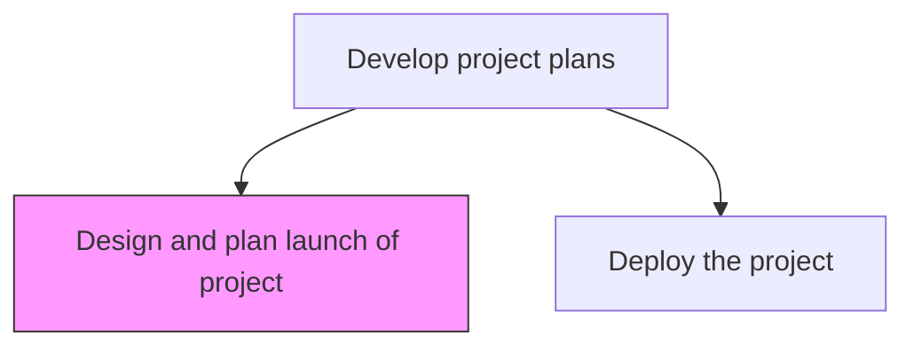
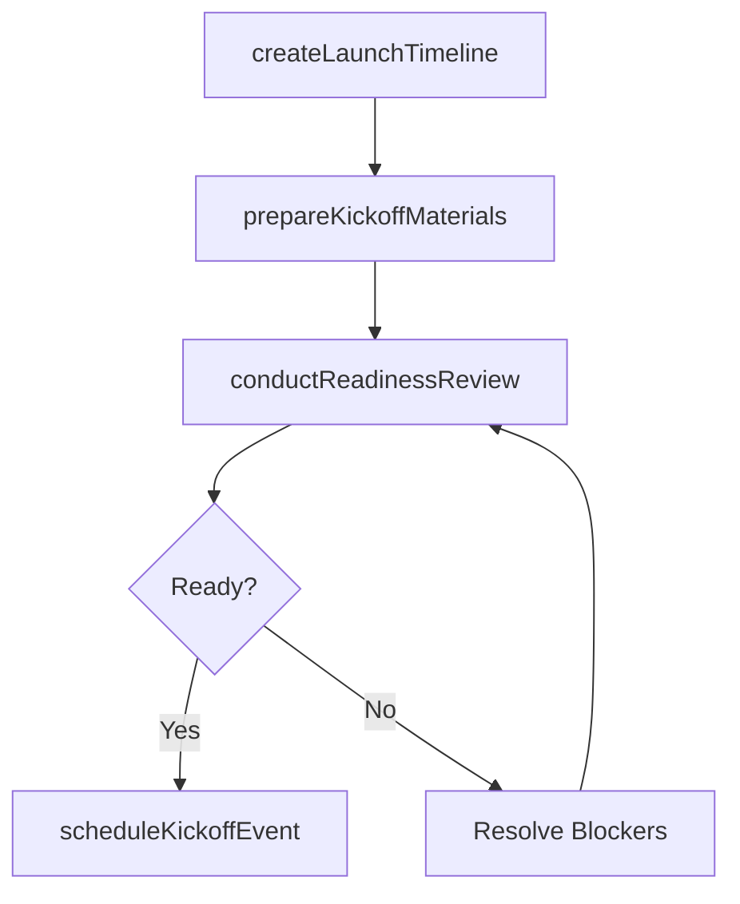

# Design and plan launch of project

> Business-as-Code definition for project launch planning. Models the preparation of kickoff activities, milestone schedules, team introductions, and go-live readiness checks.

## Overview

Creating a plan specifying when to initiate the project, and introducing it to the target audience. Clearly define the project team, objectives, timelines, and milestone.

## Process Hierarchy



## GraphDL

```yaml
design:
  object: And Plan Launch Of Project
  actor: ProjectManager
  result: ProjectLaunchPlan
```

## Actions

| Action | Description |
|--------|-------------|
| createLaunchTimeline | Define the sequence of activities leading to project kickoff |
| prepareKickoffMaterials | Develop presentations, documentation, and communication materials for launch |
| conductReadinessReview | Verify all prerequisites are met before initiating the project |
| scheduleKickoffEvent | Plan and coordinate the project kickoff meeting with all stakeholders |

## Events

| Event | Description |
|-------|-------------|
| launchTimelineCreated | Project launch sequence of activities defined |
| kickoffMaterialsPrepared | Launch presentations and documentation completed |
| readinessReviewConducted | Launch readiness confirmed through prerequisite review |
| kickoffEventScheduled | Project kickoff meeting planned and invitations sent |

## Searches

| Search | Description |
|--------|-------------|
| getLaunchPlan | Retrieve the launch plan and readiness checklist for a project |
| getKickoffSchedule | Retrieve kickoff meeting details and attendee list |

## Process Flow



## RACI Matrix

| Activity | Responsible | Accountable | Consulted | Informed |
|----------|-------------|-------------|-----------|----------|
| conductReadinessReview | ProjectManager | ProjectSponsor | TeamLeads | PMO |
| scheduleKickoffEvent | ProjectManager | ProjectSponsor | Stakeholders | AllTeamMembers |

## Related Processes

| Process | Relationship |
|---------|-------------|
| 13.2.3.3.7 Deploy the project | Downstream - launch plan leads to project deployment |
| 13.2.3.3.4 Create training and communication plans | Upstream - communication plan supports launch messaging |

## Related Departments

| Department | Role |
|-----------|------|
| PMO | Provides launch plan templates and readiness checklists |
| Communications | Supports launch messaging and stakeholder announcements |

## Related Occupations

| Occupation | Involvement |
|-----------|-------------|
| Project Manager | Plans and orchestrates the project launch |
| Communications Specialist | Prepares launch announcement materials |

## KPIs

| KPI | Description | Unit |
|-----|-------------|------|
| Launch Readiness Score | Percentage of readiness checklist items completed before kickoff | % |
| Kickoff Attendance Rate | Percentage of required attendees present at kickoff | % |

## Usage

```typescript
import { designAndPlanLaunchOfProject } from '@headlessly/design-and-plan-launch-of-project'

const launch = designAndPlanLaunchOfProject()

const plan = await launch.conductReadinessReview({
  projectId: 'PRJ-ecommerce-platform',
  checklist: ['team-assembled', 'funding-secured', 'it-environment-ready', 'stakeholders-informed'],
  launchDate: '2026-03-15'
})
```
