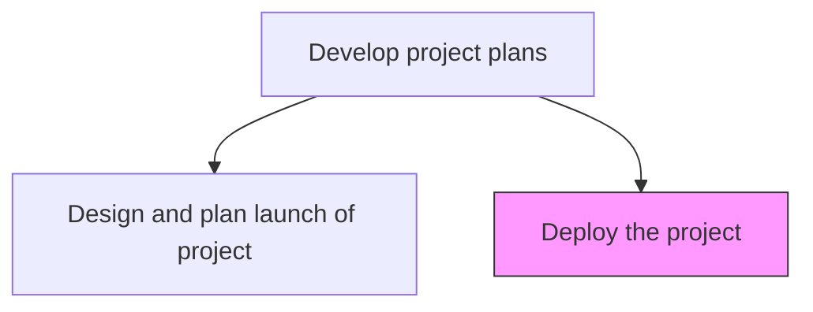
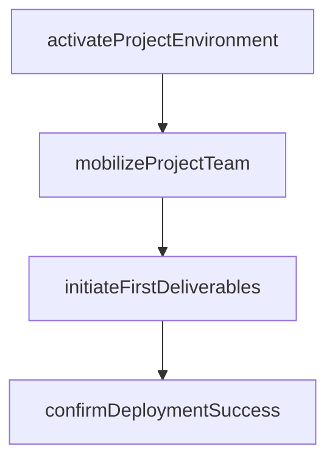

# Deploy the project

> Business-as-Code definition for project deployment. Models the activation of the project by transitioning from planning to execution, including environment setup, team mobilization, and initial deliverable production.

## Overview

Putting the project into position by effectively bringing it into action.

## Process Hierarchy



## GraphDL

```yaml
deploy:
  object: Project
  actor: ProjectManager
  result: ProjectDeploymentConfirmation
```

## Actions

| Action | Description |
|--------|-------------|
| activateProjectEnvironment | Set up project workspaces, tools, and collaboration infrastructure |
| mobilizeProjectTeam | Bring all team members onto the project and begin assigned work |
| initiateFirstDeliverables | Start production of the first planned work packages |
| confirmDeploymentSuccess | Verify that all deployment activities completed successfully |

## Events

| Event | Description |
|-------|-------------|
| projectEnvironmentActivated | Project workspaces and tools set up and accessible |
| projectTeamMobilized | All team members onboarded and work initiated |
| firstDeliverablesInitiated | Initial work packages started |
| deploymentSuccessConfirmed | Project deployment verified as operational |

## Searches

| Search | Description |
|--------|-------------|
| getDeploymentStatus | Retrieve the deployment status for a project |
| getProjectMobilizationProgress | Track team mobilization progress by role |

## Process Flow



## RACI Matrix

| Activity | Responsible | Accountable | Consulted | Informed |
|----------|-------------|-------------|-----------|----------|
| activateProjectEnvironment | ProjectManager | ProjectSponsor | IT | PMO |
| mobilizeProjectTeam | ProjectManager | ProjectSponsor | ResourceManagers | Stakeholders |

## Related Processes

| Process | Relationship |
|---------|-------------|
| 13.2.3.3.6 Design and plan launch of project | Upstream - launch plan guides deployment activities |
| 13.2.3.4 Execute projects | Downstream - deployment transitions into full project execution |

## Related Departments

| Department | Role |
|-----------|------|
| IT | Activates project infrastructure and tools |
| PMO | Verifies deployment against launch checklist |

## Related Occupations

| Occupation | Involvement |
|-----------|-------------|
| Project Manager | Orchestrates deployment and team mobilization |
| IT Administrator | Provisions project environments and tools |

## KPIs

| KPI | Description | Unit |
|-----|-------------|------|
| Deployment On-Time Rate | Percentage of deployment activities completed by planned dates | % |
| Team Mobilization Rate | Percentage of team members active on project within first week | % |

## Usage

```typescript
import { deployTheProject } from '@headlessly/deploy-project'

const deployment = deployTheProject()

const result = await deployment.activateProjectEnvironment({
  projectId: 'PRJ-ecommerce-platform',
  environments: ['development', 'staging'],
  tools: ['jira', 'confluence', 'github', 'slack-channel']
})
```
