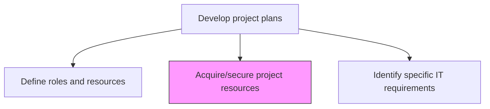
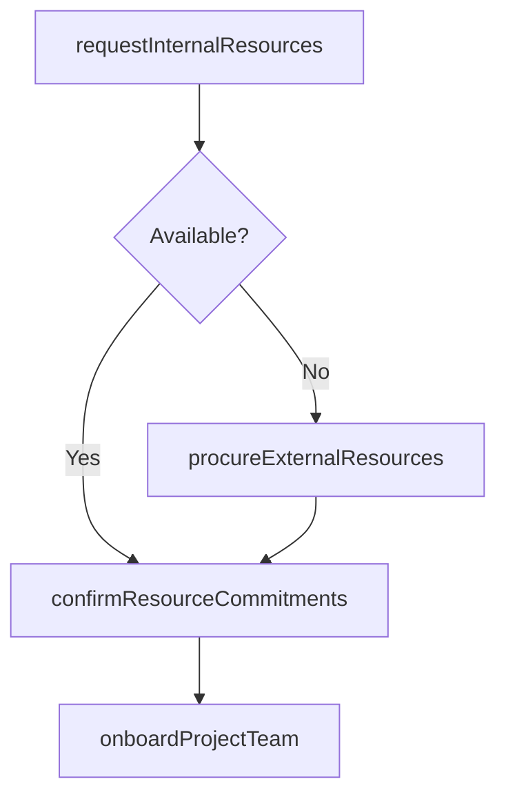

# Acquire/secure project resources

> Business-as-Code definition for project resource acquisition. Models the procurement and securing of people, equipment, and materials as defined in the project staffing plan.

## Overview

Procuring the necessary resources outlined in Define roles and resources [11123]

## Process Hierarchy



## GraphDL

```yaml
acquire/secure:
  object: Project Resources
  actor: ResourceManager
  result: ResourceCommitmentRecord
```

## Actions

| Action | Description |
|--------|-------------|
| requestInternalResources | Submit resource requests to functional managers for team member allocation |
| procureExternalResources | Engage contractors, consultants, or vendors for external resource needs |
| confirmResourceCommitments | Obtain formal commitments from resource providers with start dates |
| onboardProjectTeam | Orient acquired resources to project objectives, tools, and processes |

## Events

| Event | Description |
|-------|-------------|
| internalResourcesRequested | Resource allocation requests submitted to functional managers |
| externalResourcesProcured | External contractors or vendors engaged and contracted |
| resourceCommitmentsConfirmed | Formal resource availability commitments obtained |
| projectTeamOnboarded | Acquired resources oriented and ready for project work |

## Searches

| Search | Description |
|--------|-------------|
| getResourceCommitments | Retrieve confirmed resource commitments by project |
| findAvailableResources | List resources available for allocation within a timeframe |
| getOnboardingStatus | Track onboarding progress for acquired project resources |

## Process Flow



## RACI Matrix

| Activity | Responsible | Accountable | Consulted | Informed |
|----------|-------------|-------------|-----------|----------|
| requestInternalResources | ProjectManager | ResourceManager | FunctionalManagers | PMO |
| procureExternalResources | ProjectManager | ProjectSponsor | Procurement | Finance |

## Related Processes

| Process | Relationship |
|---------|-------------|
| 13.2.3.3.1 Define roles and resources | Upstream - role definitions drive resource acquisition |
| 13.2.3.3.3 Identify specific IT requirements | Parallel - IT resources acquired alongside team resources |

## Related Departments

| Department | Role |
|-----------|------|
| HR | Supports internal resource allocation |
| Procurement | Manages external vendor and contractor engagement |

## Related Occupations

| Occupation | Involvement |
|-----------|-------------|
| Resource Manager | Coordinates resource allocation across projects |
| Project Manager | Requests and onboards project team members |

## KPIs

| KPI | Description | Unit |
|-----|-------------|------|
| Resource Fill Rate | Percentage of required roles filled by project start date | % |
| Time to Onboard | Average days from resource commitment to project readiness | Days |

## Usage

```typescript
import { acquireSecureProjectResources } from '@headlessly/acquire-secure-project-resources'

const acquisition = acquireSecureProjectResources()

const commitments = await acquisition.confirmResourceCommitments({
  projectId: 'PRJ-data-platform',
  resources: [
    { roleId: 'tech-lead', resourceId: 'EMP-1234', startDate: '2026-03-01' },
    { roleId: 'data-engineer', source: 'external', vendor: 'VENDOR-consulting-co' }
  ]
})
```
