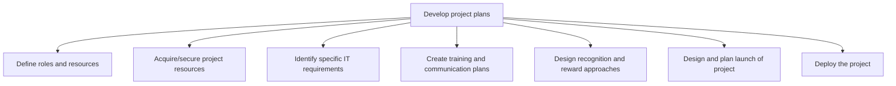
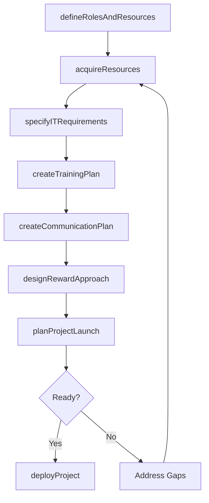

# Develop project plans

> Business-as-Code definition for project planning. Models the development of detailed project plans including role definition, resource acquisition, IT requirements, training, communications, rewards, launch planning, and deployment.

## Overview

Defining the resources and their roles. Identify IT requirements. Create plans for effective training and communication. Design reward approaches. Plan the launch of project. Deploy the project.

## Process Hierarchy



## GraphDL

```yaml
develop:
  object: Project Plans
  actor: ProjectManager
  result: ProjectPlanBaseline
```

## Actions

| Action | Description |
|--------|-------------|
| defineRolesAndResources | Specify team roles, responsibilities, and resource requirements |
| acquireResources | Procure and onboard the personnel, equipment, and services needed |
| specifyITRequirements | Document computing, network, software, and infrastructure needs |
| createTrainingPlan | Design skill-building programs to prepare the project team |
| createCommunicationPlan | Define stakeholder messaging cadence, channels, and content |
| designRewardApproach | Establish recognition and incentive mechanisms for the team |
| planProjectLaunch | Sequence launch activities and define go-live readiness criteria |
| deployProject | Activate the project and begin execution of planned work |

## Events

| Event | Description |
|-------|-------------|
| rolesAndResourcesDefined | Team structure and resource requirements documented |
| resourcesAcquired | All required personnel and assets secured and onboarded |
| itRequirementsSpecified | IT infrastructure and software needs documented and submitted |
| trainingPlanCreated | Team training schedule and materials prepared |
| communicationPlanCreated | Stakeholder communication strategy approved |
| rewardApproachDesigned | Recognition and incentive plan established |
| projectLaunchPlanned | Launch sequence and go-live criteria finalized |
| projectDeployed | Project activated and execution commenced |

## Searches

| Search | Description |
|--------|-------------|
| getProjectPlan | Retrieve the current baselined project plan |
| getResourceAssignments | List team member assignments and availability for a project |
| getTrainingSchedule | Retrieve the training plan and completion status |
| getCommunicationCalendar | Get the scheduled communications and their status |

## Process Flow



## RACI Matrix

| Activity | Responsible | Accountable | Consulted | Informed |
|----------|-------------|-------------|-----------|----------|
| defineRolesAndResources | ProjectManager | ProgramManager | HR | TeamMembers |
| acquireResources | ProjectManager | ProgramManager | Procurement | Finance |
| specifyITRequirements | ProjectManager | ProgramManager | ITArchitect | CIO |
| planProjectLaunch | ProjectManager | ExecutiveSponsor | ChangeManager | AllStakeholders |

## Sub-Processes

| ID | Name | Description |
|----|------|-------------|
| 13.2.3.3.1 | Define roles and resources | Outlining the resources and their roles in the business projects. |
| 13.2.3.3.2 | Acquire/secure project resources | Procuring the necessary resources outlined in Define roles and resources [11123] |
| 13.2.3.3.3 | Identify specific IT requirements | Determining the IT requirements for specific business projects. Identify the requirements of compute |
| 13.2.3.3.4 | Create training and communication plans | Designing a plan for equipping the project team with the necessary skills and abilities to fulfill t |
| 13.2.3.3.5 | Design recognition and reward approaches | Creating a plan for recognizing and rewarding extraordinary performances within the business project |
| 13.2.3.3.6 | Design and plan launch of project | Creating a plan specifying when to initiate the project, and introducing it to the target audience.  |
| 13.2.3.3.7 | Deploy the project | Putting the project into position by effectively bringing it into action. |

## Related Processes

| Process | Relationship |
|---------|-------------|
| 13.2.3.1 Establish project scope | Upstream - scope defines the planning boundaries |
| 13.2.3.4 Execute projects | Downstream - plans guide execution activities |
| 13.4 Manage change | Parallel - change management integrated into launch planning |

## Related Departments

| Department | Role |
|-----------|------|
| Project Management Office (PMO) | Provides planning templates, standards, and oversight |
| IT | Fulfills technology requirements and infrastructure provisioning |
| Human Resources | Supports resource acquisition and training |
| Communications | Assists with stakeholder communication planning |
| Procurement | Manages vendor contracts for external resources |

## Related Occupations

| Occupation | Involvement |
|-----------|-------------|
| Project Manager | Leads the development and baselining of project plans |
| Resource Manager | Allocates and schedules team members across projects |
| IT Architect | Specifies technology requirements and infrastructure design |

## KPIs

| KPI | Description | Unit |
|-----|-------------|------|
| Plan Completeness | Percentage of required plan components documented and approved | % |
| Resource Fill Rate | Percentage of required resource positions staffed by launch | % |
| Planning Cycle Time | Time from scope approval to plan baseline | Days |
| Training Readiness | Percentage of team members completing required training before launch | % |

## Usage

```typescript
import { developProjectPlans } from '@headlessly/develop-project-plans'

const plans = developProjectPlans()

// Define roles and resources for a project
const team = await plans.defineRolesAndResources({
  projectId: 'PRJ-2026-042',
  roles: [
    { title: 'technical-lead', count: 1, skills: ['architecture', 'cloud'] },
    { title: 'developer', count: 4, skills: ['typescript', 'react'] }
  ]
})

// Plan the project launch
const launch = await plans.planProjectLaunch({
  projectId: 'PRJ-2026-042',
  targetDate: '2026-04-01',
  readinessCriteria: ['resources-onboarded', 'infrastructure-provisioned', 'training-complete']
})
```
