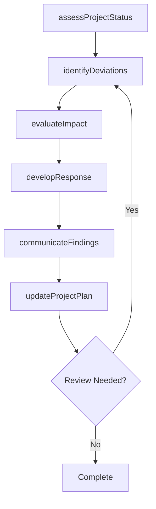

# Evaluate impact of project management (strategy and projects) on measures and outcomes

> Business-as-Code definition for evaluate impact of project management (strategy and projects) on measures and outcomes. Models the process of assessing the impact of business project management on the measures and outcomes of the projects.

## Overview

Assessing the impact of business project management on the measures and outcomes of the projects. Gauge non-financial measures, frequency of measurement, action plan, etc.

## Process Hierarchy

```mermaid
graph TD
    A[Evaluate impact of project management (strategy and projects) on measures and outcomes]
    style A fill:#f9f,stroke:#333
```

## GraphDL

```yaml
evaluate:
  object: Impact Of Project Management (strategy And Projects) On Measures And Outcomes
  actor: ProjectManager
  result: impactOfProjectManagementStrategyAndProjectsOnMeasuresAndOutcomesResult
```

## Actions

| Action | Description |
|--------|-------------|
| assessProjectStatus | Evaluate current status and progress of impact of project management (strategy and projects) on measures and outcomes |
| identifyDeviations | Detect variances from the planned baseline for impact of project management (strategy and projects) on measures and outcomes |
| evaluateImpact | Assess the impact of findings on impact of project management (strategy and projects) on measures and outcomes |
| developResponse | Create response actions to address impact of project management (strategy and projects) on measures and outcomes findings |
| communicateFindings | Report impact of project management (strategy and projects) on measures and outcomes results to stakeholders |
| updateProjectPlan | Revise project plans based on impact of project management (strategy and projects) on measures and outcomes outcomes |

## Events

| Event | Description |
|-------|-------------|
| projectStatusAssessed | Current status and progress evaluated |
| deviationsIdentified | Variances from planned baseline detected |
| impactEvaluated | Impact of findings assessed |
| responseDeveloped | Response actions created to address findings |
| findingsCommunicated | Results reported to stakeholders |
| projectPlanUpdated | Project plans revised based on outcomes |

## Searches

| Search | Description |
|--------|-------------|
| findImpactOfProjectManagementStrategyAndProjectsOnMeasuresAndOutcomes | Retrieve impact of project management (strategy and projects) on measures and outcomes records filtered by status, date, or scope |
| getImpactOfProjectManagementStrategyAndProjectsOnMeasuresAndOutcomesDetails | Get detailed information for a specific impact of project management (strategy and projects) on measures and outcomes record |
| listImpactOfProjectManagementStrategyAndProjectsOnMeasuresAndOutcomesHistory | Query the history of changes and updates to impact of project management (strategy and projects) on measures and outcomes |
| getActiveItems | List currently active items related to impact of project management (strategy and projects) on measures and outcomes |

## Process Flow



## RACI Matrix

| Activity | Responsible | Accountable | Consulted | Informed |
|----------|-------------|-------------|-----------|----------|
| assessProjectStatus | ProjectManager | ProgramDirector | ProjectTeam | Stakeholders |
| identifyDeviations | PMOAnalyst | ProjectManager | Finance | Stakeholders |
| evaluateImpact | ProjectManager | ProgramDirector | SteeringCommittee | Stakeholders |
| developResponse | PMOAnalyst | ProjectManager | BusinessSponsors | Stakeholders |

## Related Processes

| Process | Relationship |
|---------|-------------|
| 13.2.3.4 Execute projects | Parallel - project execution context |
| 13.2.3.5 Review and report project performance | Downstream - performance feeds back to project management |
| 13.4.1 Plan for change | Parallel - project changes require change management |

## Related Departments

| Department | Role |
|-----------|------|
| Project Management Office | Provides methodology, tools, and oversight for project execution |
| Finance | Monitors project budgets and financial performance |
| Operations | Provides resources and operational context for projects |
| IT | Supports project tooling and technical delivery |

## Related Occupations

| Occupation | Involvement |
|-----------|-------------|
| Project Manager | Leads project planning and execution |
| Program Director | Oversees program-level coordination |
| PMO Analyst | Provides project data analysis and reporting |

## KPIs

| KPI | Description | Unit |
|-----|-------------|------|
| Schedule Performance Index | Ratio of earned value to planned value | Ratio |
| Cost Performance Index | Ratio of earned value to actual cost | Ratio |
| Scope Change Frequency | Number of approved scope changes per project phase | Count |
| Stakeholder Satisfaction | Project stakeholder satisfaction with delivery | Score (1-5) |

## Usage

```typescript
import { evaluateImpactOfProjectManagementStrategyAndProjectsOnMeasuresAndOutcomes } from '@headlessly/evaluate-impact-of-project-management-strategy-and-projects-on-measures-and-outcomes'

const client = evaluateImpactOfProjectManagementStrategyAndProjectsOnMeasuresAndOutcomes()

// Evaluate current status and progress of impact of project management (strategy and projects) on measures and outcomes
const result = await client.assessProjectStatus({
  scope: 'enterprise',
  period: 'Q1-2025'
})

// Detect variances from the planned baseline for impact of project management (strategy and projects) on measures and outcomes
const assessment = await client.identifyDeviations({
  resultId: result.id,
  criteria: 'standard'
})

// Assess the impact of findings on impact of project management (strategy and projects) on measures and outcomes
await client.evaluateImpact({
  resultId: result.id,
  format: 'detailed',
  recipients: ['stakeholders']
})
```
