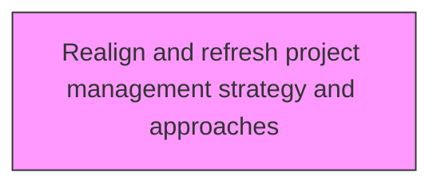
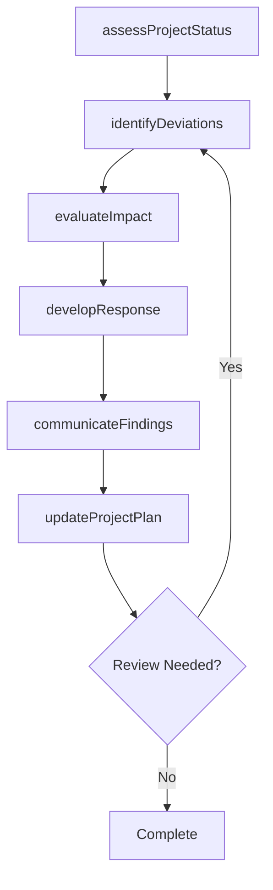

# Realign and refresh project management strategy and approaches

> Business-as-Code definition for realign and refresh project management strategy and approaches. Models the process of reorganizing and stimulating the approach and strategy for managing business projects.

## Overview

Reorganizing and stimulating the approach and strategy for managing business projects. Make improvements based on the project scope and on findings from Evaluate the impact of project management (strategy and projects) on measures and outcomes [11131].

## Process Hierarchy



## GraphDL

```yaml
realign:
  object: And Refresh Project Management Strategy And Approaches
  actor: ProjectManager
  result: refreshProjectManagementStrategyAndApproachesResult
```

## Actions

| Action | Description |
|--------|-------------|
| assessProjectStatus | Evaluate current status and progress of refresh project management strategy and approaches |
| identifyDeviations | Detect variances from the planned baseline for refresh project management strategy and approaches |
| evaluateImpact | Assess the impact of findings on refresh project management strategy and approaches |
| developResponse | Create response actions to address refresh project management strategy and approaches findings |
| communicateFindings | Report refresh project management strategy and approaches results to stakeholders |
| updateProjectPlan | Revise project plans based on refresh project management strategy and approaches outcomes |

## Events

| Event | Description |
|-------|-------------|
| projectStatusAssessed | Current status and progress evaluated |
| deviationsIdentified | Variances from planned baseline detected |
| impactEvaluated | Impact of findings assessed |
| responseDeveloped | Response actions created to address findings |
| findingsCommunicated | Results reported to stakeholders |
| projectPlanUpdated | Project plans revised based on outcomes |

## Searches

| Search | Description |
|--------|-------------|
| findRefreshProjectManagementStrategyAndApproaches | Retrieve refresh project management strategy and approaches records filtered by status, date, or scope |
| getRefreshProjectManagementStrategyAndApproachesDetails | Get detailed information for a specific refresh project management strategy and approaches record |
| listRefreshProjectManagementStrategyAndApproachesHistory | Query the history of changes and updates to refresh project management strategy and approaches |
| getActiveItems | List currently active items related to refresh project management strategy and approaches |

## Process Flow



## RACI Matrix

| Activity | Responsible | Accountable | Consulted | Informed |
|----------|-------------|-------------|-----------|----------|
| assessProjectStatus | ProjectManager | ProgramDirector | ProjectTeam | Stakeholders |
| identifyDeviations | PMOAnalyst | ProjectManager | Finance | Stakeholders |
| evaluateImpact | ProjectManager | ProgramDirector | SteeringCommittee | Stakeholders |
| developResponse | PMOAnalyst | ProjectManager | BusinessSponsors | Stakeholders |

## Related Processes

| Process | Relationship |
|---------|-------------|
| 13.2.3.4 Execute projects | Parallel - project execution context |
| 13.2.3.5 Review and report project performance | Downstream - performance feeds back to project management |
| 13.4.1 Plan for change | Parallel - project changes require change management |

## Related Departments

| Department | Role |
|-----------|------|
| Project Management Office | Provides methodology, tools, and oversight for project execution |
| Finance | Monitors project budgets and financial performance |
| Operations | Provides resources and operational context for projects |
| IT | Supports project tooling and technical delivery |

## Related Occupations

| Occupation | Involvement |
|-----------|-------------|
| Project Manager | Leads project planning and execution |
| Program Director | Oversees program-level coordination |
| PMO Analyst | Provides project data analysis and reporting |

## KPIs

| KPI | Description | Unit |
|-----|-------------|------|
| Schedule Performance Index | Ratio of earned value to planned value | Ratio |
| Cost Performance Index | Ratio of earned value to actual cost | Ratio |
| Scope Change Frequency | Number of approved scope changes per project phase | Count |
| Stakeholder Satisfaction | Project stakeholder satisfaction with delivery | Score (1-5) |

## Usage

```typescript
import { realignAndRefreshProjectManagementStrategyAndApproaches } from '@headlessly/realign-and-refresh-project-management-strategy-and-approaches'

const client = realignAndRefreshProjectManagementStrategyAndApproaches()

// Evaluate current status and progress of refresh project management strategy and approaches
const result = await client.assessProjectStatus({
  scope: 'enterprise',
  period: 'Q1-2025'
})

// Detect variances from the planned baseline for refresh project management strategy and approaches
const assessment = await client.identifyDeviations({
  resultId: result.id,
  criteria: 'standard'
})

// Assess the impact of findings on refresh project management strategy and approaches
await client.evaluateImpact({
  resultId: result.id,
  format: 'detailed',
  recipients: ['stakeholders']
})
```
