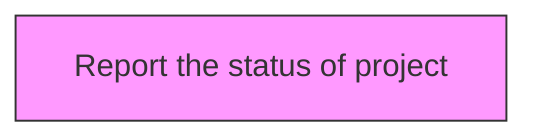
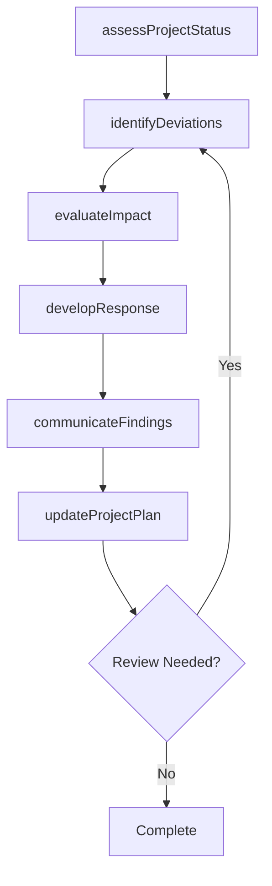

# Report the status of project

> Business-as-Code definition for report the status of project. Models the process of recording and documenting the current status and position of the project.

## Overview

Recording and documenting the current status and position of the project. Record and report items such as completed tasks, incomplete tasks, planned tasks, and problems faced.

## Process Hierarchy



## GraphDL

```yaml
report:
  object: Status Of Project
  actor: ProjectManager
  result: statusOfProjectResult
```

## Actions

| Action | Description |
|--------|-------------|
| assessProjectStatus | Evaluate current status and progress of status of project |
| identifyDeviations | Detect variances from the planned baseline for status of project |
| evaluateImpact | Assess the impact of findings on status of project |
| developResponse | Create response actions to address status of project findings |
| communicateFindings | Report status of project results to stakeholders |
| updateProjectPlan | Revise project plans based on status of project outcomes |

## Events

| Event | Description |
|-------|-------------|
| projectStatusAssessed | Current status and progress evaluated |
| deviationsIdentified | Variances from planned baseline detected |
| impactEvaluated | Impact of findings assessed |
| responseDeveloped | Response actions created to address findings |
| findingsCommunicated | Results reported to stakeholders |
| projectPlanUpdated | Project plans revised based on outcomes |

## Searches

| Search | Description |
|--------|-------------|
| findStatusOfProject | Retrieve status of project records filtered by status, date, or scope |
| getStatusOfProjectDetails | Get detailed information for a specific status of project record |
| listStatusOfProjectHistory | Query the history of changes and updates to status of project |
| getActiveItems | List currently active items related to status of project |

## Process Flow



## RACI Matrix

| Activity | Responsible | Accountable | Consulted | Informed |
|----------|-------------|-------------|-----------|----------|
| assessProjectStatus | ProjectManager | ProgramDirector | ProjectTeam | Stakeholders |
| identifyDeviations | PMOAnalyst | ProjectManager | Finance | Stakeholders |
| evaluateImpact | ProjectManager | ProgramDirector | SteeringCommittee | Stakeholders |
| developResponse | PMOAnalyst | ProjectManager | BusinessSponsors | Stakeholders |

## Related Processes

| Process | Relationship |
|---------|-------------|
| 13.2.3.4 Execute projects | Parallel - project execution context |
| 13.2.3.5 Review and report project performance | Downstream - performance feeds back to project management |
| 13.4.1 Plan for change | Parallel - project changes require change management |

## Related Departments

| Department | Role |
|-----------|------|
| Project Management Office | Provides methodology, tools, and oversight for project execution |
| Finance | Monitors project budgets and financial performance |
| Operations | Provides resources and operational context for projects |
| IT | Supports project tooling and technical delivery |

## Related Occupations

| Occupation | Involvement |
|-----------|-------------|
| Project Manager | Leads project planning and execution |
| Program Director | Oversees program-level coordination |
| PMO Analyst | Provides project data analysis and reporting |

## KPIs

| KPI | Description | Unit |
|-----|-------------|------|
| Schedule Performance Index | Ratio of earned value to planned value | Ratio |
| Cost Performance Index | Ratio of earned value to actual cost | Ratio |
| Scope Change Frequency | Number of approved scope changes per project phase | Count |
| Stakeholder Satisfaction | Project stakeholder satisfaction with delivery | Score (1-5) |

## Usage

```typescript
import { reportTheStatusOfProject } from '@headlessly/report-the-status-of-project'

const client = reportTheStatusOfProject()

// Evaluate current status and progress of status of project
const result = await client.assessProjectStatus({
  scope: 'enterprise',
  period: 'Q1-2025'
})

// Detect variances from the planned baseline for status of project
const assessment = await client.identifyDeviations({
  resultId: result.id,
  criteria: 'standard'
})

// Assess the impact of findings on status of project
await client.evaluateImpact({
  resultId: result.id,
  format: 'detailed',
  recipients: ['stakeholders']
})
```
