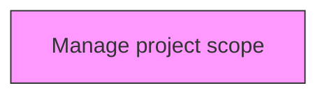
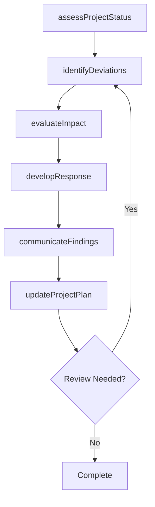

# Manage project scope

> Business-as-Code definition for manage project scope. Models the process of determining and documenting a list of specific project goals, deliverables, tasks, costs, and deadlines.

## Overview

Determining and documenting a list of specific project goals, deliverables, tasks, costs, and deadlines. Use the scope statement to explain the boundaries of the project. Assign responsibilities for team members. Set up procedures for verifying and approving the completed tasks.

## Process Hierarchy



## GraphDL

```yaml
manage:
  object: Project Scope
  actor: ProjectManager
  result: projectScopeResult
```

## Actions

| Action | Description |
|--------|-------------|
| assessProjectStatus | Evaluate current status and progress of project scope |
| identifyDeviations | Detect variances from the planned baseline for project scope |
| evaluateImpact | Assess the impact of findings on project scope |
| developResponse | Create response actions to address project scope findings |
| communicateFindings | Report project scope results to stakeholders |
| updateProjectPlan | Revise project plans based on project scope outcomes |

## Events

| Event | Description |
|-------|-------------|
| projectStatusAssessed | Current status and progress evaluated |
| deviationsIdentified | Variances from planned baseline detected |
| impactEvaluated | Impact of findings assessed |
| responseDeveloped | Response actions created to address findings |
| findingsCommunicated | Results reported to stakeholders |
| projectPlanUpdated | Project plans revised based on outcomes |

## Searches

| Search | Description |
|--------|-------------|
| findProjectScope | Retrieve project scope records filtered by status, date, or scope |
| getProjectScopeDetails | Get detailed information for a specific project scope record |
| listProjectScopeHistory | Query the history of changes and updates to project scope |
| getActiveItems | List currently active items related to project scope |

## Process Flow



## RACI Matrix

| Activity | Responsible | Accountable | Consulted | Informed |
|----------|-------------|-------------|-----------|----------|
| assessProjectStatus | ProjectManager | ProgramDirector | ProjectTeam | Stakeholders |
| identifyDeviations | PMOAnalyst | ProjectManager | Finance | Stakeholders |
| evaluateImpact | ProjectManager | ProgramDirector | SteeringCommittee | Stakeholders |
| developResponse | PMOAnalyst | ProjectManager | BusinessSponsors | Stakeholders |

## Related Processes

| Process | Relationship |
|---------|-------------|
| 13.2.3.4 Execute projects | Parallel - project execution context |
| 13.2.3.5 Review and report project performance | Downstream - performance feeds back to project management |
| 13.4.1 Plan for change | Parallel - project changes require change management |

## Related Departments

| Department | Role |
|-----------|------|
| Project Management Office | Provides methodology, tools, and oversight for project execution |
| Finance | Monitors project budgets and financial performance |
| Operations | Provides resources and operational context for projects |
| IT | Supports project tooling and technical delivery |

## Related Occupations

| Occupation | Involvement |
|-----------|-------------|
| Project Manager | Leads project planning and execution |
| Program Director | Oversees program-level coordination |
| PMO Analyst | Provides project data analysis and reporting |

## KPIs

| KPI | Description | Unit |
|-----|-------------|------|
| Schedule Performance Index | Ratio of earned value to planned value | Ratio |
| Cost Performance Index | Ratio of earned value to actual cost | Ratio |
| Scope Change Frequency | Number of approved scope changes per project phase | Count |
| Stakeholder Satisfaction | Project stakeholder satisfaction with delivery | Score (1-5) |

## Usage

```typescript
import { manageProjectScope } from '@headlessly/manage-project-scope'

const client = manageProjectScope()

// Evaluate current status and progress of project scope
const result = await client.assessProjectStatus({
  scope: 'enterprise',
  period: 'Q1-2025'
})

// Detect variances from the planned baseline for project scope
const assessment = await client.identifyDeviations({
  resultId: result.id,
  criteria: 'standard'
})

// Assess the impact of findings on project scope
await client.evaluateImpact({
  resultId: result.id,
  format: 'detailed',
  recipients: ['stakeholders']
})
```
