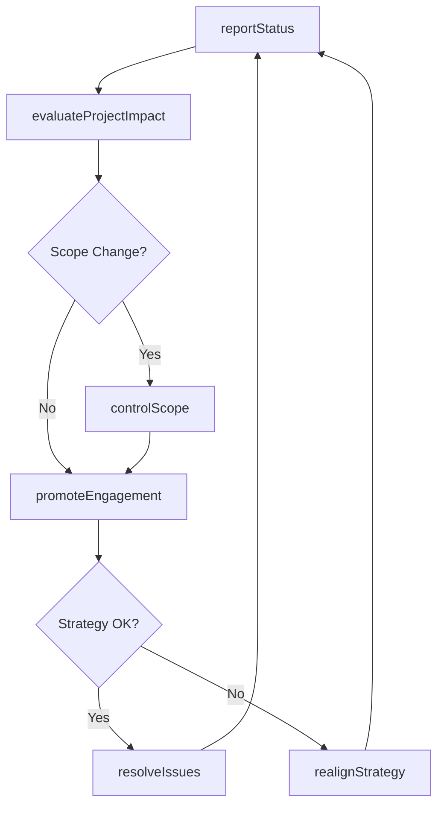

# Execute projects

> Business-as-Code definition for project execution. Models the active delivery phase including impact evaluation, status reporting, scope control, team engagement, and strategy realignment.

## Overview

Implementing the business projects of the organization. Evaluate the impact of project management. Record and report the status of the project. Manage the project scope. Promote and sustain activities and involvement. Realign and revamp the project management strategy and approach.

## Process Hierarchy

```mermaid
graph TD
    A[Execute projects]
    A --> B[Evaluate impact of project management (strategy and projects) on measures and outcomes]
    A --> C[Report the status of project]
    A --> D[Manage project scope]
    A --> E[Promote and sustain activity and involvement]
    A --> F[Realign and refresh project management strategy and approaches]
```

## GraphDL

```yaml
execute:
  object: Projects
  actor: ProjectManager
  result: ProjectStatusReport
```

## Actions

| Action | Description |
|--------|-------------|
| evaluateProjectImpact | Assess how project management practices affect outcomes and measures |
| reportStatus | Record and communicate project schedule, budget, risks, and deliverables |
| controlScope | Process scope change requests and maintain the requirements baseline |
| promoteEngagement | Encourage team participation and sustain stakeholder involvement |
| realignStrategy | Adjust project management approach based on lessons learned and performance |
| resolveIssues | Identify, escalate, and resolve project issues and blockers |

## Events

| Event | Description |
|-------|-------------|
| projectImpactEvaluated | Project management effectiveness assessment completed |
| statusReported | Project status report published with current metrics |
| scopeControlled | Scope change request processed and baseline updated |
| engagementPromoted | Team engagement activities executed and feedback gathered |
| strategyRealigned | Project management approach adjusted and communicated |
| issuesResolved | Project issues triaged and resolution actions completed |

## Searches

| Search | Description |
|--------|-------------|
| getProjectStatus | Retrieve current status report for a project |
| findScopeChanges | List scope change requests by status or impact |
| getProjectIssues | Retrieve open issues and their resolution progress |
| getTeamEngagement | Retrieve team engagement and participation metrics |

## Process Flow



## RACI Matrix

| Activity | Responsible | Accountable | Consulted | Informed |
|----------|-------------|-------------|-----------|----------|
| reportStatus | ProjectManager | ProgramManager | TeamLeads | SteeringCommittee |
| controlScope | ProjectManager | ExecutiveSponsor | BusinessAnalyst | PMO |
| promoteEngagement | ProjectManager | ProgramManager | ChangeManager | TeamMembers |
| realignStrategy | ProjectManager | PMODirector | ProgramManager | ExecutiveSponsor |

## Sub-Processes

| ID | Name | Description |
|----|------|-------------|
| 13.2.3.4.1 | Evaluate impact of project management (strategy and projects) on measures and outcomes | Assessing the impact of business project management on the measures and outcomes of the projects. Ga |
| 13.2.3.4.2 | Report the status of project | Recording and documenting the current status and position of the project. Record and report items su |
| 13.2.3.4.3 | Manage project scope | Determining and documenting a list of specific project goals, deliverables, tasks, costs, and deadli |
| 13.2.3.4.4 | Promote and sustain activity and involvement | Encouraging and sustaining the activities and involvement while executing projects. Promote the exec |
| 13.2.3.4.5 | Realign and refresh project management strategy and approaches | Reorganizing and stimulating the approach and strategy for managing business projects. Make improvem |

## Related Processes

| Process | Relationship |
|---------|-------------|
| 13.2.3.3 Develop project plans | Upstream - plans define the execution baseline |
| 13.2.3.5 Review and report project performance | Downstream - execution data feeds performance reviews |
| 13.2.3.6 Close projects | Downstream - execution completion triggers closure |

## Related Departments

| Department | Role |
|-----------|------|
| Project Management Office (PMO) | Provides execution oversight and governance |
| IT | Delivers technical workstreams and infrastructure |
| Operations | Participates in operational transition activities |
| Finance | Monitors budget consumption and variance |

## Related Occupations

| Occupation | Involvement |
|-----------|-------------|
| Project Manager | Leads day-to-day execution and status reporting |
| Scrum Master | Facilitates iterative delivery and removes impediments |
| Team Lead | Coordinates work within functional workstreams |

## KPIs

| KPI | Description | Unit |
|-----|-------------|------|
| Schedule Variance | Difference between planned and actual completion dates | Days |
| Budget Burn Rate | Actual spend rate compared to planned spend rate | Ratio |
| Issue Resolution Time | Average time from issue identification to closure | Days |
| Team Velocity | Amount of work completed per iteration or sprint | Story Points |

## Usage

```typescript
import { executeProjects } from '@headlessly/execute-projects'

const exec = executeProjects()

// Report current project status
const status = await exec.reportStatus({
  projectId: 'PRJ-2026-042',
  scheduleHealth: 'green',
  budgetHealth: 'amber',
  topRisks: ['vendor-delay', 'resource-attrition']
})

// Process a scope change request
const change = await exec.controlScope({
  projectId: 'PRJ-2026-042',
  changeRequestId: 'CR-007',
  decision: 'approved',
  impactAssessment: { schedule: '+2 weeks', budget: '+50000' }
})
```
