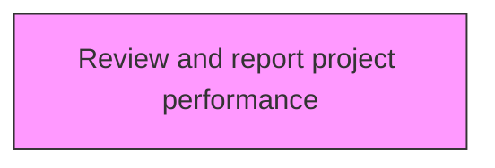
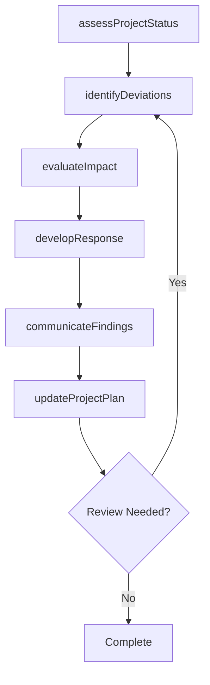

# Review and report project performance

> Business-as-Code definition for review and report project performance. Models the process of measuring the performance of a business project against key performance indicators including the project scope, schedule, quality, cost, and risk criteria.

## Overview

Measuring the performance of a business project against key performance indicators including the project scope, schedule, quality, cost, and risk criteria. Identify any deviations from the plan. Assess the impact of these deviations on the project, as well as on the overall program. Report results to key stakeholders.

## Process Hierarchy



## GraphDL

```yaml
review:
  object: And Report Project Performance
  actor: ProjectManager
  result: reportProjectPerformanceResult
```

## Actions

| Action | Description |
|--------|-------------|
| assessProjectStatus | Evaluate current status and progress of report project performance |
| identifyDeviations | Detect variances from the planned baseline for report project performance |
| evaluateImpact | Assess the impact of findings on report project performance |
| developResponse | Create response actions to address report project performance findings |
| communicateFindings | Report report project performance results to stakeholders |
| updateProjectPlan | Revise project plans based on report project performance outcomes |

## Events

| Event | Description |
|-------|-------------|
| projectStatusAssessed | Current status and progress evaluated |
| deviationsIdentified | Variances from planned baseline detected |
| impactEvaluated | Impact of findings assessed |
| responseDeveloped | Response actions created to address findings |
| findingsCommunicated | Results reported to stakeholders |
| projectPlanUpdated | Project plans revised based on outcomes |

## Searches

| Search | Description |
|--------|-------------|
| findReportProjectPerformance | Retrieve report project performance records filtered by status, date, or scope |
| getReportProjectPerformanceDetails | Get detailed information for a specific report project performance record |
| listReportProjectPerformanceHistory | Query the history of changes and updates to report project performance |
| getActiveItems | List currently active items related to report project performance |

## Process Flow



## RACI Matrix

| Activity | Responsible | Accountable | Consulted | Informed |
|----------|-------------|-------------|-----------|----------|
| assessProjectStatus | ProjectManager | ProgramDirector | ProjectTeam | Stakeholders |
| identifyDeviations | PMOAnalyst | ProjectManager | Finance | Stakeholders |
| evaluateImpact | ProjectManager | ProgramDirector | SteeringCommittee | Stakeholders |
| developResponse | PMOAnalyst | ProjectManager | BusinessSponsors | Stakeholders |

## Related Processes

| Process | Relationship |
|---------|-------------|
| 13.2.3.4 Execute projects | Parallel - project execution context |
| 13.2.3.5 Review and report project performance | Downstream - performance feeds back to project management |
| 13.4.1 Plan for change | Parallel - project changes require change management |

## Related Departments

| Department | Role |
|-----------|------|
| Project Management Office | Provides methodology, tools, and oversight for project execution |
| Finance | Monitors project budgets and financial performance |
| Operations | Provides resources and operational context for projects |
| IT | Supports project tooling and technical delivery |

## Related Occupations

| Occupation | Involvement |
|-----------|-------------|
| Project Manager | Leads project planning and execution |
| Program Director | Oversees program-level coordination |
| PMO Analyst | Provides project data analysis and reporting |

## KPIs

| KPI | Description | Unit |
|-----|-------------|------|
| Schedule Performance Index | Ratio of earned value to planned value | Ratio |
| Cost Performance Index | Ratio of earned value to actual cost | Ratio |
| Scope Change Frequency | Number of approved scope changes per project phase | Count |
| Stakeholder Satisfaction | Project stakeholder satisfaction with delivery | Score (1-5) |

## Usage

```typescript
import { reviewAndReportProjectPerformance } from '@headlessly/review-and-report-project-performance'

const client = reviewAndReportProjectPerformance()

// Evaluate current status and progress of report project performance
const result = await client.assessProjectStatus({
  scope: 'enterprise',
  period: 'Q1-2025'
})

// Detect variances from the planned baseline for report project performance
const assessment = await client.identifyDeviations({
  resultId: result.id,
  criteria: 'standard'
})

// Assess the impact of findings on report project performance
await client.evaluateImpact({
  resultId: result.id,
  format: 'detailed',
  recipients: ['stakeholders']
})
```
