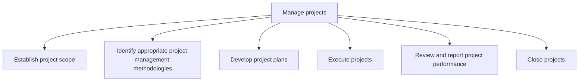
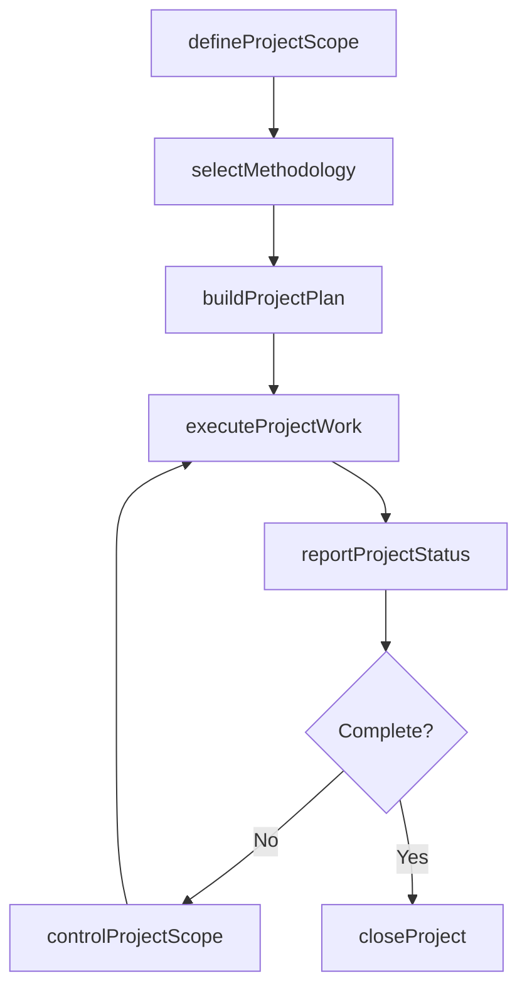

# Manage projects

> Business-as-Code definition for project management. Models the complete project lifecycle from scope definition and methodology selection through planning, execution, performance review, and formal closure.

## Overview

Establishing the scope of the projects. Create plans for implementing the projects. Initiate projects. Review and report project performance to management. Close projects.

## Process Hierarchy



## GraphDL

```yaml
manage:
  object: Projects
  actor: ProjectManager
  result: ProjectDeliverable
```

## Actions

| Action | Description |
|--------|-------------|
| defineProjectScope | Establish project objectives, requirements, deliverables, and constraints |
| selectMethodology | Choose the appropriate project management methodology for the project context |
| buildProjectPlan | Create the detailed project plan including schedule, budget, and resource assignments |
| executeProjectWork | Coordinate team activities to deliver project outputs |
| reportProjectStatus | Generate project status reports with schedule, budget, and risk indicators |
| controlProjectScope | Manage scope changes through a formal change control process |
| closeProject | Complete formal project closure with lessons learned and handoff |

## Events

| Event | Description |
|-------|-------------|
| projectScopeDefined | Project scope statement and requirements baseline approved |
| methodologySelected | Project management approach chosen and tailored |
| projectPlanBuilt | Project plan baselined with approved schedule and budget |
| projectWorkExecuted | Project deliverables produced according to plan |
| projectStatusReported | Status report generated and distributed to stakeholders |
| projectScopeControlled | Scope change request evaluated and disposition recorded |
| projectClosed | Project formally closed with final documentation archived |

## Searches

| Search | Description |
|--------|-------------|
| findProjects | List projects filtered by status, manager, program, or business unit |
| getProjectPlan | Retrieve the current baselined plan for a project |
| getProjectStatus | Get the latest status report with schedule, budget, and risk indicators |
| findProjectRisks | List open risks and issues for a specific project |
| getProjectLessonsLearned | Retrieve documented lessons from completed projects |

## Process Flow



## RACI Matrix

| Activity | Responsible | Accountable | Consulted | Informed |
|----------|-------------|-------------|-----------|----------|
| defineProjectScope | ProjectManager | ProgramManager | BusinessAnalyst | ExecutiveSponsor |
| buildProjectPlan | ProjectManager | ProgramManager | TeamLeads | PMO |
| executeProjectWork | ProjectTeam | ProjectManager | SubjectMatterExperts | Stakeholders |
| reportProjectStatus | ProjectManager | ProgramManager | TeamLeads | SteeringCommittee |
| closeProject | ProjectManager | ProgramManager | Finance | PMO |

## Sub-Processes

| ID | Name | Description |
|----|------|-------------|
| 13.2.3.1 | Establish project scope | Establishing the horizons of business projects. Identify the objectives of the program, along with t |
| 13.2.3.2 | Identify appropriate project management methodologies | Identifying and implementing the techniques and procedures for managing business projects. Identify  |
| 13.2.3.3 | Develop project plans | Defining the resources and their roles. Identify IT requirements. Create plans for effective trainin |
| 13.2.3.4 | Execute projects | Implementing the business projects of the organization. Evaluate the impact of project management. R |
| 13.2.3.5 | Review and report project performance | Measuring the performance of a business project against key performance indicators including the pro |
| 13.2.3.6 | Close projects | Settling each contract. Close each contract applicable to the project or project phase. Finalize all |

## Related Processes

| Process | Relationship |
|---------|-------------|
| 13.2.2 Manage programs | Upstream - programs decompose into projects |
| 13.2.1 Manage portfolio | Upstream - portfolio governance authorizes projects |
| 13.4 Manage change | Parallel - projects often deliver organizational changes |
| 13.1 Manage business processes | Consumer - project outputs may include new or revised processes |

## Related Departments

| Department | Role |
|-----------|------|
| Project Management Office (PMO) | Provides standards, templates, and oversight for projects |
| Finance | Tracks project budgets and financial performance |
| IT | Delivers technology components and infrastructure |
| Human Resources | Supports resource allocation and team development |
| Procurement | Manages vendor contracts and external resource acquisition |

## Related Occupations

| Occupation | Involvement |
|-----------|-------------|
| Project Manager | Leads project planning, execution, and closure |
| Business Analyst | Defines requirements and validates deliverables |
| Scrum Master | Facilitates agile project execution |
| Project Coordinator | Supports scheduling, tracking, and documentation |

## KPIs

| KPI | Description | Unit |
|-----|-------------|------|
| Schedule Performance Index (SPI) | Ratio of earned value to planned value | Ratio |
| Cost Performance Index (CPI) | Ratio of earned value to actual cost | Ratio |
| Scope Change Rate | Number of approved scope changes per project phase | Count |
| Defect Density | Number of defects found in project deliverables per unit | Count/Unit |
| Stakeholder Satisfaction | Survey-based satisfaction with project outcomes | Score (1-5) |

## Usage

```typescript
import { manageProjects } from '@headlessly/manage-projects'

const projects = manageProjects()

// Define project scope
const scope = await projects.defineProjectScope({
  name: 'CRM Migration',
  objectives: ['migrate-data', 'train-users', 'decommission-legacy'],
  budget: 500000,
  timeline: { start: '2026-03-01', end: '2026-09-30' }
})

// Report project status
const status = await projects.reportProjectStatus({
  projectId: scope.id,
  asOfDate: '2026-04-15',
  includeRiskAssessment: true
})
```
