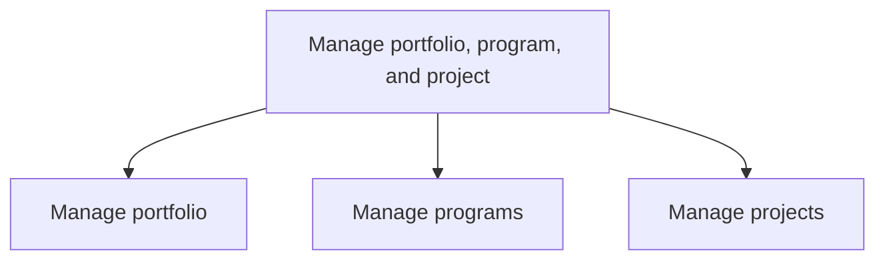
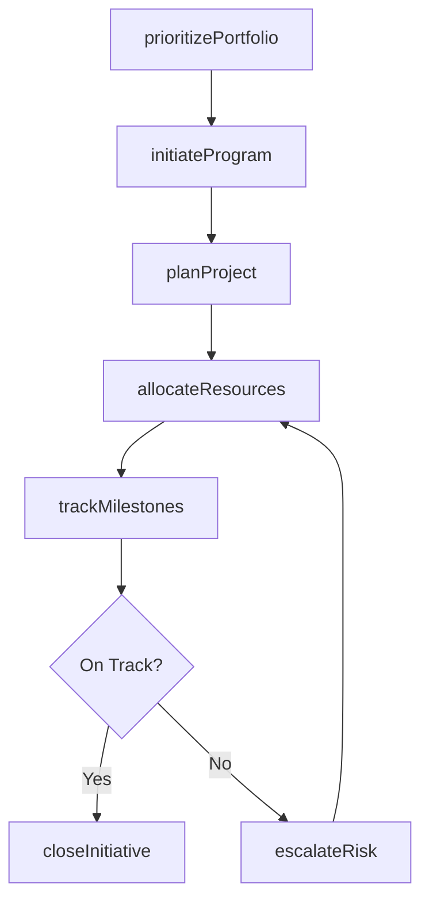

# Manage portfolio, program, and project

> Business-as-Code definition for enterprise portfolio, program, and project governance. Models the end-to-end lifecycle of strategic investment management from portfolio prioritization through program coordination to project delivery and closure.

## Overview

Managing investments, holdings, products, businesses, and brands, along with the related projects that together constitute a program.

## Process Hierarchy



## GraphDL

```yaml
manage:
  object: Portfolio, Program, And Project
  actor: PMODirector
  result: PortfolioPerformanceReport
```

## Actions

| Action | Description |
|--------|-------------|
| prioritizePortfolio | Rank and select investments based on strategic alignment and resource capacity |
| initiateProgram | Stand up a new program with governance structure and stakeholder charter |
| planProject | Define scope, schedule, budget, and resource requirements for a project |
| allocateResources | Assign personnel, funding, and assets across portfolio components |
| trackMilestones | Monitor progress against key deliverables and schedule commitments |
| escalateRisk | Raise portfolio-level risks and issues for executive decision-making |
| closeInitiative | Complete formal closure of a project or program with lessons learned |

## Events

| Event | Description |
|-------|-------------|
| portfolioPrioritized | Portfolio investments ranked and selection decisions finalized |
| programInitiated | New program formally chartered and governance established |
| projectPlanned | Project plan baselined with approved scope, schedule, and budget |
| resourcesAllocated | Personnel and funding assigned to portfolio components |
| milestonesTracked | Progress checkpoint recorded against key deliverables |
| riskEscalated | Portfolio-level risk raised for executive review |
| initiativeClosed | Project or program formally closed with documentation archived |

## Searches

| Search | Description |
|--------|-------------|
| findPortfolioComponents | List portfolio investments filtered by status, strategic theme, or business unit |
| getProjectStatus | Retrieve current status, health indicators, and milestone progress for a project |
| getProgramDashboard | Get aggregated program metrics including budget variance and schedule performance |
| findAtRiskInitiatives | List projects and programs with elevated risk or schedule slippage |
| getResourceUtilization | Retrieve resource allocation and utilization rates across the portfolio |

## Process Flow



## RACI Matrix

| Activity | Responsible | Accountable | Consulted | Informed |
|----------|-------------|-------------|-----------|----------|
| prioritizePortfolio | PortfolioManager | CIO | BusinessUnitLeads | CFO |
| initiateProgram | ProgramManager | PMODirector | ExecutiveSponsor | SteeringCommittee |
| planProject | ProjectManager | ProgramManager | SubjectMatterExperts | PMO |
| trackMilestones | ProjectManager | ProgramManager | TeamLeads | SteeringCommittee |
| closeInitiative | ProjectManager | PMODirector | Finance | ExecutiveLeadership |

## Sub-Processes

| ID | Name | Description |
|----|------|-------------|
| 13.2.1 | Manage portfolio | Managing the business portfolio of the organization, including investments, holdings, products, busi |
| 13.2.2 | Manage programs | Establishing, implementing, and managing business programs. Successfully handle related projects tha |
| 13.2.3 | Manage projects | Establishing the scope of the projects. Create plans for implementing the projects. Initiate project |

## Related Processes

| Process | Relationship |
|---------|-------------|
| 13.1 Manage business processes | Upstream - process definitions inform project scoping |
| 13.4 Manage change | Downstream - project outcomes feed change management |
| 13.6 Measure and benchmark | Parallel - performance measurement supports portfolio decisions |
| 1.2 Develop and manage business strategy | Upstream - strategic priorities drive portfolio selection |

## Related Departments

| Department | Role |
|-----------|------|
| Project Management Office (PMO) | Primary owner of portfolio, program, and project governance |
| Finance | Provides budget oversight and investment analysis |
| IT | Delivers technology-enabled projects and infrastructure |
| Strategy | Sets priorities that drive portfolio selection |
| Human Resources | Supports resource planning and organizational readiness |

## Related Occupations

| Occupation | Involvement |
|-----------|-------------|
| Portfolio Manager | Oversees strategic investment selection and portfolio balancing |
| Program Manager | Coordinates related projects to achieve program objectives |
| Project Manager | Plans and executes individual project deliverables |
| Business Analyst | Defines requirements and validates business case assumptions |

## KPIs

| KPI | Description | Unit |
|-----|-------------|------|
| Portfolio ROI | Return on investment across all active portfolio components | % |
| On-Time Delivery Rate | Percentage of projects completed by the baselined end date | % |
| Budget Variance | Difference between planned and actual spend across the portfolio | % |
| Resource Utilization | Percentage of available capacity deployed to active initiatives | % |
| Strategic Alignment Score | Degree to which the portfolio mix supports stated strategic objectives | Score (1-5) |

## Usage

```typescript
import { managePortfolioProgramAndProject } from '@headlessly/manage-portfolio-program-and-project'

const ppm = managePortfolioProgramAndProject()

// Prioritize portfolio based on strategic themes
const ranked = await ppm.prioritizePortfolio({
  fiscalYear: 2026,
  strategicThemes: ['digital-transformation', 'cost-optimization'],
  budgetCeiling: 15000000
})

// Track milestones for a specific project
const status = await ppm.trackMilestones({
  projectId: 'PRJ-2026-042',
  asOfDate: '2026-02-01'
})
```
